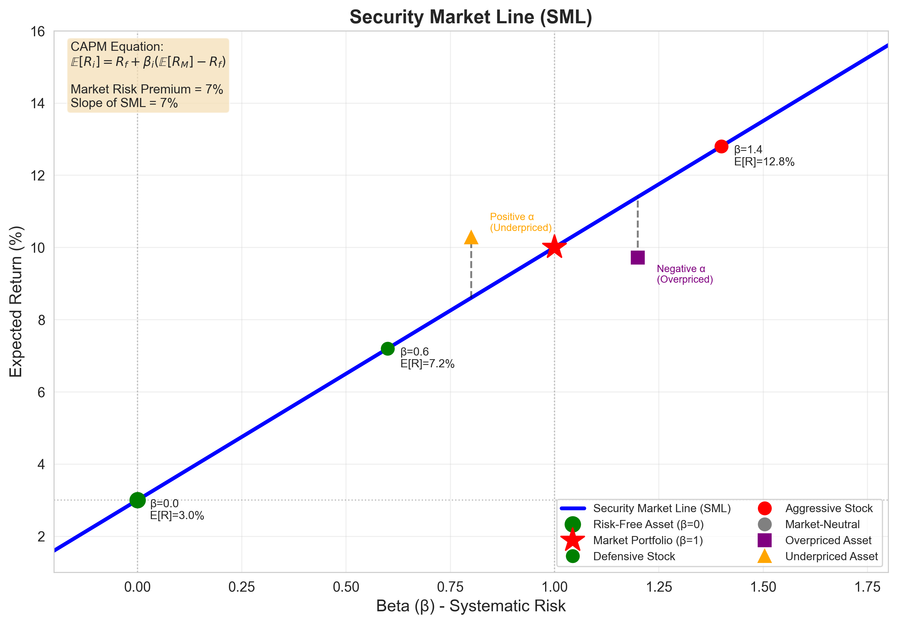
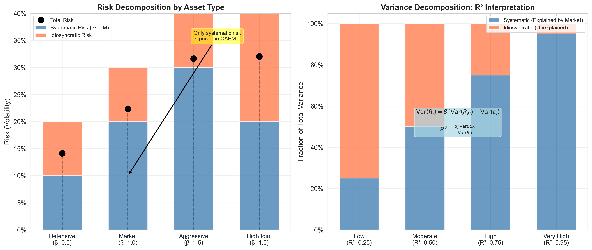
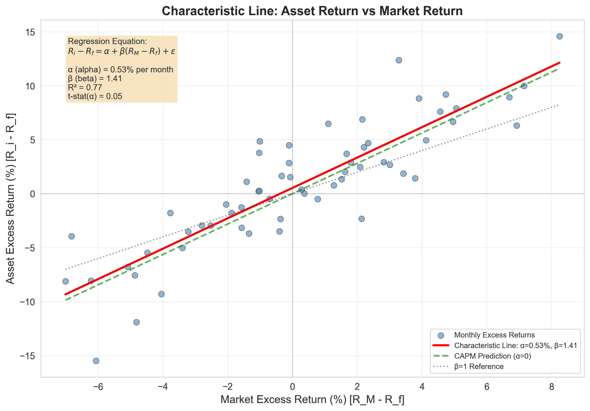
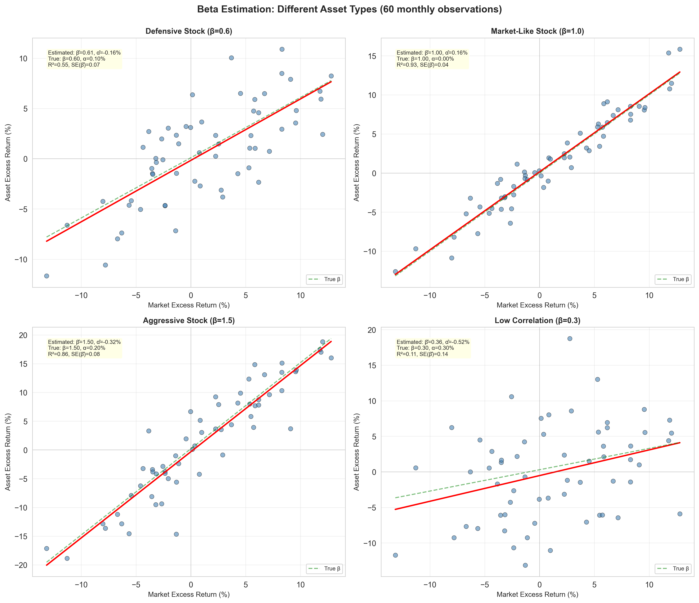

<section class="slide" markdown="1">

# Capital Asset Pricing Model (CAPM)

**Sukrit Mittal**
Franklin Templeton Investments

</section>

<section class="slide" markdown="1">

## Outline

1. Why CAPM?
2. Assumptions and market setting
3. From portfolio choice to equilibrium
4. Derivation of CAPM
5. Security Market Line (SML)
6. Systematic vs idiosyncratic risk
7. Characteristic line
8. Empirical interpretation and limits
9. Exercises

</section>

<section class="slide" markdown="1">

## 1. Why CAPM?

Up to now we solved **investor problems**.

* How should I allocate my wealth?
* What is the optimal portfolio given my risk preferences?

CAPM answers a different question:

> How are assets priced *in equilibrium*?

This is not about optimal portfolios.

It is about consistency across the entire market.

**The fundamental question:** If all investors are mean-variance optimizers, what must expected returns look like?

</section>

<section class="slide" markdown="1">

### What CAPM Is—and Is Not

CAPM is: A model of how risk translates into return

CAPM is not: A trading strategy

*It is a benchmark.*

### Historical Context

Developed independently by:

* William Sharpe (1964)
* John Lintner (1965)
* Jan Mossin (1966)

Sharpe won the Nobel Prize in Economics (1990) for this work.

The model revolutionized finance by providing a testable theory of expected returns.

</section>

<section class="slide" markdown="1">

## 2. Market Setting and Assumptions

We assume:

1. **Mean–variance optimization:** All investors choose portfolios based only on expected return and variance

2. **Homogeneous expectations:** All investors agree on:
   * Expected returns $\mu$
   * Covariance matrix $\Sigma$
   * Risk-free rate $R_f$

3. **Perfect capital markets:**
   * No transaction costs
   * No taxes
   * Assets are infinitely divisible
   * All assets are marketable and liquid

4. **Single-period horizon:** All investors have the same investment horizon

5. **Risk-free borrowing and lending:** Investors can lend or borrow unlimited amounts at rate $R_f$

These assumptions are strong.

</section>

<section class="slide" markdown="1">

### Why These Assumptions?

**What each assumption enables:**

* **Mean-variance:** Reduces preferences to two dimensions
* **Homogeneous expectations:** Ensures all investors face same optimization problem
* **Perfect markets:** Eliminates frictions that complicate pricing
* **Single period:** Avoids dynamic complexities
* **Risk-free rate:** Creates separation between risk and return

Relaxing these assumptions leads to extensions and alternative models.

But understanding CAPM requires accepting them first.

### Critique of Assumptions

**Homogeneous expectations** is the most controversial:

* Investors clearly disagree about future returns
* Disagreement is the reason trading occurs
* Yet: if disagreements are "rational," maybe they average out in equilibrium

**Perfect markets:**

* Transaction costs exist but are small for large investors
* Taxes matter but CAPM can be extended to incorporate them
* The model still provides useful baseline predictions

The question is not whether assumptions are true.

The question is whether the model is useful despite them.

</section>

<section class="slide" markdown="1">

## 3. From Portfolio Choice to Equilibrium

From Lecture 07, we know:

* All mean-variance investors (with same expectations) hold the same risky portfolio
* This portfolio is the **tangency portfolio** (maximizes Sharpe ratio)
* Differences arise only via leverage (mix with risk-free asset)

In equilibrium:

> The risky portfolio held by everyone must be the market portfolio.

**Why?** Market clearing.

* If everyone wants to hold portfolio $P$
* But some asset $i$ is not in $P$ (or has wrong weight)
* Then there is excess supply or demand for asset $i$
* Prices must adjust until $P$ equals the market portfolio

This is the critical step.

</section>

<section class="slide" markdown="1">

### The Market Portfolio

The **market portfolio** $M$ contains:

* All risky assets
* In proportion to their market values

**Definition:**

$$
w_i^M = \frac{\text{Market value of asset } i}{\text{Total market value of all assets}}
$$

**Examples:**

* If a stock has market cap \$100B and total market is \$10T, then $w_i = 0.01$
* The S&P 500 (value-weighted) approximates the U.S. equity market portfolio
* A global market portfolio includes all stocks, bonds, real estate, etc.

No asset can escape the market.

If it exists, it is priced.

### Equilibrium Condition

In equilibrium, two conditions must hold:

1. **Optimality:** Each investor holds an optimal portfolio given prices

2. **Market clearing:** Total demand = Total supply for every asset

Combining these:

$$
\text{Aggregate holdings} = \text{Market portfolio}
$$

Since everyone holds the tangency portfolio, it must equal the market portfolio.

This pins down expected returns.

</section>

<section class="slide" markdown="1">

## 4. Risk Decomposition

Consider an asset $i$ with return $R_i$.

Decompose its risk relative to the market $R_M$.

Only part of this risk matters, rest is diversifiable noise.

### Total Risk Decomposition

Any asset's return can be written as:

$$
R_i = \mathbb{E}[R_i] + \beta_i(R_M - \mathbb{E}[R_M]) + \varepsilon_i
$$

Where:
* $\beta_i(R_M - \mathbb{E}[R_M])$ = systematic component (market-driven)
* $\varepsilon_i$ = idiosyncratic component (asset-specific)
* $\mathbb{E}[\varepsilon_i] = 0$ and $\text{Cov}(\varepsilon_i, R_M) = 0$ (by construction)

**Total variance:**

$$
\text{Var}(R_i) = \beta_i^2 \text{Var}(R_M) + \text{Var}(\varepsilon_i)
$$

* First term: **systematic risk** (cannot diversify away)
* Second term: **idiosyncratic risk** (diversifies away in large portfolios)

</section>

<section class="slide" markdown="1">

### Beta: Measuring Systematic Risk

Define **beta**:

$$
\beta_i = \frac{\text{Cov}(R_i, R_M)}{\text{Var}(R_M)}
$$

Beta measures:

> Sensitivity to market movements.

**Interpretation:**

* $\beta_i = 1$: Asset moves one-for-one with the market
* $\beta_i > 1$: Asset is more volatile than the market (aggressive)
* $\beta_i < 1$: Asset is less volatile than the market (defensive)
* $\beta_i = 0$: Asset is uncorrelated with the market
* $\beta_i < 0$: Asset moves opposite to the market (rare, e.g., gold)

This is the only risk investors are paid for.

Why? Because idiosyncratic risk can be diversified away.

</section>

<section class="slide" markdown="1">

## 5. Derivation of CAPM

Consider the market portfolio $M$.

For any asset $i$:

* Adding $i$ to $M$ must not improve the Sharpe ratio

Otherwise, $M$ would not be optimal.

This restriction pins down expected returns.

### Derivation via Marginal Contribution to Risk

Consider a portfolio with weight $\alpha$ in asset $i$ and $(1-\alpha)$ in the market portfolio $M$.

Portfolio return:

$$
R_p(\alpha) = \alpha R_i + (1-\alpha) R_M
$$

Portfolio variance:

$$
\sigma_p^2(\alpha) = \alpha^2 \sigma_i^2 + (1-\alpha)^2 \sigma_M^2 + 2\alpha(1-\alpha) \text{Cov}(R_i, R_M)
$$

At $\alpha = 0$ (pure market portfolio), the Sharpe ratio must be maximized.

**First-order condition for maximum Sharpe ratio:**

$$
\frac{d}{d\alpha}\left[\frac{\mathbb{E}[R_p(\alpha)] - R_f}{\sigma_p(\alpha)}\right]\Bigg|_{\alpha=0} = 0
$$

</section>

<section class="slide" markdown="1">

### Derivation (continued)

The Sharpe ratio of the mixed portfolio is:

$$
S(\alpha) = \frac{\mathbb{E}[R_p(\alpha)] - R_f}{\sigma_p(\alpha)}
$$

For $M$ to be optimal, the derivative with respect to $\alpha$ must be zero at $\alpha = 0$.

**Step 1: Derivative of expected return**

$$
\frac{d\mathbb{E}[R_p]}{d\alpha} = \mathbb{E}[R_i] - \mathbb{E}[R_M]
$$

**Step 2: Derivative of variance**

$$
\frac{d\sigma_p^2}{d\alpha} = 2\alpha \sigma_i^2 + 2(1-2\alpha)\sigma_M^2 - 2(1-2\alpha)\text{Cov}(R_i, R_M)$$

At $\alpha = 0$:

$$
\frac{d\sigma_p^2}{d\alpha}\Bigg|_{\alpha=0} = 2[\text{Cov}(R_i, R_M) - \sigma_M^2]
$$

**Step 3: Derivative of standard deviation**

$$
\frac{d\sigma_p}{d\alpha}\Bigg|_{\alpha=0} = \frac{1}{\sigma_M}[\text{Cov}(R_i, R_M) - \sigma_M^2]
$$

**Step 4: Apply quotient rule to Sharpe ratio**

$$
\frac{dS}{d\alpha} = \frac{\frac{d\mathbb{E}[R_p]}{d\alpha} \cdot \sigma_p - (\mathbb{E}[R_p] - R_f) \cdot \frac{d\sigma_p}{d\alpha}}{\sigma_p^2}
$$

At $\alpha = 0$, set numerator to zero:

$$
[\mathbb{E}[R_i] - \mathbb{E}[R_M]] \sigma_M = [\mathbb{E}[R_M] - R_f] \cdot \frac{\text{Cov}(R_i, R_M) - \sigma_M^2}{\sigma_M}
$$

**Step 5: Simplify**

</section>

<section class="slide" markdown="1">

### CAPM Equation

Rearranging:

$$
\mathbb{E}[R_i] - \mathbb{E}[R_M] = \frac{\mathbb{E}[R_M] - R_f}{\sigma_M^2}[\text{Cov}(R_i, R_M) - \sigma_M^2]
$$

For the market portfolio itself, $\text{Cov}(R_M, R_M) = \sigma_M^2$, so this holds with equality.

For any other asset $i$:

$$
\mathbb{E}[R_i] = \mathbb{E}[R_M] + \frac{\mathbb{E}[R_M] - R_f}{\sigma_M^2}[\text{Cov}(R_i, R_M) - \sigma_M^2]
$$

Rearranging:

$$
\mathbb{E}[R_i] = R_f + \frac{\text{Cov}(R_i, R_M)}{\sigma_M^2}[\mathbb{E}[R_M] - R_f]
$$

Using $\beta_i = \frac{\text{Cov}(R_i, R_M)}{\sigma_M^2}$:

$$
\boxed{\mathbb{E}[R_i] - R_f = \beta_i\big( \mathbb{E}[R_M] - R_f \big)}
$$

This is the **CAPM equation**.

</section>

<section class="slide" markdown="1">

### Alternative Derivation: Equilibrium Pricing

**Equilibrium condition:** The market portfolio is the tangency portfolio.

From Lecture 07, the tangency portfolio satisfies:

$$
w^M \propto \Sigma^{-1}(\mu - R_f \mathbf{1})
$$

This means:

$$
\mu - R_f \mathbf{1} \propto \Sigma w^M
$$

The $i$-th component:

$$
\mu_i - R_f \propto \sum_j \Sigma_{ij} w_j^M = \text{Cov}(R_i, R_M)
$$

The proportionality constant is the same for all assets:

$$
\mu_i - R_f = \lambda \cdot \text{Cov}(R_i, R_M)
$$

For the market portfolio itself:

$$
\mu_M - R_f = \lambda \cdot \text{Var}(R_M)
$$

Therefore:

$$
\lambda = \frac{\mu_M - R_f}{\sigma_M^2}
$$

Substituting back:

$$
\mathbb{E}[R_i] - R_f = \frac{\mu_M - R_f}{\sigma_M^2} \cdot \text{Cov}(R_i, R_M) = \beta_i(\mu_M - R_f)
$$

Same result, different path.

</section>

<section class="slide" markdown="1">

## 6. Security Market Line (SML)

Plot expected return against beta.

The CAPM predicts a straight line:

$$
\mathbb{E}[R_i] = R_f + \beta_i (\mathbb{E}[R_M] - R_f)
$$

This line is the **Security Market Line (SML)**.

**Key points on the SML:**

* **Risk-free asset:** $\beta = 0$, $\mathbb{E}[R] = R_f$
* **Market portfolio:** $\beta = 1$, $\mathbb{E}[R] = \mathbb{E}[R_M]$
* **Aggressive asset:** $\beta > 1$, $\mathbb{E}[R] > \mathbb{E}[R_M]$
* **Defensive asset:** $0 < \beta < 1$, $R_f < \mathbb{E}[R] < \mathbb{E}[R_M]$

**Graphical Representation:**

*Figure: The Security Market Line shows the linear relationship between beta and expected return predicted by CAPM. Assets above the line are underpriced (positive alpha), while those below are overpriced (negative alpha).*

</section>

<section class="slide" markdown="1">

### Interpretation of the SML

**Components:**

* **Intercept:** $R_f$ (risk-free rate)
* **Slope:** $\mathbb{E}[R_M] - R_f$ (market risk premium)

**Economic interpretation:**

$$
\text{Expected excess return} = \beta \times \text{Market risk premium}
$$

* You earn the risk-free rate for waiting
* You earn a premium proportional to **systematic risk** ($\beta$)
* Idiosyncratic risk earns no premium (it can be diversified)

**Asset pricing implications:**

* Assets **above** the line: underpriced (higher return than CAPM predicts)
* Assets **on** the line: fairly priced
* Assets **below** the line: overpriced (lower return than CAPM predicts)

In theory.

### Numerical Example: Using the SML

Suppose:
* $R_f = 3\%$
* $\mathbb{E}[R_M] = 10\%$
* Market risk premium: $\mathbb{E}[R_M] - R_f = 7\%$

**Asset A:** $\beta_A = 0.8$ (defensive)

$$
\mathbb{E}[R_A] = 0.03 + 0.8(0.10 - 0.03) = 0.03 + 0.056 = 8.6\%
$$

**Asset B:** $\beta_B = 1.5$ (aggressive)

$$
\mathbb{E}[R_B] = 0.03 + 1.5(0.10 - 0.03) = 0.03 + 0.105 = 13.5\%
$$

**Asset C:** $\beta_C = 1.2$, observed return = $15\%$

CAPM prediction:

$$
\mathbb{E}[R_C] = 0.03 + 1.2(0.07) = 11.4\%
$$

Actual return (15%) > CAPM prediction (11.4%)

**Interpretation:** Asset C is underpriced or has positive alpha.

</section>

<section class="slide" markdown="1">

## 7. Systematic vs Idiosyncratic Risk

Total risk decomposes into:

* **Systematic risk** (market-related, undiversifiable)
* **Idiosyncratic risk** (asset-specific, diversifiable)

Diversification eliminates only the latter.

Markets pay only for what cannot be diversified.

### Mathematical Decomposition

Recall the risk decomposition:

$$
R_i = \mathbb{E}[R_i] + \beta_i(R_M - \mathbb{E}[R_M]) + \varepsilon_i
$$

Taking variance:

$$
\text{Var}(R_i) = \beta_i^2 \text{Var}(R_M) + \text{Var}(\varepsilon_i)
$$

**R-squared:** Fraction of variance explained by the market:

$$
R^2 = \frac{\beta_i^2 \text{Var}(R_M)}{\text{Var}(R_i)}
$$

* $R^2 = 1$: All risk is systematic (perfectly correlated with market)
* $R^2 = 0$: All risk is idiosyncratic (uncorrelated with market)
* Typical stock: $R^2 \approx 0.3$ (30% of variance is systematic)

</section>

<section class="slide" markdown="1">

### Why Only Systematic Risk Is Priced

**Key insight:** In a well-diversified portfolio, idiosyncratic risks cancel out.

For a portfolio of $n$ assets with equal weights:

$$
R_p = \frac{1}{n}\sum_{i=1}^n R_i = \mathbb{E}[R_p] + \beta_p(R_M - \mathbb{E}[R_M]) + \frac{1}{n}\sum_{i=1}^n \varepsilon_i
$$

Where $\beta_p = \frac{1}{n}\sum_{i=1}^n \beta_i$.

**Variance of idiosyncratic component:**

If $\varepsilon_i$ are uncorrelated with average variance $\bar{\sigma}_\varepsilon^2$:

$$
\text{Var}\left(\frac{1}{n}\sum_{i=1}^n \varepsilon_i\right) = \frac{\bar{\sigma}_\varepsilon^2}{n} \to 0 \text{ as } n \to \infty
$$

**Conclusion:** Large portfolios eliminate idiosyncratic risk.

Since investors can diversify at zero cost, they won't pay a premium for bearing idiosyncratic risk.

**Visual Decomposition:**

*Figure: (Left) Risk decomposition for different asset types showing systematic and idiosyncratic components. (Right) R² interpretation showing the fraction of variance explained by the market.*

### Numerical Example: Diversification

Consider 50 stocks, each with:
* Beta: $\beta_i = 1.2$
* Idiosyncratic variance: $\text{Var}(\varepsilon_i) = 0.04$
* Market variance: $\sigma_M^2 = 0.04$

**Individual stock variance:**

$$
\text{Var}(R_i) = (1.2)^2(0.04) + 0.04 = 0.0576 + 0.04 = 0.0976
$$

Standard deviation: $\sigma_i = 31.2\%$

**Equally-weighted portfolio variance:**

$$
\text{Var}(R_p) = (1.2)^2(0.04) + \frac{0.04}{50} = 0.0576 + 0.0008 = 0.0584
$$

Standard deviation: $\sigma_p = 24.2\%$

**Risk reduction:** From 31.2% to 24.2% (22% reduction)

* Systematic risk: $\sqrt{0.0576} = 24\%$ (unchanged)
* Idiosyncratic risk: nearly eliminated

</section>

<section class="slide" markdown="1">

## 8. Characteristic Line

The **characteristic line** relates an asset's excess return to the market's excess return:

$$
R_i - R_f = \alpha_i + \beta_i (R_M - R_f) + \varepsilon_i
$$

This is a **regression equation**.

**Components:**

* $\alpha_i$ = **alpha** (intercept) = abnormal return
* $\beta_i$ = **beta** (slope) = systematic risk exposure
* $\varepsilon_i$ = residual (idiosyncratic component)

**Assumptions:**

* $\mathbb{E}[\varepsilon_i] = 0$
* $\text{Cov}(\varepsilon_i, R_M) = 0$

This is **not** just a theoretical construct — it's how we estimate beta in practice.

**Graphical Representation:**

*Figure: The characteristic line shows the regression of asset excess returns against market excess returns. The slope is beta, and the intercept is alpha. Positive alpha indicates outperformance relative to CAPM predictions.*

</section>

<section class="slide" markdown="1">

### Interpretation of Parameters

**Beta ($\beta_i$):**

* Measures **systematic exposure** to market risk
* $\beta_i = \frac{\text{Cov}(R_i - R_f, R_M - R_f)}{\text{Var}(R_M - R_f)}$
* Estimated as the slope in time-series regression

**Alpha ($\alpha_i$):**

* Measures **abnormal return** (above or below CAPM prediction)
* In CAPM equilibrium: $\alpha_i = 0$ for all assets
* Nonzero alpha suggests:
  * Mispricing
  * Model misspecification
  * Superior skill (if persistent)

**Residual ($\varepsilon_i$):**

* Idiosyncratic noise
* Diversifies away in portfolios
* Variance $\text{Var}(\varepsilon_i)$ measures idiosyncratic risk

In CAPM:

$$
\alpha_i = 0
$$

Nonzero alpha is a claim.

Extraordinary claims require extraordinary evidence.

</section>

<section class="slide" markdown="1">

### Estimating Beta: Time-Series Regression

**Data:** Historical returns for asset $i$ and market $M$ over $T$ periods

**Regression:**

$$
r_{i,t} - r_{f,t} = \alpha_i + \beta_i(r_{M,t} - r_{f,t}) + \varepsilon_{i,t}
$$

for $t = 1, 2, \ldots, T$

**Ordinary Least Squares (OLS) estimate:**

$$
\hat{\beta}_i = \frac{\sum_{t=1}^T (r_{i,t} - \bar{r}_i)(r_{M,t} - \bar{r}_M)}{\sum_{t=1}^T (r_{M,t} - \bar{r}_M)^2}
$$

**Standard error:**

$$
\text{SE}(\hat{\beta}_i) = \frac{\hat{\sigma}_\varepsilon}{\sqrt{\sum_{t=1}^T (r_{M,t} - \bar{r}_M)^2}}
$$

Where $\hat{\sigma}_\varepsilon$ is the standard deviation of residuals.

**Beta Estimation Examples:**

*Figure: Beta estimation for different asset types using time-series regression. Each panel shows 60 monthly observations with the fitted characteristic line. Note how R² varies with the strength of market correlation.*

### Numerical Example: Estimating Beta

Suppose we have 60 monthly returns for Stock XYZ and the S&P 500.

**Regression results:**

$$
r_{\text{XYZ},t} - r_{f,t} = 0.005 + 1.35(r_{M,t} - r_{f,t}) + \varepsilon_t
$$

* $\hat{\alpha} = 0.005$ (0.5% per month = 6% per year)
* $\hat{\beta} = 1.35$ (more volatile than market)
* $t$-statistic for $\alpha$: $t = 2.1$ (marginally significant)
* $R^2 = 0.42$ (42% of variance explained by market)

**Interpretation:**

* XYZ is an aggressive stock ($\beta > 1$)
* It appears to have positive alpha (outperforms CAPM prediction)
* But statistical significance is weak — could be luck

**CAPM prediction:** With $R_f = 2\%$ and $\mathbb{E}[R_M] = 9\%$:

$$
\mathbb{E}[R_{\text{XYZ}}] = 0.02 + 1.35(0.09 - 0.02) = 11.45\%
$$

If alpha persists, expected return would be: $11.45\% + 6\% = 17.45\%$

</section>

<section class="slide" markdown="1">

## 9. Empirical Reality

CAPM is elegant.

Reality is less cooperative.

Empirically:

* Betas are unstable over time
* Many anomalies exist (size, value, momentum)
* Alpha is often statistically significant

But CAPM survives as a benchmark.

Bad models die.

Useful models endure.

### Empirical Tests of CAPM

**Classic tests:**

1. **Black, Jensen, Scholes (1972):** Found that low-beta stocks earn higher returns than CAPM predicts

2. **Fama-French (1992):** Size and book-to-market ratio explain returns better than beta alone

3. **Roll's critique (1977):** CAPM is untestable because the true market portfolio is unobservable

**Key empirical findings:**

* **Flat Security Market Line:** Empirically, the SML is flatter than CAPM predicts
  * Low-beta stocks earn more than predicted
  * High-beta stocks earn less than predicted

* **Anomalies:**
  * **Size effect:** Small stocks outperform large stocks (controlling for beta)
  * **Value effect:** High book-to-market stocks outperform growth stocks
  * **Momentum:** Past winners continue to outperform

* **Time-varying betas:** Beta estimates change with the sample period

</section>

<section class="slide" markdown="1">

### Why CAPM Fails Empirically

**Violated assumptions:**

1. **Not all investors are mean-variance optimizers**
   * Some use heuristics, others are constrained

2. **Heterogeneous expectations**
   * Investors disagree about expected returns

3. **Market frictions matter**
   * Transaction costs, taxes, short-sale constraints

4. **The market portfolio is unobservable**
   * S&P 500 ≠ true market portfolio
   * Should include bonds, real estate, human capital, etc.

5. **Time-varying risk premiums**
   * Market risk premium changes with economic conditions

**Despite failures, CAPM remains useful:**

* **Benchmark:** Provides a null hypothesis for asset pricing
* **Risk adjustment:** Beta is still widely used to adjust for risk
* **Cost of capital:** Companies use CAPM to estimate required returns
* **Performance evaluation:** Mutual funds are evaluated using alpha

</section>

<section class="slide" markdown="1">

### Extensions and Alternatives

**Multi-factor models:**

* **Fama-French 3-factor:** Adds size and value factors to CAPM
* **Carhart 4-factor:** Adds momentum factor
* **Fama-French 5-factor:** Adds profitability and investment factors

**Consumption CAPM (CCAPM):**

* Relates returns to consumption growth
* More theoretically sound, but harder to test

**Intertemporal CAPM (ICAPM):**

* Merton (1973): Extends CAPM to multiple periods
* Assets hedge against changes in investment opportunities

**Arbitrage Pricing Theory (APT):**

* Ross (1976): Multiple risk factors, fewer assumptions
* Does not specify what the factors are

**Behavioral models:**

* Incorporate investor psychology
* Overconfidence, loss aversion, etc.

CAPM opened the door.

Others walked through.

</section>

<section class="slide" markdown="1">

## 10. Exercises

### Exercise 1: Basic CAPM Calculation

Given:

* Risk-free rate: $R_f = 3\%$
* Expected market return: $\mathbb{E}[R_M] = 11\%$
* Beta of Stock A: $\beta_A = 1.5$
* Beta of Stock B: $\beta_B = 0.7$

**Tasks:**
1. Calculate the expected return for Stock A using CAPM
2. Calculate the expected return for Stock B using CAPM
3. Which stock has higher expected return? Higher risk? Explain.
4. If Stock A's actual expected return is 14%, what is its alpha?

</section>

<section class="slide" markdown="1">

### Exercise 2: Beta Estimation

You have the following data for Stock XYZ over 5 years:

| Year | Stock Return | Market Return | Risk-Free Rate |
|------|--------------|---------------|----------------|
| 1    | 12%          | 8%            | 2%             |
| 2    | -5%          | -3%           | 2%             |
| 3    | 18%          | 12%           | 2%             |
| 4    | 8%           | 6%            | 2%             |
| 5    | 15%          | 10%           | 2%             |

**Tasks:**
1. Calculate excess returns for both stock and market
2. Estimate beta using the formula: $\hat{\beta} = \frac{\text{Cov}(r_i - r_f, r_M - r_f)}{\text{Var}(r_M - r_f)}$
3. Estimate alpha from the regression intercept
4. What is the R-squared of this relationship?
5. Discuss limitations of using only 5 years of data

</section>

<section class="slide" markdown="1">

### Exercise 3: Security Market Line

An asset lies persistently above the SML.

List and explain three possible reasons:

1. **Reason 1:** \_\_\_\_\_
2. **Reason 2:** \_\_\_\_\_
3. **Reason 3:** \_\_\_\_\_

For each reason, discuss:
* Whether it implies market inefficiency
* Whether it's likely to persist
* How an investor might exploit it

</section>

<section class="slide" markdown="1">

### Exercise 4: Risk Decomposition

A stock has:
* Total variance: $\sigma_i^2 = 0.09$ (30% std dev)
* Beta: $\beta_i = 1.2$
* Market variance: $\sigma_M^2 = 0.04$ (20% std dev)

**Tasks:**
1. Calculate the systematic risk component: $\beta_i^2 \sigma_M^2$
2. Calculate the idiosyncratic risk component: $\text{Var}(\varepsilon_i)$
3. What is the R-squared? Interpret this value.
4. If you hold 30 of these stocks (equally weighted, uncorrelated idiosyncratic risk), what is the portfolio's total variance?
5. How much of the risk is eliminated by diversification?

</section>

<section class="slide" markdown="1">

### Exercise 5: Portfolio Beta

You have a portfolio with three stocks:

| Stock | Weight | Beta |
|-------|--------|------|
| A     | 30%    | 0.8  |
| B     | 50%    | 1.3  |
| C     | 20%    | 1.6  |

Given $R_f = 4\%$ and $\mathbb{E}[R_M] = 12\%$:

**Tasks:**
1. Calculate the portfolio beta: $\beta_p = \sum_i w_i \beta_i$
2. Calculate the expected return of the portfolio using CAPM
3. Verify this matches the weighted average of individual expected returns
4. If you want to achieve $\beta_p = 1.0$, how should you adjust the weights?

</section>

<section class="slide" markdown="1">

### Exercise 6: CAPM and Cost of Capital

A company is considering a new project with the following characteristics:
* Project beta: $\beta = 1.4$
* Risk-free rate: $R_f = 3\%$
* Market risk premium: $\mathbb{E}[R_M] - R_f = 8\%$

**Tasks:**
1. Calculate the required rate of return using CAPM
2. The project requires an initial investment of \$10M and is expected to generate \$12M in one year. Should the company accept the project?
3. What is the NPV of the project?
4. What beta would make the project break-even (NPV = 0)?

</section>

<section class="slide" markdown="1">

## Final Takeaways

* **CAPM is an equilibrium model of asset pricing**
  * Derived from mean-variance optimization + market clearing
  * Expected return = risk-free rate + beta × market risk premium
  * $\mathbb{E}[R_i] = R_f + \beta_i(\mathbb{E}[R_M] - R_f)$

* **Only systematic risk is priced**
  * Beta measures sensitivity to market movements
  * Idiosyncratic risk can be diversified away at zero cost
  * Markets don't pay for risk that can be eliminated

* **The Security Market Line (SML)**
  * Linear relationship between beta and expected return
  * Assets above the line: underpriced (positive alpha)
  * Assets below the line: overpriced (negative alpha)
  * In equilibrium, all assets lie on the SML

* **The characteristic line connects theory to data**
  * $R_i - R_f = \alpha_i + \beta_i(R_M - R_f) + \varepsilon_i$
  * Beta estimated via time-series regression
  * Alpha measures abnormal return (should be zero in equilibrium)
  * R-squared shows fraction of variance explained by market

* **CAPM has strong assumptions**
  * Mean-variance optimization
  * Homogeneous expectations
  * Perfect markets, no frictions
  * Single period
  * These assumptions are transparent but unrealistic

* **Empirically, CAPM has problems**
  * Flat SML (low-beta stocks earn more than predicted)
  * Anomalies: size, value, momentum effects
  * Time-varying betas and risk premiums
  * Market portfolio is unobservable (Roll's critique)

* **Despite failures, CAPM remains foundational**
  * Benchmark for performance evaluation (alpha)
  * Cost of capital estimation
  * Risk adjustment in corporate finance
  * Starting point for multi-factor models

* **Extensions improve on CAPM**
  * Fama-French: adds size and value factors
  * APT: multiple factors, fewer assumptions
  * Consumption CAPM: theoretically superior
  * Behavioral models: incorporate psychology

**Key insight:** CAPM is wrong, but useful.

It provides a disciplined way to think about risk and return.

All models are simplifications.

Good models clarify thinking even when they fail empirically.

Next lecture: We move beyond simple models to **utility theory** and **risk measurement** via Value-at-Risk (VaR).

The journey from portfolio theory to risk management.

</section>

