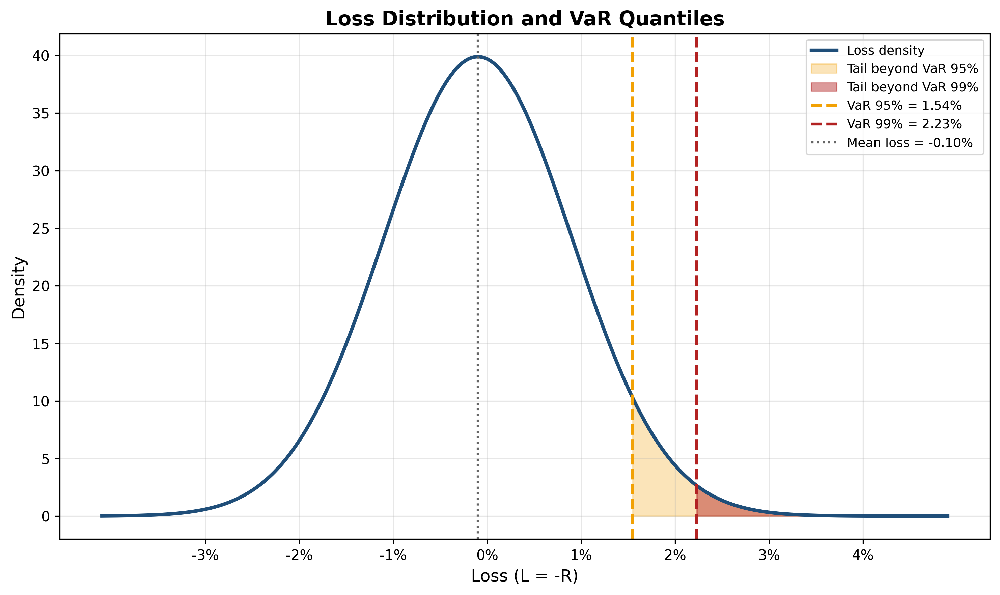

<section class="slide" markdown="1">

# Value at Risk (VaR)

**Sukrit Mittal**
Franklin Templeton Investments

</section>

<section class="slide" markdown="1">

## Outline

1. Motivation: why downside risk?
2. From portfolio theory to risk management
3. Loss distributions and quantiles
4. Definition of Value at Risk
5. Computing VaR: three methods
6. Parametric VaR with normal returns
7. Historical simulation VaR
8. Monte Carlo VaR
9. Mathematical properties of VaR
10. Limitations and critique of VaR
11. Exercises

</section>

<section class="slide" markdown="1">

## 1. Motivation: Why Downside Risk?

Variance treats upside and downside symmetrically; Investors do not.

Losses hurt more than gains feel good—this asymmetry is fundamental to human psychology.

### The Problem with Variance

It measures **total volatility**—both upside and downside.
$$
\text{Portfolio risk} = \sigma_p^2 = w^\top \Sigma w
$$

**Example:** Consider two one-year return distributions:

* **Portfolio A:** $-10\%$ with probability $50\%$, $+10\%$ with probability $50\%$
* **Portfolio B:** $-20\%$ with probability $20\%$, $+5\%$ with probability $80\%$

Both have the same mean and variance:

$$
\mathbb{E}[R_A]=\mathbb{E}[R_B]=0,\qquad \mathrm{Var}(R_A)=\mathrm{Var}(R_B)=0.01
$$

So variance can label them as equally risky, even though **B** has a much more severe left tail.

</section>

<section class="slide" markdown="1">

### Why Focus on Downside?

Risk management addresses specific questions:

> How much can we lose?

> With what probability?

> Over what horizon?

These questions require **downside risk measures**, not total volatility.

**Real-world applications:**

* **Banks:** Need to hold capital against potential losses
* **Pension funds:** Must ensure they can meet future obligations
* **Hedge funds:** Face redemptions if losses exceed thresholds
* **Regulators:** Monitor systemic risk in financial institutions

All of these focus on **left-tail risk**—extreme losses, not extreme gains.

</section>

<section class="slide" markdown="1">

### Historical Context: The Rise of VaR

**Late 1980s-early 1990s:** Financial institutions sought a unified risk metric.

**Problem:**

* Trading desks used different risk measures
* Senior management couldn't compare risks across asset classes
* No single number summarized total firm-wide risk

**Solution:** JP Morgan developed RiskMetrics (1994)

* Standardized VaR calculation
* Published volatility and correlation data
* Made VaR the industry standard

**Result:**

* Basel Committee adopted VaR for bank capital requirements (Basel II, 2004)
* VaR became the dominant risk measure worldwide

Despite known flaws, VaR persists because:

1. It's simple to communicate (one number)
2. It's widely understood by regulators and managers
3. It works reasonably well in normal market conditions

But it fails catastrophically in crises.

</section>

<section class="slide" markdown="1">

## 2. From Portfolio Choice to Risk Management

### The Shift in Perspective

**Portfolio optimization**

* Objective: Maximize $\mathbb{E}[U(W)]$ or $\mu - \frac{\gamma}{2}\sigma^2$
* Output: Optimal portfolio weights $w^*$
* Focus: **Upside potential** balanced against risk

**Risk management**

* Objective: Measure and control downside risk
* Output: Risk metrics (VaR, ES, etc.)
* Focus: **Downside protection** and loss prevention

**Key difference:**

* Portfolio theory: *How should I invest to maximize return?*
* Risk management: *How much can I lose, and can I survive it?*

This is not a contradiction—they're complementary perspectives.

</section>

<section class="slide" markdown="1">

### Connection to Utility Theory

Risk aversion can be characterized by a concave utility function $u(W)$, where
$$
u(\mathbb{E}[W]) > \mathbb{E}[u(W)]
$$

**Key insight:** The concavity of $u$ is strongest in the loss region.

For CRRA utility $u(W) = \frac{W^{1-\gamma}}{1-\gamma}$:
$$
u'(W) = W^{-\gamma}
$$

**Interpretation:** The first dollar lost hurts much more than the last dollar gained feels good.

This asymmetry motivates downside risk measures.

**Risk premium revisited:**
$$
RP = \mathbb{E}[W] - CE
$$

The risk premium reflects willingness to pay to avoid the **downside**.

VaR attempts to quantify this downside directly.

</section>

<section class="slide" markdown="1">

## 3. Loss Distributions and Quantiles

Let $R_p$ denote the portfolio return over a fixed horizon $T$ (e.g., 1 day, 10 days). Define **loss** as:
$$
L = -R_p
$$

**Sign convention:**
* Positive $L$ = Loss
* Negative $L$ = Gain

The distribution of $L$ encodes all risk information.

### The Loss Distribution

For a portfolio with initial value $V_0$:
$$
\text{Profit/Loss} = V_0 R_p = -V_0 L
$$

**Example:** If $R_p \sim N(0.001, 0.01^2)$ (daily), then
$$
L \sim N(-0.001, 0.01^2)
$$

The left tail of $R_p$ corresponds to the right tail of $L$.

</section>

<section class="slide" markdown="1">

### Quantiles of a Distribution

For a random variable $X$ with CDF $F_X(x) = \mathbb{P}(X \le x)$, the $\alpha$**-quantile** is:

$$
q_\alpha = \inf\{x : F_X(x) \ge \alpha\} = F_X^{-1}(\alpha)
$$

**Interpretation:**

With probability $\alpha$, the outcome does not exceed $q_\alpha$.

**Common quantiles:**

* $q_{0.5}$ = median
* $q_{0.95}$ = 95th percentile (exceeded 5% of the time)
* $q_{0.99}$ = 99th percentile (exceeded 1% of the time)

For the **standard normal** $Z \sim N(0,1)$:

* $q_{0.95} \approx 1.645$
* $q_{0.99} \approx 2.326$
* $q_{0.999} \approx 3.090$

</section>

<section class="slide" markdown="1">

### Visualizing Quantiles

*Figure: Loss distribution with VaR at 95% and 99% confidence levels. The shaded regions show the probability mass beyond each VaR threshold. VaR captures a single quantile but ignores the severity of losses beyond that point.*

**Key observation:**

VaR tells us **where** the $\alpha$-quantile is, but not **how bad** losses can be beyond that point.

This is a fundamental limitation (more on this later).

</section>

<section class="slide" markdown="1">

## 4. Definition of Value at Risk

The **Value at Risk** at confidence level $\alpha$ over horizon $T$ is:

$$
\text{VaR}_\alpha(L) = \inf\{x : \mathbb{P}(L \le x) \ge \alpha\}
$$

**Alternative formulation:** For continuous distributions,

$$
\mathbb{P}(L \le \text{VaR}_\alpha) = \alpha
$$

In words:

> VaR is the worst loss not exceeded with probability $\alpha$.

Or equivalently:

> VaR is exceeded with probability $1-\alpha$.

</section>

<section class="slide" markdown="1">

### Interpretation and Conventions

**Standard choices:**

* **Confidence level:** $\alpha = 95\%$ or $99\%$
* **Horizon:** 1 day, 10 days, or 1 year

**Example statement:**

"The 1-day 99% VaR is \$2 million."

**Meaning:**

* Horizon: 1 day
* Confidence: 99%
* Interpretation: We expect to lose more than \$2M on only 1% of days

**Two sign conventions:**

1. **Loss convention** (used here): VaR is a positive number representing potential loss
2. **Return convention:** VaR is negative, representing the return threshold

We use the loss convention: $\text{VaR}_\alpha(L) > 0$ means potential loss.

</section>

<section class="slide" markdown="1">

### VaR in Terms of Returns

If we work with returns $R_p$ instead of losses $L = -R_p$:

$$
\text{VaR}_\alpha = -F_R^{-1}(1-\alpha)
$$

where $F_R$ is the CDF of returns.

**Example:** For $\alpha = 95\%$:

$$
\text{VaR}_{0.95} = -q_{0.05}^R
$$

where $q_{0.05}^R$ is the 5th percentile of the return distribution.

**For dollar VaR:**

$$
\text{VaR}_\alpha^{\$} = V_0 \times \text{VaR}_\alpha
$$

where $V_0$ is the portfolio value.

</section>

<section class="slide" markdown="1">

### Relationship to Utility Theory

VaR can be connected to utility through the **certainty equivalent** concept.

Recall from Lecture 09:

$$
u(CE) = \mathbb{E}[u(W)]
$$

VaR is related but simpler—it ignores utility curvature and focuses solely on the quantile.

**Key difference:**

* **Certainty equivalent:** Captures full risk aversion via $u$
* **VaR:** Captures only distributional location (quantile)

VaR is easier to compute but loses information about preferences.

**Example:** Two investors with different $u$ will have different CEs for the same lottery, but identical VaR.

VaR is **preference-free**—it describes the distribution, not the investor's attitude toward risk.

</section>

<section class="slide" markdown="1">

## 5. Computing VaR: Three Methods

There are three main approaches to computing VaR:

1. **Parametric (Variance-Covariance) Method**
   - Assume returns follow a known distribution (usually normal)
   - Use analytical formulas
   - Fast but relies on distributional assumptions

2. **Historical Simulation**
   - Use empirical distribution of past returns
   - No distributional assumptions
   - Simple but assumes past predicts future

3. **Monte Carlo Simulation**
   - Simulate returns from a specified model
   - Flexible and accurate
   - Computationally intensive

We'll cover each in detail.

</section>

<section class="slide" markdown="1">

## 6. Parametric VaR with Normal Returns

Assume portfolio returns are normally distributed:

$$
R_p \sim N(\mu, \sigma^2)
$$

Then losses $L = -R_p$ are also normal:

$$
L \sim N(-\mu, \sigma^2)
$$

### Derivation of Normal VaR

For $L \sim N(-\mu, \sigma^2)$, the $\alpha$-quantile is:

$$
\text{VaR}_\alpha = -\mu + \sigma \cdot z_\alpha
$$

where $z_\alpha = \Phi^{-1}(\alpha)$ is the $\alpha$-quantile of the standard normal $N(0,1)$.

**Proof:**

Standardize $L$:

$$
\frac{L - (-\mu)}{\sigma} = \frac{L + \mu}{\sigma} \sim N(0,1)
$$

The $\alpha$-quantile satisfies:

$$
\mathbb{P}(L \le \text{VaR}_\alpha) = \alpha
$$

$$
\mathbb{P}\left(\frac{L + \mu}{\sigma} \le \frac{\text{VaR}_\alpha + \mu}{\sigma}\right) = \alpha
$$

$$
\Phi\left(\frac{\text{VaR}_\alpha + \mu}{\sigma}\right) = \alpha
$$

$$
\frac{\text{VaR}_\alpha + \mu}{\sigma} = z_\alpha
$$

$$
\text{VaR}_\alpha = -\mu + \sigma z_\alpha
$$

</section>

<section class="slide" markdown="1">

### Standard Normal Quantiles

For reference:

| Confidence $\alpha$ | $z_\alpha$ | Interpretation |
|---------------------|-----------|----------------|
| 90% | 1.282 | Exceeded 10% of the time |
| 95% | 1.645 | Exceeded 5% of the time |
| 99% | 2.326 | Exceeded 1% of the time |
| 99.5% | 2.576 | Exceeded 0.5% of the time |
| 99.9% | 3.090 | Exceeded 0.1% of the time |

**Note:** These are for the **upper tail** of $N(0,1)$.

For the lower tail (relevant for returns), we use $z_{1-\alpha} = -z_\alpha$.

</section>

<section class="slide" markdown="1">

### Parametric VaR Formula (Summary)

For returns $R_p \sim N(\mu, \sigma^2)$:

$$
\boxed{\text{VaR}_\alpha = \sigma z_\alpha - \mu}
$$

Often $\mu$ is small relative to $\sigma z_\alpha$, so:

$$
\text{VaR}_\alpha \approx \sigma z_\alpha
$$

**Dollar VaR:**

$$
\text{VaR}_\alpha^{\$} = V_0(\sigma z_\alpha - \mu)
$$

**Approximation for small $\mu$:**

$$
\text{VaR}_\alpha^{\$} \approx V_0 \sigma z_\alpha
$$

This is the form most commonly used in practice.

</section>

<section class="slide" markdown="1">

### Numerical Example 1: Single Asset VaR

Consider a portfolio invested in a single stock:

* Initial value: $V_0 = \$1,000,000$
* Expected daily return: $\mu = 0.05\%$ (roughly 12% annualized)
* Daily volatility: $\sigma = 2\%$
* Confidence level: $\alpha = 95\%$

**Compute 1-day 95% VaR:**

$$
\text{VaR}_{0.95} = \sigma z_{0.95} - \mu = 0.02 \times 1.645 - 0.0005 = 0.0329 - 0.0005 = 0.0324 = 3.24\%
$$

**Dollar VaR:**

$$
\text{VaR}_{0.95}^{\$} = 1,000,000 \times 0.0324 = \$32,400
$$

**Interpretation:** We expect to lose more than \$32,400 on 5% of days (roughly 1 day per month).

</section>

<section class="slide" markdown="1">

### Numerical Example 2: Multi-Asset Portfolio VaR

Consider a portfolio with two assets:

* Asset 1: $w_1 = 60\%$, $\sigma_1 = 15\%$ (annual)
* Asset 2: $w_2 = 40\%$, $\sigma_2 = 25\%$ (annual)
* Correlation: $\rho_{12} = 0.4$
* Initial value: $V_0 = \$5,000,000$
* Expected annual return: $\mu_p = 8\%$
* Horizon: 1 year
* Confidence: 99%

**Step 1: Calculate portfolio variance**

$$
\sigma_p^2 = w_1^2 \sigma_1^2 + w_2^2 \sigma_2^2 + 2w_1 w_2 \rho_{12} \sigma_1 \sigma_2
$$

$$
= (0.6)^2(0.15)^2 + (0.4)^2(0.25)^2 + 2(0.6)(0.4)(0.4)(0.15)(0.25)
$$

$$
= 0.0081 + 0.01 + 0.0036 = 0.0217
$$

$$
\sigma_p = \sqrt{0.0217} = 14.73\%
$$

**Step 2: Calculate VaR**

$$
\text{VaR}_{0.99} = \sigma_p z_{0.99} - \mu_p = 0.1473 \times 2.326 - 0.08 = 0.3427 - 0.08 = 0.2627 = 26.27\%
$$

**Step 3: Dollar VaR**

$$
\text{VaR}_{0.99}^{\$} = 5,000,000 \times 0.2627 = \$1,313,500
$$

**Interpretation:** With 99% confidence, annual losses will not exceed \$1.31M.

Or: We expect to lose more than \$1.31M in 1 out of 100 years.

</section>

<section class="slide" markdown="1">

### Time Scaling of VaR

A common (but imperfect) approximation: VaR scales with the **square root of time**.

For a $T$-period horizon:

$$
\text{VaR}_\alpha(T) = \sqrt{T} \times \text{VaR}_\alpha(1)
$$

**Assumptions:**

* Returns are i.i.d. normal
* No autocorrelation
* No time-varying volatility

**Example:** Scale 1-day VaR to 10-day VaR:

$$
\text{VaR}_{10} = \sqrt{10} \times \text{VaR}_1 \approx 3.16 \times \text{VaR}_1
$$

**Warning:** This scaling is approximate and breaks down for:

* Non-normal distributions (especially fat tails)
* Portfolios with options (nonlinear payoffs)
* Mean-reverting assets

**Better approach:** Compute VaR directly for the desired horizon using the full model.

</section>

<section class="slide" markdown="1">

### Parametric VaR for Portfolios: General Formula

For a portfolio with weights $w \in \mathbb{R}^n$ and return covariance matrix $\Sigma$:

$$
\sigma_p = \sqrt{w^\top \Sigma w}
$$

$$
\text{VaR}_\alpha = \sigma_p z_\alpha - w^\top \mu
$$

**Marginal VaR:** Contribution of asset $i$ to portfolio VaR:

$$
\frac{\partial \text{VaR}_\alpha}{\partial w_i} = z_\alpha \frac{(\Sigma w)_i}{\sigma_p} - \mu_i
$$

This measures how VaR changes when we increase allocation to asset $i$.

**Component VaR:** How much of total VaR is attributable to asset $i$:

$$
\text{CVaR}_i = w_i \times \frac{\partial \text{VaR}_\alpha}{\partial w_i}
$$

**Property:** Component VaRs sum to total VaR:

$$
\sum_{i=1}^n \text{CVaR}_i = \text{VaR}_\alpha
$$

This decomposition is useful for risk attribution and portfolio management.

</section>

<section class="slide" markdown="1">

## 7. Historical Simulation VaR

**Idea:** Use the empirical distribution of past returns to estimate VaR.

**Assumptions:**

* The past is representative of the future
* No distributional assumptions (non-parametric)

### Algorithm

1. Collect historical returns: $r_1, r_2, \ldots, r_T$ (e.g., daily returns over past 250 days)

2. Convert to losses: $\ell_t = -r_t$ for $t = 1, \ldots, T$

3. Sort losses in ascending order: $\ell_{(1)} \le \ell_{(2)} \le \cdots \le \ell_{(T)}$

4. Find the $\alpha$-quantile: $\text{VaR}_\alpha = \ell_{(\lceil \alpha T \rceil)}$

where $\lceil x \rceil$ denotes rounding up to the nearest integer.

**Example:** For 95% VaR with $T = 250$ days:

$$
\lceil 0.95 \times 250 \rceil = 238
$$

So $\text{VaR}_{0.95}$ is the 238th worst loss out of 250 observations.

</section>

<section class="slide" markdown="1">

### Numerical Example: Historical Simulation

Suppose we have 100 days of historical returns for a portfolio. Here are the 10 worst returns:

| Rank | Return | Loss |
|------|--------|------|
| 1 | -5.2% | 5.2% |
| 2 | -4.8% | 4.8% |
| 3 | -4.1% | 4.1% |
| 4 | -3.7% | 3.7% |
| 5 | -3.5% | 3.5% |
| 6 | -3.2% | 3.2% |
| 7 | -2.9% | 2.9% |
| 8 | -2.7% | 2.7% |
| 9 | -2.5% | 2.5% |
| 10 | -2.3% | 2.3% |

**95% VaR:** $\lceil 0.95 \times 100 \rceil = 95$th worst loss

Looking at our sorted data, the 95th observation (5th worst return) gives:

$$
\text{VaR}_{0.95} = 3.5\%
$$

**99% VaR:** $\lceil 0.99 \times 100 \rceil = 99$th worst loss

$$
\text{VaR}_{0.99} = 4.8\%
$$

**For dollar VaR with $V_0 = \$2,000,000$:**

$$
\text{VaR}_{0.95}^{\$} = 2,000,000 \times 0.035 = \$70,000
$$

$$
\text{VaR}_{0.99}^{\$} = 2,000,000 \times 0.048 = \$96,000
$$

</section>

<section class="slide" markdown="1">

### Advantages and Disadvantages of Historical Simulation

**Advantages:**

1. **No distributional assumptions:** Works for any return distribution
2. **Captures fat tails:** If historical data has extreme events, they're reflected in VaR
3. **Simple to implement:** Just sort and pick the quantile
4. **Captures empirical correlations:** No need to estimate a covariance matrix

**Disadvantages:**

1. **Past ≠ Future:** Historical returns may not represent future risks
2. **Limited data:** With only $T$ observations, we can't estimate quantiles beyond $1/T$
   - Example: With 250 days of data, we can't reliably estimate 99.9% VaR
3. **Discrete jumps:** Adding or removing an extreme observation changes VaR discontinuously
4. **Ignores current conditions:** Treats all historical periods equally
5. **Ghost effects:** Extreme events 1 year ago still affect VaR today, then suddenly drop out

**Improvements:**

* **Weighted historical simulation:** Give more weight to recent observations
* **Filtered historical simulation:** Adjust returns for time-varying volatility (GARCH)

</section>

<section class="slide" markdown="1">

## 8. Monte Carlo VaR

**Idea:** Simulate many paths of portfolio returns from a specified model, then compute VaR from the simulated distribution.

### Algorithm

1. **Specify a model** for return dynamics (e.g., geometric Brownian motion, GARCH, jump-diffusion)

2. **Estimate parameters** from historical data

3. **Simulate $N$ paths** of returns over horizon $T$:
   $$
   r_1^{(1)}, r_2^{(1)}, \ldots, r_N^{(1)}
   $$

4. **Compute losses:** $\ell_i = -r_i^{(1)}$ for $i = 1, \ldots, N$

5. **Sort and extract quantile:** As in historical simulation

**Typical choice:** $N = 10,000$ to $100,000$ simulations

</section>

<section class="slide" markdown="1">

### Example: Monte Carlo VaR with Geometric Brownian Motion

Assume the portfolio value follows:

$$
dS_t = \mu S_t dt + \sigma S_t dW_t
$$

Over a small time step $\Delta t$, the return is approximately:

$$
r_t \approx \mu \Delta t + \sigma \sqrt{\Delta t} Z_t, \quad Z_t \sim N(0,1)
$$

**Algorithm:**

1. Set parameters: $\mu = 0.08$, $\sigma = 0.2$, $\Delta t = 1/252$ (1 trading day)

2. Simulate $N = 10,000$ returns:
   $$
   r_i = 0.08 \times \frac{1}{252} + 0.2 \times \sqrt{\frac{1}{252}} \times Z_i, \quad Z_i \sim N(0,1)
   $$

3. Convert to losses: $\ell_i = -r_i$

4. Sort: $\ell_{(1)} \le \ell_{(2)} \le \cdots \le \ell_{(10000)}$

5. Extract 95% VaR: $\text{VaR}_{0.95} = \ell_{(9500)}$

**Result:** With these parameters, Monte Carlo simulation gives approximately the same result as the parametric method (since we assumed normality).

Monte Carlo is more powerful when the model is **non-normal** or when the portfolio contains **options**.

</section>

<section class="slide" markdown="1">

### Monte Carlo VaR with Fat Tails

**Motivation:** Empirical returns often have heavier tails than normal (more extreme events).

**Model:** Use a **Student's t-distribution** with $\nu$ degrees of freedom:

$$
r_t \sim t_\nu(\mu, \sigma^2)
$$

For $\nu < \infty$, this has fatter tails than normal. As $\nu \to \infty$, it converges to normal.

**Typical values:** $\nu = 4$ to $10$ for financial returns

**Simulation:**

1. Generate $Z_i \sim t_\nu$

2. Compute returns: $r_i = \mu + \sigma Z_i$

3. Proceed as before

**Result:** VaR estimates are **larger** with fat-tailed distributions.

**Example:** For $\mu = 0$, $\sigma = 2\%$ daily:

* **Normal distribution:** $\text{VaR}_{0.99} = 2\% \times 2.326 = 4.65\%$
* **t-distribution ($\nu = 5$):** $\text{VaR}_{0.99} \approx 2\% \times 3.36 = 6.72\%$

Fat tails increase VaR by about 45% in this example.

</section>

<section class="slide" markdown="1">

### Advantages and Disadvantages of Monte Carlo

**Advantages:**

1. **Flexible:** Can incorporate complex dynamics (jumps, stochastic volatility, regime switches)
2. **Handles nonlinearity:** Works for portfolios with options and derivatives
3. **Captures path dependence:** Can model barriers, Asian options, etc.
4. **Stress testing:** Can simulate specific scenarios
5. **Arbitrary quantiles:** With enough simulations, can estimate any quantile

**Disadvantages:**

1. **Computationally intensive:** Requires thousands of simulations
2. **Model risk:** Results depend on the chosen model
3. **Parameter estimation:** Requires careful calibration
4. **No closed-form solution:** Unlike parametric VaR
5. **Convergence:** Accuracy depends on number of simulations

**Rule of thumb:** To estimate the $\alpha$-quantile with reasonable accuracy, need at least $N \sim 100/(1-\alpha)$ simulations.

* For 95% VaR: $N \ge 2,000$
* For 99% VaR: $N \ge 10,000$
* For 99.9% VaR: $N \ge 100,000$

</section>

<section class="slide" markdown="1">

### Comparison of the Three Methods

| Method | Assumptions | Advantages | Best Use Case |
|--------|-------------|------------|---------------|
| **Parametric** | Normal returns | Fast, analytical | Simple portfolios, stable markets |
| **Historical** | Past = future | No model needed | When concerned about model risk |
| **Monte Carlo** | Specified model | Very flexible | Complex portfolios, options, stress testing |

**Practical advice:**

* **Start with parametric VaR:** Quick estimate, useful as a baseline
* **Check with historical VaR:** See if normality assumption is reasonable
* **Use Monte Carlo for:**
  - Options and nonlinear payoffs
  - Fat-tailed or skewed distributions
  - Portfolios with complex risk factors
* **Report multiple VaR estimates:** Compare methods to assess model uncertainty

In practice, sophisticated institutions use all three methods and compare results.

</section>

<section class="slide" markdown="1">

## 9. Mathematical Properties of VaR

We now examine VaR's formal properties and see where it fails to be a "coherent" risk measure.

### Property 1: Positive Homogeneity

For any $\lambda > 0$:

$$
\text{VaR}_\alpha(\lambda L) = \lambda \, \text{VaR}_\alpha(L)
$$

**Proof:** If $\mathbb{P}(L \le x) = \alpha$, then $\mathbb{P}(\lambda L \le \lambda x) = \alpha$.

Therefore, $\text{VaR}_\alpha(\lambda L) = \lambda x = \lambda \, \text{VaR}_\alpha(L)$. ✓

**Interpretation:** Doubling position size doubles VaR.

This is intuitive and desirable.

</section>

<section class="slide" markdown="1">

### Property 2: Translation Invariance

For any constant $c$:

$$
\text{VaR}_\alpha(L + c) = \text{VaR}_\alpha(L) + c
$$

**Proof:** $\mathbb{P}(L + c \le x) = \mathbb{P}(L \le x - c) = \alpha$ when $x - c = \text{VaR}_\alpha(L)$.

So $\text{VaR}_\alpha(L + c) = \text{VaR}_\alpha(L) + c$. ✓

**Interpretation:** Adding a certain loss $c$ increases VaR by exactly $c$.

This is also intuitive.

</section>

<section class="slide" markdown="1">

### Property 3: Monotonicity

If $L_1 \le L_2$ almost surely, then:

$$
\text{VaR}_\alpha(L_1) \le \text{VaR}_\alpha(L_2)
$$

**Proof:** For any $x$:

$$
\{L_1 \le x\} \supseteq \{L_2 \le x\}
$$

So $\mathbb{P}(L_1 \le x) \ge \mathbb{P}(L_2 \le x)$.

This implies $\text{VaR}_\alpha(L_1) \le \text{VaR}_\alpha(L_2)$. ✓

**Interpretation:** A portfolio that always has smaller losses has lower VaR.

Reasonable.

</section>

<section class="slide" markdown="1">

### Property 4: Lack of Subadditivity

**Subadditivity** would require:

$$
\text{VaR}_\alpha(L_1 + L_2) \le \text{VaR}_\alpha(L_1) + \text{VaR}_\alpha(L_2)
$$

**Interpretation:** Combining two portfolios should not increase total risk.

This is the **diversification principle**.

**Bad news:** VaR is **not subadditive** in general.

**Counterexample:** See next slide.

</section>

<section class="slide" markdown="1">

### Counterexample: VaR Violates Subadditivity

Consider two independent bonds, each with:

* Value: \$100
* Default probability: 4%
* Recovery: \$0 if default, \$100 if no default

**Individual VaR at 95%:**

Each bond has:

$$
\mathbb{P}(\text{loss} = 0) = 0.96, \quad \mathbb{P}(\text{loss} = 100) = 0.04
$$

Since $\mathbb{P}(\text{loss} \le 0) = 0.96 > 0.95$:

$$
\text{VaR}_{0.95}(\text{one bond}) = 0
$$

**Portfolio VaR at 95%:**

For two independent bonds, the joint distribution is:

* Loss = 0 with probability $0.96^2 = 0.9216$
* Loss = 100 with probability $2 \times 0.96 \times 0.04 = 0.0768$
* Loss = 200 with probability $0.04^2 = 0.0016$

Since $\mathbb{P}(\text{loss} \le 0) = 0.9216 < 0.95$, we need the next threshold:

$$
\mathbb{P}(\text{loss} \le 100) = 0.9216 + 0.0768 = 0.9984 > 0.95
$$

So:

$$
\text{VaR}_{0.95}(\text{two bonds}) = 100
$$

**Subadditivity fails:**

$$
100 = \text{VaR}_{0.95}(L_1 + L_2) > \text{VaR}_{0.95}(L_1) + \text{VaR}_{0.95}(L_2) = 0 + 0 = 0
$$

**Interpretation:** Diversifying (holding two bonds instead of one) **increases** VaR!

This is paradoxical and violates the diversification principle.

</section>

<section class="slide" markdown="1">

### Why VaR Fails Subadditivity

The problem is that VaR **ignores the tail beyond the quantile**.

In the bond example:

* Holding one bond: 95% of the time you lose nothing
* Holding two bonds: You're more likely to lose *something* (small losses from one default)
* But the *worst case* (two defaults) is rare enough to not matter at 95%

VaR sees only that you're more likely to exceed the threshold, not that the worst outcome is still bounded.

**Key insight:** VaR measures "probability of exceeding a threshold" but not "severity of exceedance."

This is why we need **Expected Shortfall** (Lecture 11)—it captures tail severity.

</section>

<section class="slide" markdown="1">

### When Is VaR Subadditive?

VaR **is** subadditive under specific conditions:

**Theorem:** If returns are jointly **elliptically distributed** (e.g., multivariate normal), then VaR is subadditive.

**Proof sketch:** For elliptical distributions, portfolio VaR can be written as:

$$
\text{VaR}_\alpha(w^\top R) = w^\top \mu + z_\alpha \sqrt{w^\top \Sigma w}
$$

By the triangle inequality for norms:

$$
\sqrt{(w_1 + w_2)^\top \Sigma (w_1 + w_2)} \le \sqrt{w_1^\top \Sigma w_1} + \sqrt{w_2^\top \Sigma w_2}
$$

So subadditivity holds for normal returns. ✓

**But:** Real returns are not normal, especially in the tails.

So VaR fails subadditivity in realistic settings.

</section>

<section class="slide" markdown="1">

### Summary: Properties of VaR

| Property | VaR Satisfies? | Implication |
|----------|----------------|-------------|
| Positive homogeneity | ✓ Yes | Scales correctly with position size |
| Translation invariance | ✓ Yes | Adding cash affects VaR correctly |
| Monotonicity | ✓ Yes | More loss → higher VaR |
| **Subadditivity** | ✗ No | **May penalize diversification** |

The failure of subadditivity is a **critical flaw**.

It means VaR can:

* Discourage diversification
* Lead to incorrect risk aggregation across divisions
* Violate the principle that "the whole is less risky than the sum of parts"

This motivated the development of **coherent risk measures** (Lecture 11).

</section>

<section class="slide" markdown="1">

## 10. Limitations and Critique of VaR

VaR is the most widely used risk measure, but it has serious limitations.

### Limitation 1: Ignores Tail Severity

VaR tells us the threshold, but not what happens beyond it.

**Example:** Two portfolios with the same VaR:

* **Portfolio A:** 99% VaR = \$1M; beyond VaR, losses are \$1.1M
* **Portfolio B:** 99% VaR = \$1M; beyond VaR, losses can reach \$100M

VaR treats these identically, but Portfolio B is far riskier.

**Solution:** Use **Expected Shortfall (ES)**, which averages losses beyond VaR.

</section>

<section class="slide" markdown="1">

### Limitation 2: Not Subadditive

As we've seen, VaR can discourage diversification.

**Real-world consequence:**

* Banks with multiple divisions compute VaR for each
* Sum of divisional VaRs may exceed consolidated VaR
* This creates perverse incentives

**Regulatory response:** Basel III moved toward Expected Shortfall for this reason.

</section>

<section class="slide" markdown="1">

### Limitation 3: Sensitive to Distributional Assumptions

Parametric VaR assumes normality.

But returns have:

* **Fat tails:** More extreme events than normal predicts
* **Skewness:** Asymmetric distributions
* **Time-varying volatility:** Variance changes over time

**Example:** During the 2008 financial crisis, many banks exceeded their 99% daily VaR **multiple times per week**.

If VaR were correct, this should happen once per 100 days (2-3 times per year).

**Implication:** Parametric VaR can severely underestimate risk during crises.

</section>

<section class="slide" markdown="1">

### Limitation 4: Procyclicality

VaR is **procyclical**—it amplifies market cycles.

**Mechanism:**

1. **Calm markets:** Low historical volatility → Low VaR → Traders take more risk
2. **Market shock:** Volatility spikes → VaR increases dramatically
3. **Forced deleveraging:** Traders must reduce positions to meet VaR limits
4. **Fire sales:** Selling drives prices down, increasing volatility further
5. **Feedback loop:** Higher volatility → Higher VaR → More selling

This happened in:

* **1998:** Long-Term Capital Management crisis
* **2007-2008:** Financial crisis
* **2020:** March COVID-19 sell-off

VaR-based risk management can **destabilize markets** during stress.

</section>

<section class="slide" markdown="1">

### Limitation 5: Model Risk

All VaR methods rely on models or assumptions:

* **Parametric:** Assumes normal returns
* **Historical:** Assumes past predicts future
* **Monte Carlo:** Assumes the specified model is correct

**Model risk** is the risk that the model is wrong.

**Example:** In August 2007, Goldman Sachs' quantitative equity funds lost money on multiple days that their models said were "25-sigma events" (should happen once per 10^135 years).

The models were wrong.

**Mitigation:**

* Use multiple models and compare
* Stress test beyond VaR
* Supplement with scenario analysis

</section>

<section class="slide" markdown="1">

### Limitation 6: Gaming and Manipulation

VaR can be manipulated by:

1. **Choosing a favorable model:** Use the method that gives the lowest VaR
2. **Selling out-of-the-money options:** Collects premium, increases VaR only slightly (but adds extreme tail risk)
3. **Using longer horizons:** 10-day VaR scales by $\sqrt{10}$, not linearly
4. **Data selection:** Cherry-pick historical periods with low volatility

**Regulatory arbitrage:** Banks optimize portfolios to minimize regulatory capital (VaR-based), not actual risk.

**Consequence:** VaR can create a false sense of security.

</section>

<section class="slide" markdown="1">

### The 2008 Financial Crisis and VaR

**Before the crisis:**

* Banks relied heavily on VaR for risk management
* VaR models showed acceptable risk levels
* CDOs and mortgage-backed securities had low VaR (high credit ratings)

**During the crisis:**

* VaR was exceeded repeatedly
* Historical correlations broke down
* Tail events occurred far more frequently than models predicted

**Post-crisis consensus:**

* VaR is necessary but not sufficient
* Must be supplemented with:
  - Stress testing
  - Scenario analysis
  - Expected Shortfall
  - Qualitative risk assessment

**Quote from Nassim Taleb:**

> "VaR is like an airbag that works in a crash, except when you need it most."

</section>

<section class="slide" markdown="1">

### Despite Limitations, VaR Persists

Why does VaR remain the industry standard?

1. **Simplicity:** One number summarizes risk
2. **Communication:** Easily understood by non-technical managers and regulators
3. **Comparability:** Standardized across institutions
4. **Regulatory acceptance:** Required by Basel accords
5. **Historical momentum:** Infrastructure and systems built around it

**Modern best practice:**

* Use VaR as **one tool among many**
* Supplement with Expected Shortfall
* Conduct regular stress tests
* Maintain adequate capital buffers
* Don't optimize to minimize VaR—optimize for actual risk

VaR is a useful risk metric, but a dangerous risk management strategy.

</section>

<section class="slide" markdown="1">

## 11. Exercises

### Exercise 1: Parametric VaR Calculation

A portfolio has:

* Expected annual return: $\mu = 10\%$
* Annual volatility: $\sigma = 25\%$
* Current value: $V_0 = \$10,000,000$

Assume returns are normally distributed.

**Tasks:**

1. Calculate the 1-year 95% VaR
2. Calculate the 1-year 99% VaR
3. Calculate the 1-day 95% VaR (assuming 252 trading days per year)
4. Interpret each result in plain English
5. What assumptions are critical for these calculations?

</section>

<section class="slide" markdown="1">

### Exercise 2: Portfolio VaR with Correlation

Consider a portfolio with two assets:

* Asset A: $w_A = 70\%$, $\sigma_A = 20\%$
* Asset B: $w_B = 30\%$, $\sigma_B = 35\%$
* Correlation: $\rho = 0.3$
* Portfolio value: $V_0 = \$5,000,000$

**Tasks:**

1. Calculate the portfolio volatility $\sigma_p$
2. Calculate the 99% 1-year VaR
3. Recalculate VaR assuming $\rho = 0$ (uncorrelated assets)
4. Recalculate VaR assuming $\rho = 1$ (perfectly correlated)
5. Discuss how correlation affects VaR

</section>

<section class="slide" markdown="1">

### Exercise 3: Historical Simulation VaR

You have the following 20 daily returns (in %):

$$
1.2, 0.8, -0.5, 2.1, -1.3, 0.3, -2.8, 1.5, 0.7, -0.9,
$$

$$
1.8, -1.7, 0.4, -3.5, 2.3, -0.6, 1.1, -2.1, 0.9, -1.0
$$

**Tasks:**

1. Sort the returns from worst to best
2. Identify the 95% VaR (use the return that is exceeded 5% of the time)
3. Identify the 90% VaR
4. For a portfolio value of \$1,000,000, what is the dollar 95% VaR?
5. What are the main limitations of using only 20 observations?

</section>

<section class="slide" markdown="1">

### Exercise 4: VaR Scaling

A portfolio has a 1-day 95% VaR of \$50,000.

**Tasks:**

1. Estimate the 10-day 95% VaR using the square-root-of-time rule
2. Estimate the 1-month (21 trading days) 95% VaR
3. Estimate the 1-year (252 trading days) 95% VaR
4. What assumptions are required for this scaling to be valid?
5. Give two examples where this scaling would fail

</section>

<section class="slide" markdown="1">

### Exercise 5: Subadditivity Failure

Consider two independent lotteries:

* **Lottery A:** Loss of \$100 with 3% probability, \$0 otherwise
* **Lottery B:** Loss of \$100 with 3% probability, \$0 otherwise

**Tasks:**

1. Calculate $\text{VaR}_{0.95}(A)$ and $\text{VaR}_{0.95}(B)$
2. Calculate the distribution of losses for the combined position $A + B$
3. Calculate $\text{VaR}_{0.95}(A + B)$
4. Show that $\text{VaR}_{0.95}(A + B) > \text{VaR}_{0.95}(A) + \text{VaR}_{0.95}(B)$
5. Explain intuitively why VaR increases with diversification in this case
6. How would Expected Shortfall handle this example differently?

</section>

<section class="slide" markdown="1">

### Exercise 6: VaR with Fat Tails

A portfolio has daily returns that follow a Student's t-distribution with:

* Mean: $\mu = 0.05\%$
* Standard deviation: $\sigma = 1.5\%$
* Degrees of freedom: $\nu = 5$

For $t_5$, the 99th percentile is approximately $z_{0.99} \approx 3.36$.

**Tasks:**

1. Calculate the 99% parametric VaR assuming normal returns
2. Calculate the 99% VaR using the t-distribution
3. What is the percentage difference between the two estimates?
4. Explain why fat tails increase VaR
5. What does this imply about VaR based on historical data that excludes crisis periods?

</section>

<section class="slide" markdown="1">

### Exercise 7: Backtesting VaR

You have computed a 95% daily VaR for a portfolio. Over the past 250 trading days, your portfolio exceeded the VaR on 20 days.

**Tasks:**

1. What is the empirical exceedance rate?
2. Under the null hypothesis that VaR is correctly specified, exceedances should occur 5% of the time. Construct a binomial test: is 20 exceedances out of 250 days significantly different from 5%?
3. The p-value for this test is approximately 0.005. What do you conclude?
4. List three possible explanations for this result
5. What actions should the risk manager take?

**Hint:** Under the null, the number of exceedances follows $\text{Binomial}(n=250, p=0.05)$.

</section>

<section class="slide" markdown="1">

### Exercise 8: VaR and Options

A portfolio consists of:

* Long position in a stock: $S_0 = \$100$, $\sigma = 30\%$
* Short position in a put option: strike $K = \$95$, maturity $T = 1$ year

**Tasks:**

1. Explain why parametric VaR (assuming linear returns) will underestimate risk for this portfolio
2. Sketch the profit/loss distribution. Is it symmetric?
3. Would historical simulation VaR work well if historical data doesn't include large market drops?
4. Which VaR method (parametric, historical, Monte Carlo) is most appropriate here? Why?
5. Describe how you would implement Monte Carlo VaR for this portfolio

</section>

<section class="slide" markdown="1">

## Final Takeaways

* **VaR is a quantile-based risk measure**
  - $\text{VaR}_\alpha$ is the worst loss not exceeded with probability $\alpha$
  - Typically used with $\alpha = 95\%$ or $99\%$
  - Focuses exclusively on downside risk

* **Three methods to compute VaR**
  - **Parametric:** Fast, assumes normal returns
  - **Historical simulation:** Non-parametric, simple
  - **Monte Carlo:** Flexible, can handle complex models

* **Parametric VaR formula:**
  $$
  \text{VaR}_\alpha = \sigma z_\alpha - \mu \approx \sigma z_\alpha
  $$
  for normal returns with small mean

* **VaR has critical limitations**
  - Ignores tail severity (what happens beyond VaR?)
  - Not subadditive (may penalize diversification)
  - Sensitive to distributional assumptions
  - Procyclical (amplifies market stress)

* **VaR satisfies some desirable properties**
  - Positive homogeneity (scales correctly)
  - Translation invariance (cash affects VaR correctly)
  - Monotonicity (more loss → higher VaR)
  - But fails subadditivity—not a coherent risk measure

* **Despite flaws, VaR remains widely used**
  - Simple to communicate (one number)
  - Regulatory standard (Basel accords)
  - Useful as one tool among many

* **Best practices:**
  - Don't rely on VaR alone
  - Supplement with stress testing and scenario analysis
  - Use Expected Shortfall for tail risk
  - Backtest VaR regularly
  - Be aware of model limitations

**Key insight:** VaR answers "How much can I lose?" but not "How bad can it get beyond that point?"

Next lecture: **Coherent risk measures**—Expected Shortfall and the axiomatic foundations of risk measurement.

Because regulators learned the hard way that VaR is not enough.

</section>

