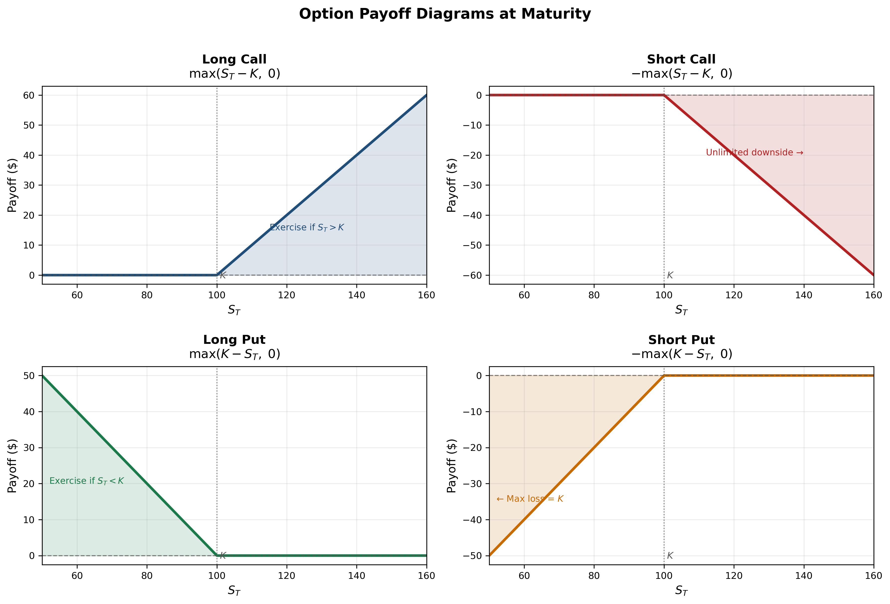
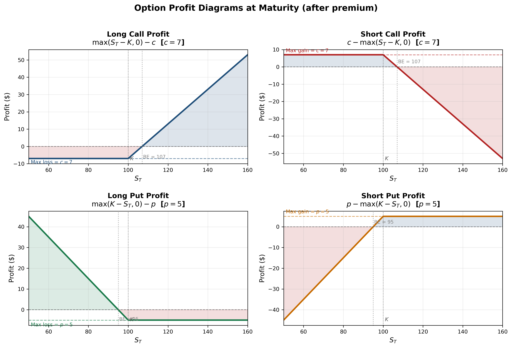
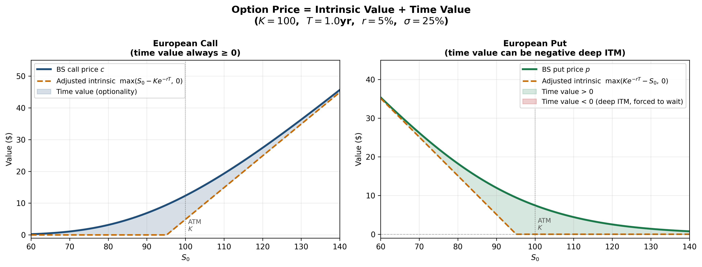
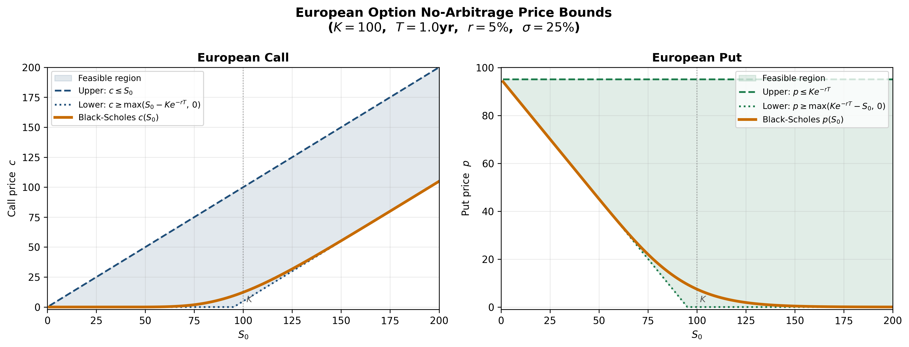
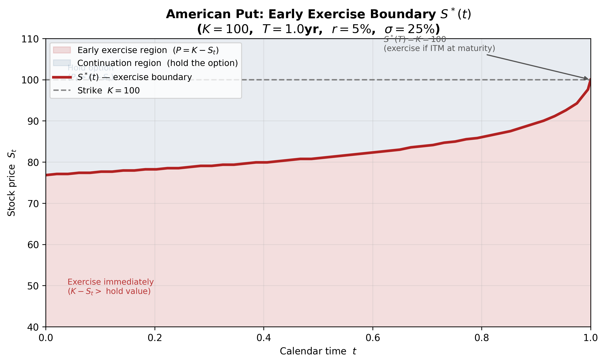
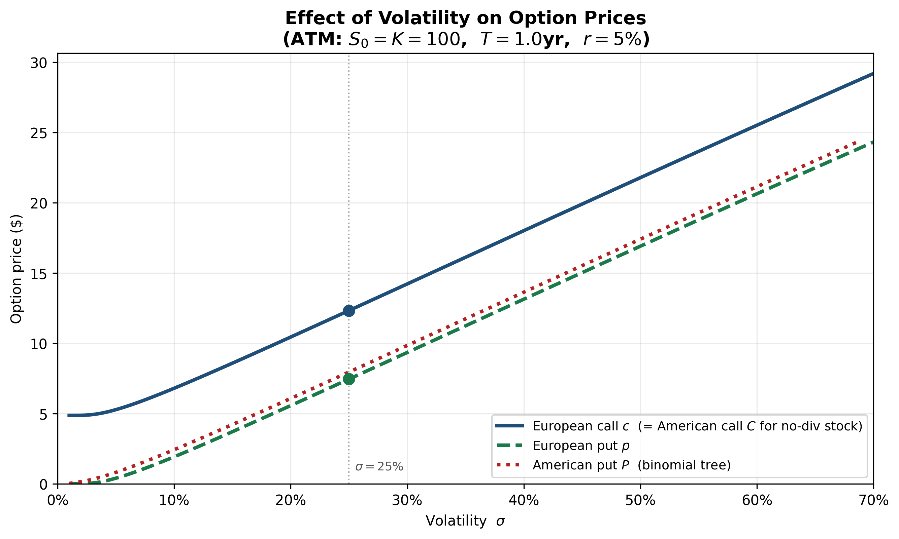
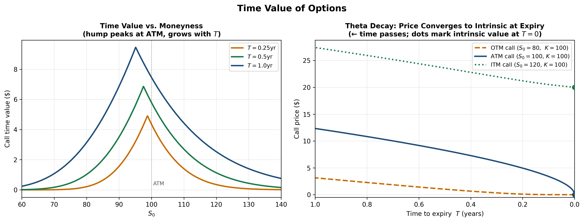

<section class="slide" markdown="1">

# Options: General Properties

**Sukrit Mittal**
Franklin Templeton Investments

</section>

<section class="slide" markdown="1">

## Cases

1. Insurance policy (metaphorically): getting protection against unpleasant price drops.
2. Income generation: by selling options, you can earn premiums.
3. Price discovery: options markets can reveal information about future volatility and market sentiment.
4. Holding flight prices for a day or two, at a premium.

</section>

<section class="slide" markdown="1">

## Outline

1. From forwards to options: the asymmetric payoff
2. Basic definitions and notation
3. Payoff and profit diagrams
4. Moneyness and intrinsic value
5. Put-call parity (European)
6. Put-call inequalities (American)
7. Bounds on European option prices
8. European and American calls on non-dividend-paying stocks
9. Bounds on American option prices
10. Variables determining option prices
11. Time value of options
12. Exercises

</section>

<section class="slide" markdown="1">

## 1. From Forwards to Options

A forward contract **obligates** both parties.

The buyer must buy. The seller must sell.

Symmetry has a cost: both sides bear unlimited risk.

An **option** breaks this symmetry.

One party acquires a **right**. The other accepts an **obligation**.

This asymmetry is purchased. The price is the **premium**.

Forwards are free to enter. Options are not.

Nothing valuable is free.

</section>

<section class="slide" markdown="1">

## 2. Basic Definitions

### Call Option

A **European call option** gives the holder the **right, but not the obligation**, to **buy** the underlying asset at a predetermined price $K$ on a specified date $T$.

### Put Option

A **European put option** gives the holder the **right, but not the obligation**, to **sell** the underlying asset at a predetermined price $K$ on a specified date $T$.

### American Options

An **American call** (or put) gives the same right, but it may be exercised **at any time** on or before $T$, not just at maturity.

The distinction seems minor. **It is not.**

</section>

<section class="slide" markdown="1">

### Notation

Throughout this lecture:

| Symbol | Meaning |
|--------|---------|
| $S_0$ | Current price of the underlying asset |
| $S_T$ | Price of the underlying at maturity |
| $K$ | Strike price (exercise price) |
| $T$ | Time to maturity (in years) |
| $r_f$ | Continuously compounded risk-free rate |
| $c$ | Price (premium) of a European call |
| $p$ | Price (premium) of a European put |
| $C$ | Price (premium) of an American call |
| $P$ | Price (premium) of an American put |

**Convention:** Lowercase for European, uppercase for American.

All options considered here are on a **non-dividend-paying stock** unless stated otherwise.

</section>

<section class="slide" markdown="1">

### The Four Basic Positions

Every option trade has two sides:

**Long call:** Pay premium $c$, acquire the right to buy at $K$

**Short call:** Receive premium $c$, accept the obligation to sell at $K$

**Long put:** Pay premium $p$, acquire the right to sell at $K$

**Short put:** Receive premium $p$, accept the obligation to buy at $K$

The buyer's gain is the seller's loss.

Options are zero-sum contracts between the two counterparties.

</section>

<section class="slide" markdown="1">

## 3. Payoff and Profit

### Call Option Payoff

At maturity, the holder of a European call exercises only if $S_T > K$:
$$
\boxed{\text{Call payoff} = \max(S_T - K, \, 0) = (S_T - K)^+}
$$
If $S_T > K$: exercise, buy at $K$, asset is worth $S_T$. Profit from exercise: $S_T - K$.

If $S_T \leq K$: do not exercise. The option expires worthless.

The payoff is **never negative**. That is the privilege of holding a right.

### Put Option Payoff
$$
\boxed{\text{Put payoff} = \max(K - S_T, \, 0) = (K - S_T)^+}
$$
If $S_T < K$: exercise, sell at $K$, asset is worth only $S_T$. Profit from exercise: $K - S_T$.

If $S_T \geq K$: do not exercise.

</section>

<section class="slide" markdown="1">

*Figure: Payoff at maturity for all four basic option positions ($K = 100$). Long call and long put payoffs are always non-negative — the holder's right is never exercised at a loss. Short positions mirror these with opposite sign.*

</section>

<section class="slide" markdown="1">

### Profit Diagrams

The **profit** accounts for the premium paid:
$$
\text{Long call profit} = \max(S_T - K, \, 0) - c
$$
$$
\text{Long put profit} = \max(K - S_T, \, 0) - p
$$

For short positions, negate:
$$
\text{Short call profit} = c - \max(S_T - K, \, 0)
$$
$$
\text{Short put profit} = p - \max(K - S_T, \, 0)
$$

**Key features:**

* Long call: unlimited upside, limited downside (lose at most $c$)
* Long put: large upside (up to $K - p$ if stock goes to zero), limited downside (lose at most $p$)
* Short call: limited upside (collect premium $c$), **unlimited** downside (stock can rise without bound)
* Short put: limited upside (collect premium $p$), large but **bounded** downside (at most $K - p$, if stock falls to zero)

The asymmetry is the entire point.

</section>

<section class="slide" markdown="1">

*Figure: Profit at maturity for all four positions ($K = 100$, $c = 7$, $p = 5$). Blue shading marks profit zones; red shading marks loss zones. Dashed horizontals indicate the premium collected or paid. Dotted verticals mark the breakeven stock price.*

</section>

<section class="slide" markdown="1">

### Breakeven Points

**Long call breakeven:** $S_T = K + c$

The stock must rise above the strike by at least the premium paid.

**Long put breakeven:** $S_T = K - p$

The stock must fall below the strike by at least the premium paid.

**Example:** A call with $K = 100$ and $c = 7$ breaks even at $S_T = 107$. For $S_T = 115$, the profit is $115 - 100 - 7 = 8$. For $S_T = 95$, the loss is $-7$ (the entire premium).

The premium sets the threshold. Below it, the right has no value.

</section>

<section class="slide" markdown="1">

## 4. Moneyness and Intrinsic Value

### Moneyness

Options are classified by their relationship to the current spot price:

| Status | Call ($S_0$ vs $K$) | Put ($S_0$ vs $K$) |
|--------|-------------------|-------------------|
| **In-the-money (ITM)** | $S_0 > K$ | $S_0 < K$ |
| **At-the-money (ATM)** | $S_0 = K$ | $S_0 = K$ |
| **Out-of-the-money (OTM)** | $S_0 < K$ | $S_0 > K$ |

An ITM option has immediate exercise value.

An OTM option does not.

But an OTM option is not worthless — time remains.

</section>

<section class="slide" markdown="1">

### Intrinsic Value

The **intrinsic value** is the payoff if the option were exercised immediately:
$$
\text{Intrinsic value of call} = \max(S_0 - K, \, 0)
$$

$$
\text{Intrinsic value of put} = \max(K - S_0, \, 0)
$$

Intrinsic value is always non-negative. It measures the "minimum worth" of the option based on current prices.

### Time Value

The **time value** (also called extrinsic value) is the excess of the option price over intrinsic value:
$$
\text{Time value} = \text{Option price} - \text{Intrinsic value}
$$

For a call: $\text{Time value} = c - \max(S_0 - K, \, 0)$

For a put: $\text{Time value} = p - \max(K - S_0, \, 0)$

Time value reflects the **possibility** that the option will become more valuable before expiration. Possibility has a price.

</section>

<section class="slide" markdown="1">

*Figure: Option price decomposed into intrinsic value (lower fill) and time value (upper fill) as a function of $S_0$ ($K=100$, $T=1$yr, $r=5\%$, $\sigma=25\%$). For the European call, time value is always non-negative and peaks at-the-money. For the European put, time value turns negative deep in-the-money (red region) — the cost of being forced to wait rather than exercising now.*

</section>

<section class="slide" markdown="1">

## 5. Put-Call Parity (European Options)

This is one of the most important results in option theory.

It requires **no model** for the stock price.

No assumptions about volatility or distributions.

Only the absence of arbitrage.

### The Two Portfolios

Consider two portfolios constructed at time $0$:

**Portfolio A:** One European call option ($c$) + cash equal to $Ke^{-rT}$

**Portfolio B:** One European put option ($p$) + one share of stock ($S_0$)

We will show that both portfolios have **identical payoffs** at maturity $T$.

Therefore, by the no-arbitrage principle, they must have **identical values** today.

</section>

<section class="slide" markdown="1">

### Payoff Analysis at Maturity

**Portfolio A at time $T$:**

The cash grows to $Ke^{-rT} \cdot e^{rT} = K$.

| Scenario | Call payoff | Cash | Total |
|----------|------------|------|-------|
| $S_T > K$ | $S_T - K$ | $K$ | $S_T$ |
| $S_T \leq K$ | $0$ | $K$ | $K$ |

Portfolio A pays $\max(S_T, K)$.

**Portfolio B at time $T$:**

| Scenario | Put payoff | Stock | Total |
|----------|-----------|-------|-------|
| $S_T > K$ | $0$ | $S_T$ | $S_T$ |
| $S_T \leq K$ | $K - S_T$ | $S_T$ | $K$ |

Portfolio B also pays $\max(S_T, K)$.

</section>

<section class="slide" markdown="1">

### The Parity Relation

Since both portfolios produce the same payoff in every state of the world:
$$
\boxed{c + Ke^{-rT} = p + S_0}
$$

This is **put-call parity** for European options on a non-dividend-paying stock.

Rearranging:
$$
c - p = S_0 - Ke^{-rT}
$$

The difference between a call and a put (same strike, same maturity) equals the difference between the stock price and the present value of the strike.

### Interpretation

* If you know $c$, you can infer $p$ (and vice versa)
* The relationship holds regardless of the stock price model
* Violations imply arbitrage opportunities

Put-call parity is a **consistency condition** that any prices must satisfy.

</section>

<section class="slide" markdown="1">

### Arbitrage When Parity Is Violated

**Case 1:** $c + Ke^{-rT} > p + S_0$

Portfolio A is overpriced relative to Portfolio B.

**Strategy:** Sell Portfolio A, buy Portfolio B.

* Sell the call: receive $c$
* Borrow $Ke^{-rT}$: receive $Ke^{-rT}$ now, repay $K$ at $T$
* Buy the put: pay $p$
* Buy the stock: pay $S_0$

**Net cash flow at $t=0$:** $c + Ke^{-rT} - p - S_0 > 0$

**At maturity:**

If $S_T > K$: call is exercised against you, deliver stock at $K$, repay loan $K$. Put expires. Net: $0$.

If $S_T \leq K$: call expires, exercise put to sell stock at $K$, repay loan $K$. Net: $0$.

Riskless profit of $c + Ke^{-rT} - p - S_0$ at inception.

**Case 2:** $c + Ke^{-rT} < p + S_0$

Reverse every position. Same logic, same conclusion.

</section>

<section class="slide" markdown="1">

### Numerical Example

**Given:** $S_0 = 100$, $K = 105$, $T = 0.5$, $r = 6\%$, $c = 8.00$.

**Find:** The no-arbitrage put price.

From put-call parity:

$$
p = c + Ke^{-rT} - S_0 = 8.00 + 105 \cdot e^{-0.06 \times 0.5} - 100
$$

$$
p = 8.00 + 105 \times 0.9704 - 100 = 8.00 + 101.90 - 100 = 9.90
$$

If the market quotes $p = 10.50$, the put is overpriced.

**Arbitrage:** Sell the put at $10.50$, buy a synthetic put (buy call at $8.00$, short stock at $100$, lend $Ke^{-rT} = 101.90$). Net cash inflow: $10.50 - 9.90 = 0.60$ per share.

</section>

<section class="slide" markdown="1">

## 6. Put-Call Inequalities (American Options)

American options can be exercised early.

This breaks the clean equality of put-call parity.

But inequality constraints survive.

### Why Parity Fails for American Options

The proof of European put-call parity relies on comparing terminal payoffs.

For American options, early exercise creates **additional cash flows** at intermediate dates that depend on the stock price path.

Two portfolios with the same terminal payoff may differ if one component is exercised early.

Equality becomes inequality.

</section>

<section class="slide" markdown="1">

### American Put-Call Inequality

For American options on a non-dividend-paying stock:

$$
\boxed{S_0 - K \leq C - P \leq S_0 - Ke^{-rT}}
$$

### Proof of the Upper Bound:

For a non-dividend-paying stock, early exercise of an American call is never optimal (we prove this in Section 8). Therefore $C = c$.

We already know $c - p = S_0 - Ke^{-rT}$.

Since $P \geq p$ (the American put is at least as valuable as the European put):

$$
C - P = c - P \leq c - p = S_0 - Ke^{-rT}
$$

</section>

<section class="slide" markdown="1">

### Proof of the Lower Bound:

Consider two portfolios:

**Portfolio A:** One American call + cash $K$

**Portfolio B:** One American put + one share

If the put in Portfolio B is exercised early at time $\tau \leq T$, Portfolio B yields $K + $ dividends (but there are none) $= K$. At that moment, Portfolio A is worth at least $C_\tau + Ke^{r\tau} \geq K$ since $C_\tau \geq 0$ and $Ke^{r\tau} \geq K$.

If the put is not exercised early, at maturity both portfolios yield $\max(S_T, K)$ (same as European case). Portfolio A's cash has grown to $Ke^{rT} \geq K$.

In all scenarios, Portfolio A is worth at least as much as Portfolio B:

$$
C + K \geq P + S_0 \implies C - P \geq S_0 - K
$$

</section>

<section class="slide" markdown="1">

## 7. Bounds on European Option Prices

* Every option price must lie within bounds dictated by no-arbitrage.
* These bounds require no model.
* They are consequences of logic alone.

### Upper Bounds

**European call:**
$$
\boxed{c \leq S_0}
$$

A call gives the right to buy the stock. It can never be worth more than the stock itself. If $c > S_0$, sell the call and buy the stock for a riskless profit.

**European put:**
$$
\boxed{p \leq Ke^{-rT}}
$$

A European put pays at most $K$ at maturity. Its present value cannot exceed $Ke^{-rT}$. If $p > Ke^{-rT}$, sell the put and invest the proceeds at the risk-free rate.

</section>

<section class="slide" markdown="1">

### Lower Bound for European Call
$$
\boxed{c \geq \max(S_0 - Ke^{-rT}, \, 0)}
$$
The option price is never negative (a right has non-negative value).

We need to show $c \geq S_0 - Ke^{-rT}$.

**Proof by arbitrage:** Suppose $c < S_0 - Ke^{-rT}$.

**Strategy:** Buy the call at $c$, short the stock at $S_0$, invest $Ke^{-rT}$ at the risk-free rate.

**Cash at $t = 0$:** $S_0 - c - Ke^{-rT} > 0$ (by assumption).

**At maturity ($T$):** The investment grows to $K$.

If $S_T > K$: exercise the call, buy stock at $K$, return to short position. Net: $0$.

If $S_T \leq K$: let call expire, buy stock at $S_T$ to close the short. Net: $K - S_T \geq 0$.

Initial positive cash flow + non-negative terminal payoff = **arbitrage**.

Therefore $c \geq S_0 - Ke^{-rT}$.

</section>

<section class="slide" markdown="1">

### Lower Bound for European Put
$$
\boxed{p \geq \max(Ke^{-rT} - S_0, \, 0)}
$$
**Proof by arbitrage:** Suppose $p < Ke^{-rT} - S_0$.

**Strategy:** Buy the put at $p$, buy the stock at $S_0$, borrow $Ke^{-rT}$ at the risk-free rate.

**Cash at $t = 0$:** $Ke^{-rT} - p - S_0 > 0$ (by assumption).

**At maturity ($T$):** The loan requires repayment of $K$.

If $S_T < K$: exercise the put, sell stock at $K$, repay $K$. Net: $0$.

If $S_T \geq K$: let put expire, sell stock at $S_T$, repay $K$. Net: $S_T - K \geq 0$.

Initial positive cash flow + non-negative terminal payoff = **arbitrage**.

Therefore $p \geq Ke^{-rT} - S_0$.

</section>

<section class="slide" markdown="1">

### Summary of European Bounds

Collecting all results for a non-dividend-paying stock:

**European call:**

$$
\max(S_0 - Ke^{-rT}, \, 0) \leq c \leq S_0
$$

**European put:**

$$
\max(Ke^{-rT} - S_0, \, 0) \leq p \leq Ke^{-rT}
$$

These bounds narrow the possible range of option prices **without any model**.

Any quoted price outside these bounds is an arbitrage opportunity.

Inside these bounds, we need a model (like Black-Scholes) to pin down the exact price.

</section>

<section class="slide" markdown="1">

*Figure: The shaded region shows the feasible price range for European calls (left) and puts (right) as a function of $S_0$. The Black-Scholes price (orange) threads inside the band. Any price outside the band implies an arbitrage opportunity. ($K=100$, $T=1$yr, $r=5\%$, $\sigma=25\%$)*

</section>

<section class="slide" markdown="1">

### Numerical Example: European Bounds

**Given:** $S_0 = 50$, $K = 48$, $T = 0.25$, $r = 5\%$.

**Call bounds:**
$$
\text{Lower:} \quad S_0 - Ke^{-rT} = 50 - 48 \cdot e^{-0.05 \times 0.25} = 50 - 48 \times 0.9876 = 50 - 47.40 = 2.60
$$
$$
\text{Upper:} \quad S_0 = 50
$$
So $2.60 \leq c \leq 50$.

**Put bounds:**
$$
\text{Lower:} \quad Ke^{-rT} - S_0 = 47.40 - 50 = -2.60 \implies \max(-2.60, \, 0) = 0
$$
$$
\text{Upper:} \quad Ke^{-rT} = 47.40
$$
So $0 \leq p \leq 47.40$.

The call lower bound of $2.60$ is tight — it represents the **minimum** a rational market would charge.

</section>

<section class="slide" markdown="1">

## 8. European and American Calls on Non-Dividend-Paying Stocks

This section contains one of the most elegant results in option theory.

### Theorem: Early Exercise of American Calls Is Never Optimal

For a non-dividend-paying stock:

$$
\boxed{C = c}
$$

An American call on a non-dividend-paying stock is worth exactly the same as a European call.

The right to exercise early has **zero value**.

This is counterintuitive. Let us prove it.

</section>

<section class="slide" markdown="1">

### Proof: Why Early Exercise Destroys Value

Suppose the American call is deep in-the-money at time $t < T$, with stock price $S_t \gg K$.

**If you exercise:** You receive $S_t - K$ immediately.

**If you do not exercise:** You hold an option worth at least $c_t \geq S_t - Ke^{-r(T-t)}$.

Compare the two:
$$
S_t - Ke^{-r(T-t)} > S_t - K
$$
since $Ke^{-r(T-t)} < K$ for $r > 0$ and $T - t > 0$.

**The option alive is worth more than the option dead.**

By holding rather than exercising, you:

1. **Defer payment** of $K$ — keeping $K$ invested at rate $r$ until maturity
2. **Retain insurance** — if the stock crashes before $T$, you can walk away losing only the premium

Early exercise sacrifices both the time value of money and the insurance value. No rational agent does this.

</section>

<section class="slide" markdown="1">

### Formal Argument

Since early exercise is never optimal, the American call will always be held to maturity and exercised (or not) at time $T$ — exactly like a European call. Therefore:
$$
C = c
$$
and the lower bound for the American call is:
$$
C \geq \max(S_0 - Ke^{-rT}, \, 0)
$$
This is **strictly greater** than the intrinsic value $\max(S_0 - K, \, 0)$ whenever $r > 0$ and $T > 0$.

An American call on a non-dividend-paying stock should never be exercised early.

It should never trade below $S_0 - Ke^{-rT}$.

### What Changes with Dividends?

* If the stock pays dividends before $T$, the stock price drops on the ex-dividend date.
* This drop is a **cost of waiting** that does not affect the option holder.
* Early exercise may then become optimal — specifically, just before an ex-dividend date.
* Dividends break the result. Without them, it holds unconditionally.

</section>

<section class="slide" markdown="1">

## 9. Bounds on American Option Prices

American options inherit all European bounds and add more, because early exercise can only **add** value.

### Relation to European Prices

Since an American option can do everything a European option can (and more):
$$
C \geq c, \qquad P \geq p
$$

The American premium is at least as large as the European premium.

### American Call (Non-Dividend-Paying Stock)

From Section 8, $C = c$. So:
$$
\max(S_0 - Ke^{-rT}, \, 0) \leq C \leq S_0
$$

The bounds are the same as European.

</section>

<section class="slide" markdown="1">

### American Put: Early Exercise Can Be Optimal

Unlike calls, **American puts may be exercised early** — even without dividends.

**Intuition:** Suppose $S_t = 0$ (the stock is worthless). The put payoff from immediate exercise is $K$. Waiting until $T$ gives $K$ at maturity, whose present value is $Ke^{-r(T-t)} < K$.

You collect $K$ now and invest it at the risk-free rate, earning $K(e^{r(T-t)} - 1)$ in interest.

Waiting has an **opportunity cost** when the put is deep in-the-money.

The stock cannot fall below zero, so the put's payoff cannot improve by waiting — holding provides no additional insurance.

### Bounds on American Put

Since early exercise is possible:
$$
\boxed{\max(K - S_0, \, 0) \leq P \leq K}
$$
The lower bound uses $K - S_0$ (not $Ke^{-rT} - S_0$), because you can exercise now and receive $K - S_0$ immediately.

The upper bound is $K$ (not $Ke^{-rT}$), because immediate exercise yields at most $K$ when $S_0 = 0$.

</section>

<section class="slide" markdown="1">

### American Put: The Early Exercise Boundary

At any time $t$, there exists a critical stock price $S^*(t)$ below which immediate exercise is optimal.

**Optimal exercise condition:** Exercise the American put at time $t$ if:

$$
K - S_t \geq P_t(S_t)
$$

where $P_t(S_t)$ is the value of the put if held alive. The critical price $S^*(t)$ satisfies:

$$
K - S^*(t) = P_t(S^*(t))
$$

Below $S^*(t)$: the intrinsic value exceeds the continuation value. Exercise immediately.

Above $S^*(t)$: the continuation value (including insurance) exceeds the intrinsic value. Keep holding.

**Properties of $S^*(t)$:**

* $S^*(T) = K$ (at maturity, exercise whenever ITM)
* $S^*(t) < K$ for $t < T$ (before maturity, some ITM puts should not be exercised)
* $S^*(t)$ increases as $t \to T$ (the exercise boundary converges to $K$)

The American put premium exceeds the European put premium precisely because of this early exercise right:

$$
P - p \geq 0
$$

with strict inequality whenever there is a positive probability of optimal early exercise.

*Figure: The early exercise boundary $S^*(t)$ for an American put ($K=100$, $T=1$yr, $r=5\%$, $\sigma=25\%$). Below the curve (red), the intrinsic value exceeds the continuation value — exercise immediately. Above the curve (blue), it is optimal to keep holding the option. The boundary converges to $K$ at maturity ($S^*(T) = K$).*

</section>

<section class="slide" markdown="1">

### Summary: European vs American Bounds

| Option | Lower Bound | Upper Bound |
|--------|-------------|-------------|
| European call | $\max(S_0 - Ke^{-rT}, \, 0)$ | $S_0$ |
| European put | $\max(Ke^{-rT} - S_0, \, 0)$ | $Ke^{-rT}$ |
| American call (no div) | $\max(S_0 - Ke^{-rT}, \, 0)$ | $S_0$ |
| American put | $\max(K - S_0, \, 0)$ | $K$ |

Note the difference in the put bounds:

* European put lower bound involves the **present value** $Ke^{-rT}$
* American put lower bound involves $K$ directly (because you can exercise now)

Similarly for upper bounds:

* European put upper bound: $Ke^{-rT}$ (payment only at $T$)
* American put upper bound: $K$ (exercise any time)

</section>

<section class="slide" markdown="1">

## 10. Variables Determining Option Prices

Six variables affect option prices. Understanding their directional effects requires no model — only arbitrage reasoning and economic intuition.

### The Six Variables

1. **Current stock price** $S_0$
2. **Strike price** $K$
3. **Time to maturity** $T$
4. **Risk-free interest rate** $r$
5. **Volatility of the stock** $\sigma$
6. **Dividends** expected during the life of the option

We analyze each in turn for European and American options.

</section>

<section class="slide" markdown="1">

### Effect of Stock Price $S_0$

**Calls** (European and American): **Increasing** in $S_0$.

A higher stock price means the call is more likely to finish in-the-money.

For European calls, the lower bound $S_0 - Ke^{-rT}$ increases with $S_0$.

**Puts** (European and American): **Decreasing** in $S_0$.

A higher stock price makes the put less likely to have value at expiry.

These are the most intuitive effects. If you are paying for the right to buy, you want the asset to be expensive at maturity. A higher starting point helps.

</section>

<section class="slide" markdown="1">

### Effect of Strike Price $K$

**Calls:** **Decreasing** in $K$.

A higher strike means you must pay more upon exercise. The right to buy at $100$ is more valuable than the right to buy at $110$.

For two European calls with strikes $K_1 < K_2$:

$$
c(K_1) \geq c(K_2)
$$

**Proof:** At maturity, $(S_T - K_1)^+ \geq (S_T - K_2)^+$ for all $S_T$. By no-arbitrage, the present value of the larger payoff is at least as large.

**Puts:** **Increasing** in $K$.

A higher strike means you can sell at a higher price. The right to sell at $110$ is more valuable than the right to sell at $100$.

</section>

<section class="slide" markdown="1">

### Effect of Time to Maturity $T$

**American options** (calls and puts): **Non-decreasing** in $T$.

An American option with longer maturity can do everything a shorter-maturity option can — it has the same exercise rights plus more. Therefore:

$$
C(T_2) \geq C(T_1), \quad P(T_2) \geq P(T_1) \quad \text{for } T_2 > T_1
$$

**European options:** The effect is **generally positive but not guaranteed**.

A European option can only be exercised at maturity. A longer-maturity European option cannot replicate a shorter-maturity one (it cannot be exercised at the earlier date).

For European calls on non-dividend-paying stocks, the effect is unambiguously positive (since $C = c$ and $C$ is non-decreasing in $T$).

For European puts, longer maturity means the present value of the strike $Ke^{-rT}$ is lower. This discounting effect can sometimes dominate, making the European put less valuable despite having more time.

</section>

<section class="slide" markdown="1">

### Effect of Risk-Free Rate $r$

**Calls** (European and American): **Increasing** in $r$.

A higher rate reduces the present value of the strike payment $Ke^{-rT}$.

Buying the stock via a call effectively defers payment. Higher rates make deferral more valuable.

From the lower bound: $c \geq S_0 - Ke^{-rT}$, which increases with $r$.

**Puts** (European and American): **Decreasing** in $r$.

A higher rate reduces the present value of the strike received upon exercise.

Selling the stock via a put defers the receipt of $K$. Higher rates make this deferral more costly.

### Effect of Volatility $\sigma$

**All options** (European and American, calls and puts): **Increasing** in $\sigma$.

Higher volatility means larger potential price swings in both directions.

The option holder benefits from favorable swings (captures upside) and is protected from adverse swings (can walk away).

More volatility = more extreme outcomes = more valuable insurance.

This is the single most important variable in option pricing.

*Figure: All four option types increase monotonically in volatility $\sigma$ (ATM: $S_0 = K = 100$, $T=1$yr, $r=5\%$). The European call equals the American call for a non-dividend-paying stock. The American put price (binomial tree) sits above the European put due to the early exercise premium, with the gap widening at lower volatilities.*

</section>

<section class="slide" markdown="1">

### Effect of Dividends

Dividends reduce the stock price on the ex-dividend date.

**Calls:** **Decreasing** in expected dividends.

A lower stock price reduces the call's expected payoff.

**Puts:** **Increasing** in expected dividends.

A lower stock price increases the put's expected payoff.

For a stock paying known dividends with present value $D$ during the option's life, put-call parity generalizes to:

$$
c + Ke^{-rT} = p + S_0 - D
$$

The stock price is effectively replaced by $S_0 - D$ (the stock price net of the present value of dividends).

</section>

<section class="slide" markdown="1">

### Summary Table: Effect of Variables on Option Prices

| Variable | European Call $c$ | European Put $p$ | American Call $C$ | American Put $P$ |
|----------|:-:|:-:|:-:|:-:|
| $S_0 \uparrow$ | $+$ | $-$ | $+$ | $-$ |
| $K \uparrow$ | $-$ | $+$ | $-$ | $+$ |
| $T \uparrow$ | $+^*$ | $?$ | $+$ | $+$ |
| $r \uparrow$ | $+$ | $-$ | $+$ | $-$ |
| $\sigma \uparrow$ | $+$ | $+$ | $+$ | $+$ |
| Dividends $\uparrow$ | $-$ | $+$ | $-$ | $+$ |

$+^*$: Positive for non-dividend-paying stocks; generally positive but not guaranteed otherwise.

$?$: The effect can go either way (discounting vs. optionality).

Memorizing this table is unnecessary.

Understanding the economics behind each entry is sufficient.

</section>

<section class="slide" markdown="1">

## 11. Time Value of Options

### Decomposition

Every option price can be decomposed:

$$
\boxed{\text{Option price} = \text{Intrinsic value} + \text{Time value}}
$$

The standard practitioner definition (Section 4) uses $\max(S_0 - K, 0)$ for a call. However, for European options it is more natural to use the **adjusted intrinsic value** $\max(S_0 - Ke^{-rT}, 0)$, which accounts for the fact that the strike is paid at maturity, not today:

$$
c = \underbrace{\max(S_0 - Ke^{-rT}, \, 0)}_{\text{adjusted intrinsic value}} + \underbrace{(c - \max(S_0 - Ke^{-rT}, \, 0))}_{\text{time value}}
$$

With this adjusted definition, time value is always non-negative for European calls on non-dividend-paying stocks (this follows directly from the lower bound $c \geq S_0 - Ke^{-rT}$).

Note: under the standard definition, time value $c - \max(S_0 - K, 0)$ is also non-negative for European calls, since $S_0 - Ke^{-rT} \geq S_0 - K$ when $r \geq 0$. The two definitions agree on the sign; the adjusted version simply gives a tighter decomposition.

</section>

<section class="slide" markdown="1">

### Behavior of Time Value

**At-the-money options** have the **maximum time value**.

**Intuition:** An ATM option is poised on the boundary between exercise and non-exercise. Small price movements in either direction have large effects on whether the option finishes ITM. This uncertainty is most valuable when the option is at-the-money.

**Deep ITM and deep OTM options** have **minimal time value**.

* Deep ITM: the option will almost certainly be exercised. Its value converges to the (discounted) intrinsic value. There is little optionality remaining.
* Deep OTM: the option will almost certainly expire worthless. Its value converges to zero. There is little chance of recovery.

The time value is a **hump-shaped** function of moneyness, peaking at ATM.

*Figure — Left: Call time value as a function of $S_0$ for three maturities. The hump peaks at-the-money and grows with $T$. — Right: Theta decay — call price as time to expiry shrinks to zero (time flows left to right). The ATM call loses time value fastest near expiry; OTM and ITM calls converge more gradually. Dots mark each option's intrinsic value at $T=0$.*

</section>

<section class="slide" markdown="1">

### Time Decay

As $T \to 0$, time value decays to zero.

At expiration, there is no time left and no possibility of favorable price movements:

$$
\lim_{T \to 0} \text{Time value} = 0
$$

The option price converges to its intrinsic value:

$$
c \to \max(S_T - K, \, 0), \quad p \to \max(K - S_T, \, 0)
$$

**Key properties of time decay:**

1. Time decay is **non-linear**: most time value is lost near expiration
2. ATM options lose time value fastest as expiration approaches
3. Deep ITM and deep OTM options lose time value slowly (there is little to lose)

In options trading, this is called **theta** — the rate of change of option price with respect to time:

$$
\Theta = \frac{\partial V}{\partial t}
$$

For most long positions, $\Theta < 0$ — the option loses value as time passes, all else being equal.

**Exception:** Deep ITM European puts can have $\Theta > 0$. Their value is approximately $Ke^{-r(T-t)} - S_t$, which *increases* as $t$ advances because the discounting penalty shrinks. This is consistent with their negative time value — the passage of time brings them closer to collecting $K$, which is beneficial.

For long calls on non-dividend-paying stocks, $\Theta < 0$ always holds.

Time is generally the enemy of the option buyer.

Time is generally the ally of the option seller.

</section>

<section class="slide" markdown="1">

### Time Value and No-Arbitrage

The no-arbitrage lower bound for a European call can be rewritten:

$$
c \geq S_0 - Ke^{-rT} = (S_0 - K) + K(1 - e^{-rT})
$$

The first term is the traditional intrinsic value.

The second term $K(1 - e^{-rT})$ represents the **interest advantage** of deferring payment of the strike.

This decomposition shows that even for a deep ITM call, the time value has two components:

1. **Insurance value:** the possibility that $S_T$ may fall below $K$
2. **Interest value:** the benefit of paying $K$ later rather than now

As $T \to 0$, both components vanish: there is no time for the stock to move, and no time to earn interest on $K$.

As $T \to \infty$, the call value approaches $S_0$ (since $Ke^{-rT} \to 0$), and time value converges to $\min(S_0, K)$ — large, but bounded. A perpetual call is valuable, but its value never exceeds the stock price.

</section>

<section class="slide" markdown="1">

### European Put: Time Value Subtlety

For European puts, time value can be **negative** for deep ITM options.

Consider a European put with $S_0 \ll K$. The intrinsic value is approximately $K - S_0$.

But the European put price satisfies:

$$
p \leq Ke^{-rT}
$$

For a deep ITM put, the intrinsic value $K - S_0$ can exceed $Ke^{-rT}$ when $S_0$ is very small:

$$
K - S_0 > Ke^{-rT} \quad \Leftrightarrow \quad S_0 < K(1 - e^{-rT})
$$

In this region, the European put trades **below its intrinsic value** — its time value is negative.

**Why?** The European put cannot be exercised until $T$. Even though the stock is nearly worthless, the holder cannot collect $K$ until maturity. The present value of this delayed payment is $Ke^{-rT} < K$.

This is precisely the situation where an **American** put would be exercised early. The American put holder collects $K$ now, invests it, and avoids the discounting penalty.

Negative time value for European puts is not a paradox.

It is the cost of being forced to wait.

</section>

<section class="slide" markdown="1">

## Final Takeaways

* **Options introduce asymmetric payoffs**
  * The buyer pays a premium for the right to choose
  * Payoff: $\max(S_T - K, 0)$ for calls, $\max(K - S_T, 0)$ for puts
  * Asymmetry is the defining feature separating options from forwards

* **Put-call parity is a model-free consistency condition**
  * European: $c + Ke^{-rT} = p + S_0$
  * Violations imply arbitrage
  * American options satisfy inequalities: $S_0 - K \leq C - P \leq S_0 - Ke^{-rT}$

* **No-arbitrage bounds constrain option prices without any model**
  * European call: $\max(S_0 - Ke^{-rT}, 0) \leq c \leq S_0$
  * European put: $\max(Ke^{-rT} - S_0, 0) \leq p \leq Ke^{-rT}$
  * American bounds differ because of early exercise

* **Early exercise of American calls on non-dividend-paying stocks is never optimal**
  * $C = c$ — the early exercise right has zero value
  * Exercising sacrifices both time value of money and insurance
  * Dividends change this conclusion

* **American puts may be exercised early**
  * Deep ITM puts benefit from collecting $K$ now rather than waiting
  * An early exercise boundary $S^*(t)$ separates the exercise and continuation regions

* **Six variables determine option prices**
  * $S_0$, $K$, $T$, $r$, $\sigma$, and dividends
  * Volatility is the most important — it always increases option value

* **Time value reflects optionality and decays to zero at maturity**
  * Maximum at ATM, minimal deep ITM/OTM
  * Non-linear decay accelerates near expiration
  * European puts can have negative time value (cost of forced waiting)

Next lecture: **Option pricing** — the Black-Scholes framework and the mathematics of replication under uncertainty.

</section>

<section class="slide" markdown="1">

## 12. Exercises

### Exercise 1: Payoffs and Profit

A European call on stock XYZ has $K = 65$ and premium $c = 4.50$.

**Tasks:**
1. Compute the payoff and profit for $S_T \in \{55, 60, 65, 70, 75, 80\}$
2. What is the breakeven stock price?
3. What is the maximum loss for the call buyer?
4. What is the maximum loss for the call seller?

</section>

<section class="slide" markdown="1">

### Exercise 2: Put-Call Parity

A non-dividend-paying stock has $S_0 = 42$. European options with $K = 40$ and $T = 0.5$ are available. The risk-free rate is $r = 8\%$ (continuously compounded). The European call trades at $c = 5.50$.

**Tasks:**
1. Use put-call parity to determine the European put price $p$
2. If the market quotes $p = 2.00$, describe the arbitrage strategy in detail
3. Compute the arbitrage profit per share

</section>

<section class="slide" markdown="1">

### Exercise 3: European Bounds

Consider a non-dividend-paying stock with $S_0 = 90$, $K = 85$, $T = 1$, $r = 4\%$.

**Tasks:**
1. Compute the lower and upper bounds for the European call price
2. Compute the lower and upper bounds for the European put price
3. A broker quotes $c = 4.00$. Show that this violates the lower bound and describe the arbitrage
4. Verify that your arbitrage generates a non-negative payoff in every scenario

</section>

<section class="slide" markdown="1">

### Exercise 4: Early Exercise

An American call on a non-dividend-paying stock has $K = 50$, $T = 3$ months, $r = 10\%$, $S_0 = 62$.

**Tasks:**
1. Compute the lower bound for this call
2. What would the holder receive from immediate exercise?
3. Show that the lower bound exceeds the immediate exercise value
4. Explain economically why early exercise is suboptimal

</section>

<section class="slide" markdown="1">

### Exercise 5: American Put-Call Inequality

For a non-dividend-paying stock: $S_0 = 55$, $K = 50$, $T = 0.25$, $r = 6\%$. An American call is priced at $C = 8.00$.

**Tasks:**
1. State the American put-call inequality
2. Compute the upper and lower bounds for $C - P$
3. Determine the range of no-arbitrage prices for the American put $P$
4. If $P = 1.50$, check whether the inequality is satisfied

</section>

<section class="slide" markdown="1">

### Exercise 6: Variables and Option Prices

A European call on a non-dividend-paying stock is currently priced at $c = 6.00$, with $S_0 = 100$, $K = 100$, $T = 0.5$, $r = 5\%$, $\sigma = 25\%$.

For each of the following changes (taken independently), state whether the call price increases, decreases, or is ambiguous, and explain why:

1. $S_0$ increases to $105$
2. $K$ increases to $105$
3. $T$ increases to $1.0$
4. $r$ increases to $8\%$
5. $\sigma$ increases to $35\%$
6. The stock announces a dividend of $\$2$ payable in 3 months

</section>

<section class="slide" markdown="1">

### Exercise 7: Time Value Analysis

A European put has $K = 100$, $T = 1$, $r = 6\%$.

**Tasks:**
1. Compute the European put upper bound $Ke^{-rT}$
2. For $S_0 = 2$, compute the intrinsic value $K - S_0$ and compare to the upper bound. Is time value negative?
3. For $S_0 = 98$ (near ATM), would you expect time value to be positive or negative? Explain.
4. Explain why an American put holder would exercise early in the situation from part 2

</section>

<section class="slide" markdown="1">

### Exercise 8: Proving a Bound

Prove that for European call options on a non-dividend-paying stock with strikes $K_1 < K_2$:

$$
c(K_1) - c(K_2) \leq (K_2 - K_1)e^{-rT}
$$

**Hint:** Consider a portfolio that is long one call with strike $K_1$, short one call with strike $K_2$, and analyze the maximum payoff at maturity.

**Tasks:**
1. Write the payoff of this portfolio at maturity for each scenario ($S_T < K_1$, $K_1 \leq S_T < K_2$, $S_T \geq K_2$)
2. Show that the payoff never exceeds $K_2 - K_1$
3. Conclude the bound using no-arbitrage pricing
4. Interpret this result: what does it say about how fast call prices decrease with strike?

</section>

