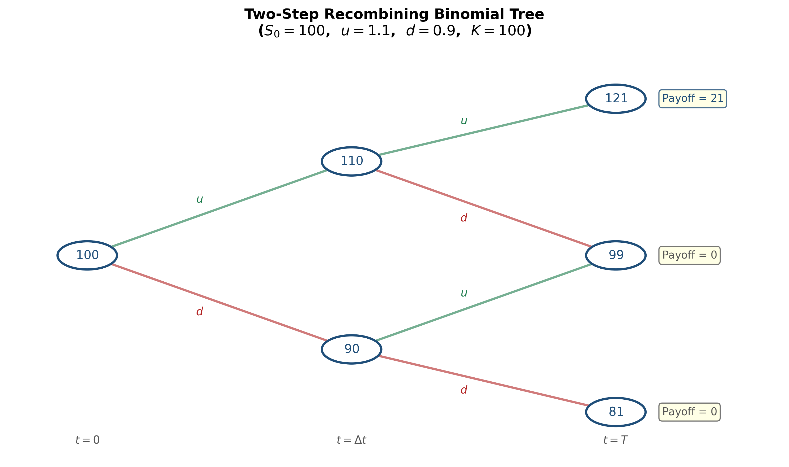
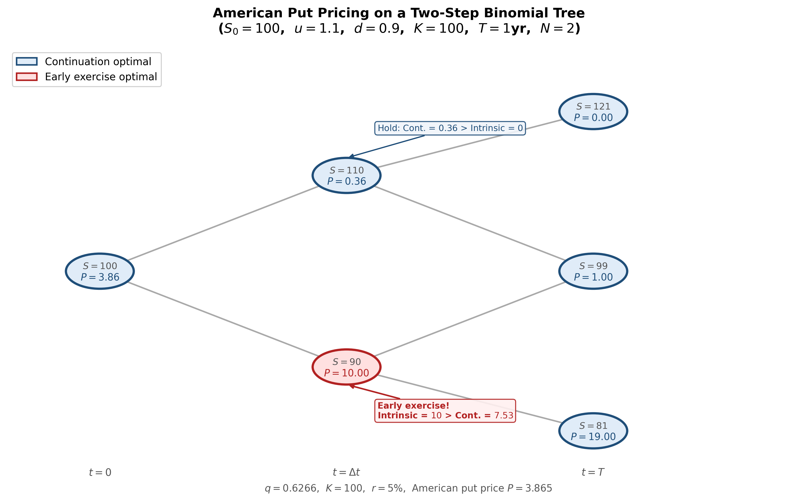
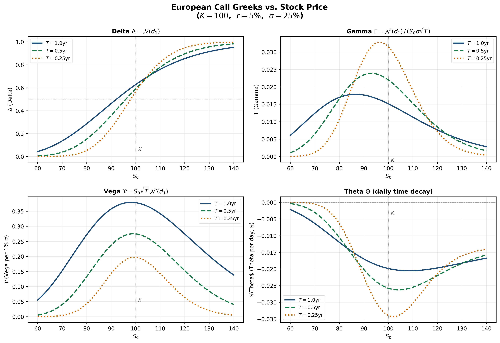

<section class="slide" markdown="1">

# Option Pricing

**Sukrit Mittal**
Franklin Templeton Investments

</section>

<section class="slide" markdown="1">

## Outline

1. Recap: replication in the one-step binomial model
2. Risk-neutral pricing: the key insight
3. Two-step binomial trees
4. General $N$-step binomial model
5. The Cox-Ross-Rubinstein (CRR) formula
6. American options in the binomial tree
7. From discrete to continuous: the Black-Scholes formula
8. Black-Scholes: interpretation and Greeks
9. Exercises

</section>

<section class="slide" markdown="1">

## 1. Recap: Replication in the One-Step Binomial Model

In Lecture 2, we priced a call option by **replication** — constructing a portfolio of stocks and bonds that matches the option's payoff in every state, then invoking no-arbitrage.

### Setup

One period: $t = 0$ to $t = T$. Two assets:

* **Stock:** Current price $S_0$, future price $S_0 u$ (up) or $S_0 d$ (down), with $d < u$.
* **Bond:** Grows from $1$ to $e^{rT}$ (or $1 + r_F$ in discrete compounding).

A derivative pays $f_u$ in the up state and $f_d$ in the down state.

We seek a replicating portfolio $(x, y)$: hold $x$ shares of stock and $y$ dollars in bonds.
$$
\begin{cases}
x \cdot S_0 u + y \cdot e^{rT} = f_u \\
x \cdot S_0 d + y \cdot e^{rT} = f_d
\end{cases}
$$

Two equations, two unknowns. The solution is unique (since $u \neq d$).

</section>

<section class="slide" markdown="1">

### Solution by Replication

Subtracting the second equation from the first:
$$
\boxed{x = \frac{f_u - f_d}{S_0 u - S_0 d} = \frac{f_u - f_d}{S_0(u - d)}}
$$

The quantity $x$ is the **hedge ratio** of the option — the number of shares needed to replicate it. (In later sections, we will call this the option's **delta**.)

Substituting back:
$$
y = e^{-rT}(f_u - x \cdot S_0 u) = e^{-rT}\left(\frac{u \, f_d - d \, f_u}{u - d}\right)
$$

The derivative price at $t = 0$ is the cost of the replicating portfolio:
$$
f = x \cdot S_0 + y
$$

This was the method used in Lecture 2. It works perfectly. But for multi-step trees, solving simultaneous equations at every node becomes unwieldy. We need a more elegant approach.

</section>

<section class="slide" markdown="1">

## 2. Risk-Neutral Pricing: The Key Insight

Let us rearrange the replication price algebraically. Substituting $x$ and $y$ into $f = x S_0 + y$:
$$
f = \frac{f_u - f_d}{u - d} + e^{-rT}\left(\frac{u \, f_d - d \, f_u}{u - d}\right)
$$

Combining over the common denominator $u - d$:
$$
f = e^{-rT}\left[\frac{e^{rT} - d}{u - d} \cdot f_u + \frac{u - e^{rT}}{u - d} \cdot f_d\right]
$$

Define:
$$
\boxed{q = \frac{e^{rT} - d}{u - d}}
$$

Then:
$$
\boxed{f = e^{-rT}\left[q \, f_u + (1 - q) \, f_d\right]}
$$

This is a **discounted expectation** — but under what probability?

</section>

<section class="slide" markdown="1">

### The Risk-Neutral Probability

The quantity $q$ is called the **risk-neutral probability** (or equivalent martingale probability).

**Is $q$ a valid probability?** We need $0 < q < 1$.

From $q = \frac{e^{rT} - d}{u - d}$:

* $q > 0$ requires $e^{rT} > d$
* $q < 1$ requires $e^{rT} < u$

Together: $d < e^{rT} < u$, which is precisely the **no-arbitrage condition** from Lecture 2.

Under the no-arbitrage condition, $q$ is a well-defined probability on $\{u, d\}$.

### What does $q$ represent?

Under the risk-neutral probability $q$, the **expected return on the stock equals the risk-free rate**:
$$
q \cdot S_0 u + (1 - q) \cdot S_0 d = S_0 \cdot \left[q \, u + (1-q) \, d\right] = S_0 \, e^{rT}
$$
Verify: $q \, u + (1-q) \, d = \frac{(e^{rT} - d) \, u + (u - e^{rT}) \, d}{u - d} = \frac{e^{rT}(u - d)}{u - d} = e^{rT}$. $\checkmark$

</section>

<section class="slide" markdown="1">

### Interpretation

Under the risk-neutral measure $\mathbb{Q}$:

* Every asset earns the risk-free rate in expectation
* The stock price is a **martingale** after discounting: $S_0 = e^{-rT} \, \mathbb{E}^{\mathbb{Q}}[S_T]$
* No investor demands a risk premium — hence the name "risk-neutral"

The real-world probability $p$ (which determines how likely the stock is to go up) **does not appear anywhere** in the pricing formula.

This is remarkable. Two investors who disagree completely about the probability of the stock rising will nevertheless agree on the option price — because the price is determined by **replication**, not by expectations about the future.

The risk-neutral probability $q$ is not a belief about the world. It is a mathematical device extracted from the no-arbitrage condition.

### The Pricing Recipe

To price any derivative in a one-step binomial model:

1. Compute $q = \frac{e^{rT} - d}{u - d}$
2. Compute $f = e^{-rT}[q \, f_u + (1 - q) \, f_d]$

No need to solve simultaneous equations. This scales beautifully to multi-step trees.

</section>

<section class="slide" markdown="1">

### Numerical Example

**Given:** $S_0 = 100$, $u = 1.2$, $d = 0.8$, $r = 10\%$, $T = 1$ year.

Price a European call with $K = 100$.

**Step 1:** Risk-neutral probability:
$$
q = \frac{e^{0.10} - 0.8}{1.2 - 0.8} = \frac{1.1052 - 0.8}{0.4} = \frac{0.3052}{0.4} = 0.7629
$$

**Step 2:** Payoffs:
$$
f_u = \max(120 - 100, 0) = 20, \qquad f_d = \max(80 - 100, 0) = 0
$$

**Step 3:** Price:
$$
c = e^{-0.10}[0.7629 \times 20 + 0.2371 \times 0] = e^{-0.10} \times 15.258 = 0.9048 \times 15.258 = 13.81
$$

Compare with the replication method from Lecture 2 (which gave $13.64$ for slightly different parameters). The logic is the same; the computation is simpler.

</section>

<section class="slide" markdown="1">

### Why Not Just Use Real Probabilities?

A natural question: why not compute $\mathbb{E}^p[\text{payoff}]$ under the real probability $p$ and discount?

Consider the same example with $p = 0.6$:
$$
\mathbb{E}^p[\text{payoff}] = 0.6 \times 20 + 0.4 \times 0 = 12
$$

$$
e^{-0.10} \times 12 = 10.86
$$
This gives a **different** (and wrong) answer. The error is that discounting at the risk-free rate is only correct when the cash flows are risk-free. Option payoffs are risky — they should be discounted at a **risk-adjusted** rate. But what is that rate?

We would need to know the option's beta, the market risk premium, and so on. This is circular and impractical.

The risk-neutral approach sidesteps the problem entirely: by adjusting the probabilities (from $p$ to $q$), we account for risk preferences implicitly, and discounting at the risk-free rate becomes correct.
$$
\text{True price} = e^{-rT} \, \mathbb{E}^{\mathbb{Q}}[\text{payoff}] = e^{-\mu T} \, \mathbb{E}^{p}[\text{payoff}]
$$

where $\mu$ is the unknown risk-adjusted discount rate. The left-hand side is computable; the right-hand side is not.

</section>

<section class="slide" markdown="1">

## 3. Two-Step Binomial Trees

### Setup

Divide $[0, T]$ into two equal steps of length $\Delta t = T/2$.

At each step, the stock price moves up by factor $u$ or down by factor $d$.

After two steps, three possible stock prices:

$$
S_{uu} = S_0 u^2, \qquad S_{ud} = S_0 u d, \qquad S_{dd} = S_0 d^2
$$

Note: $S_{ud} = S_{du}$ — the tree **recombines**. This is crucial for computational efficiency.

*Figure: Two-step recombining binomial tree. The stock starts at $S_0$ and branches at each node. After two steps, three distinct terminal prices emerge.*

</section>

<section class="slide" markdown="1">

### Backward Induction

The key to multi-step trees is **backward induction**: price the derivative by working backwards from maturity to the present, one step at a time.

**At maturity ($t = T$):** The derivative payoffs are known:
$$
f_{uu} = g(S_0 u^2), \qquad f_{ud} = g(S_0 u d), \qquad f_{dd} = g(S_0 d^2)
$$
where $g(\cdot)$ is the payoff function (e.g., $g(S) = \max(S - K, 0)$ for a call).

**At $t = \Delta t$:** Apply one-step risk-neutral pricing at each intermediate node.

If the stock is at $S_0 u$ (the up node):
$$
f_u = e^{-r \Delta t}[q \, f_{uu} + (1-q) \, f_{ud}]
$$
If the stock is at $S_0 d$ (the down node):
$$
f_d = e^{-r \Delta t}[q \, f_{ud} + (1-q) \, f_{dd}]
$$
**At $t = 0$:** Apply one more step:
$$
f = e^{-r \Delta t}[q \, f_u + (1-q) \, f_d]
$$
Each step uses the **same** risk-neutral probability $q = \frac{e^{r \Delta t} - d}{u - d}$, because the tree has the same $u$, $d$, $r$ at every node.

</section>

<section class="slide" markdown="1">

### Numerical Example: Two-Step Call

**Given:** $S_0 = 100$, $u = 1.1$, $d = 0.9$, $r = 5\%$, $T = 1$ year (two steps of $\Delta t = 0.5$). European call with $K = 100$.

**Step 1:** Stock prices at maturity:
$$
S_{uu} = 100 \times 1.1^2 = 121, \quad S_{ud} = 100 \times 1.1 \times 0.9 = 99, \quad S_{dd} = 100 \times 0.9^2 = 81
$$

**Step 2:** Call payoffs at maturity:
$$
f_{uu} = \max(121 - 100, 0) = 21, \quad f_{ud} = \max(99 - 100, 0) = 0, \quad f_{dd} = \max(81 - 100, 0) = 0
$$

**Step 3:** Risk-neutral probability:
$$
q = \frac{e^{0.05 \times 0.5} - 0.9}{1.1 - 0.9} = \frac{1.02532 - 0.9}{0.2} = \frac{0.12532}{0.2} = 0.6266
$$

</section>

<section class="slide" markdown="1">

### Numerical Example (continued)

**Step 4:** Backward induction at $t = 0.5$:

At the up node ($S = 110$):
$$
f_u = e^{-0.025}[0.6266 \times 21 + 0.3734 \times 0] = 0.97531 \times 13.159 = 12.834
$$

At the down node ($S = 90$):
$$
f_d = e^{-0.025}[0.6266 \times 0 + 0.3734 \times 0] = 0
$$

**Step 5:** Back to $t = 0$:
$$
c = e^{-0.025}[0.6266 \times 12.834 + 0.3734 \times 0] = 0.97531 \times 8.042 = 7.84
$$

The European call is worth $c = 7.84$.

**Verification:** We can also expand this as a direct formula over the terminal nodes (next section).

</section>

<section class="slide" markdown="1">

### Direct Formula for Two Steps

Substituting the backward induction into one expression:
$$
f = e^{-r \Delta t}\Big[q \cdot e^{-r \Delta t}(q \, f_{uu} + (1-q) \, f_{ud}) + (1-q) \cdot e^{-r \Delta t}(q \, f_{ud} + (1-q) \, f_{dd})\Big]
$$

$$
\boxed{f = e^{-rT}\left[q^2 f_{uu} + 2q(1-q) f_{ud} + (1-q)^2 f_{dd}\right]}
$$
The coefficients $q^2$, $2q(1-q)$, $(1-q)^2$ are the **binomial probabilities** — the risk-neutral probabilities of reaching each terminal node.

This is the discounted expected payoff under the risk-neutral measure over two steps. The pattern is unmistakable: it is a **binomial distribution**.

Let us verify with our example:
$$
c = e^{-0.05}\left[0.6266^2 \times 21 + 2 \times 0.6266 \times 0.3734 \times 0 + 0.3734^2 \times 0\right]
$$

$$
= 0.9512 \times [0.3926 \times 21] = 0.9512 \times 8.245 = 7.84 \quad \checkmark
$$

</section>

<section class="slide" markdown="1">

## 4. General $N$-Step Binomial Model

### Setup

Divide $[0, T]$ into $N$ equal steps of length $\Delta t = T/N$.

At each step, the stock multiplies by $u$ (up) or $d$ (down).

After $N$ steps, the stock price at maturity is:
$$
S_T = S_0 \, u^j \, d^{N-j}
$$
where $j \in \{0, 1, 2, \ldots, N\}$ counts the number of up moves.

Since the tree recombines, there are only $N + 1$ distinct terminal prices (not $2^N$ paths). This is what makes the binomial tree computationally tractable.

</section>

<section class="slide" markdown="1">

### Risk-Neutral Probability

At each step, the risk-neutral probability of an up move is:
$$
q = \frac{e^{r \Delta t} - d}{u - d}
$$

The probability of exactly $j$ up moves in $N$ steps is:
$$
\mathbb{Q}(j \text{ up moves}) = \binom{N}{j} q^j (1-q)^{N-j}
$$

This is the **binomial distribution** $B(N, q)$.

</section>

<section class="slide" markdown="1">

### The $N$-Step Pricing Formula

By repeated backward induction (or equivalently, by direct computation of the risk-neutral expectation):
$$
\boxed{f = e^{-rT} \sum_{j=0}^{N} \binom{N}{j} q^j (1-q)^{N-j} \, g\!\left(S_0 \, u^j d^{N-j}\right)}
$$

where $g(\cdot)$ is the payoff function.

This is the **discounted risk-neutral expectation** of the terminal payoff.

For a European call ($g(S) = \max(S - K, 0)$):
$$
c = e^{-rT} \sum_{j=0}^{N} \binom{N}{j} q^j (1-q)^{N-j} \max\!\left(S_0 \, u^j d^{N-j} - K, \, 0\right)
$$

The $\max$ function zeroes out terms where the call finishes out-of-the-money. Only paths with sufficiently many up moves contribute.

</section>

<section class="slide" markdown="1">

### The Critical Number of Up Moves

Define $a$ as the **minimum number of up moves** for the call to finish in-the-money:
$$
S_0 \, u^j \, d^{N-j} > K \quad \Leftrightarrow \quad j > \frac{\ln(K / S_0 d^N)}{\ln(u/d)}
$$

Let $a = \min\{j \in \{0, 1, \ldots, N\} : S_0 u^j d^{N-j} > K\}$.

Then the call price simplifies to a sum over only the in-the-money paths:
$$
c = e^{-rT} \sum_{j=a}^{N} \binom{N}{j} q^j (1-q)^{N-j} \left(S_0 \, u^j d^{N-j} - K\right)
$$

$$
= e^{-rT} \sum_{j=a}^{N} \binom{N}{j} q^j (1-q)^{N-j} S_0 \, u^j d^{N-j} \;-\; K e^{-rT} \sum_{j=a}^{N} \binom{N}{j} q^j (1-q)^{N-j}
$$
Both sums have clean interpretations, leading to the Cox-Ross-Rubinstein formula.

</section>

<section class="slide" markdown="1">

## 5. The Cox-Ross-Rubinstein (CRR) Formula

$$
\boxed{c = S_0 \, \Phi(a; N, q') - K e^{-rT} \, \Phi(a; N, q)}
$$
where:
$$
\Phi(a; N, q) = \sum_{j=a}^{N} \binom{N}{j} q^j (1-q)^{N-j}
$$
is the **complementary binomial distribution function** (probability of $a$ or more successes in $N$ trials with success probability $q$), and:
$$
q' = q \cdot \frac{u}{e^{r \Delta t}} = \frac{u \, e^{-r\Delta t}(e^{r \Delta t} - d)}{u - d}
$$

### Derivation of $q'$

The first sum involves terms $q^j (1-q)^{N-j} \cdot u^j d^{N-j}$. Factor out $e^{rT} = (e^{r\Delta t})^N$:
$$
q^j (1-q)^{N-j} u^j d^{N-j} = e^{rT} \cdot (q')^j (1-q')^{N-j}
$$
where $q' = qu/e^{r\Delta t}$ and $1-q' = (1-q)d/e^{r\Delta t}$.

The $e^{rT}$ factor cancels with $e^{-rT}$ in the discounting, yielding $S_0 \, \Phi(a; N, q')$.

</section>

<section class="slide" markdown="1">

### Verifying That $q'$ Is a Valid Probability

We need $0 < q' < 1$.
$$
q' = \frac{u(e^{r\Delta t} - d)}{e^{r\Delta t}(u - d)}
$$
Since $d < e^{r\Delta t} < u$ (no-arbitrage), both numerator and denominator are positive, so $q' > 0$.

For $q' < 1$:
$$
q' < 1 \iff u(e^{r\Delta t} - d) < e^{r\Delta t}(u - d) \iff ue^{r\Delta t} - ud < ue^{r\Delta t} - de^{r\Delta t}
$$

$$
\iff -ud < -de^{r\Delta t} \iff de^{r\Delta t} < du \iff e^{r\Delta t} < u \quad \checkmark
$$
Also: $1 - q' = \frac{d(u - e^{r\Delta t})}{e^{r\Delta t}(u - d)} > 0$ since $e^{r\Delta t} < u$. $\checkmark$

So $q'$ is indeed a probability — in fact, it is the risk-neutral probability of an up move measured in **stock-price numeraire** rather than money-market numeraire. This distinction becomes important in advanced theory.

</section>

<section class="slide" markdown="1">

### Interpretation of the CRR Formula

$$
c = S_0 \, \Phi(a; N, q') - K e^{-rT} \, \Phi(a; N, q)
$$

* $\Phi(a; N, q)$ = risk-neutral probability that the call finishes in-the-money
* $K e^{-rT} \Phi(a; N, q)$ = present value of the strike, weighted by the exercise probability
* $S_0 \Phi(a; N, q')$ = present value of receiving the stock upon exercise (using the stock-price numeraire probability $q'$)

The formula has the structure:

$$
\text{Call} = \text{PV(what you receive)} - \text{PV(what you pay)}
$$

This structure will reappear in the Black-Scholes formula, where $\Phi$ is replaced by the **normal distribution** $\mathcal{N}$.

</section>

<section class="slide" markdown="1">

### CRR Parameter Choices

Cox, Ross, and Rubinstein (1979) proposed specific values for $u$ and $d$ that ensure the binomial model converges to geometric Brownian motion as $N \to \infty$:

$$
\boxed{u = e^{\sigma\sqrt{\Delta t}}, \qquad d = e^{-\sigma\sqrt{\Delta t}} = \frac{1}{u}}
$$

where $\sigma$ is the stock's volatility and $\Delta t = T/N$.

**Why these choices?**

With $ud = 1$ and $\Delta t = T/N$:

* The log-return per step is $\pm \sigma\sqrt{\Delta t}$
* The variance of the log-return per step is $\sigma^2 \Delta t$ (to leading order)
* Over $N$ steps, the total variance is $N \cdot \sigma^2 \Delta t = \sigma^2 T$

By the Central Limit Theorem, as $N \to \infty$, the distribution of $\ln(S_T/S_0)$ converges to a **normal distribution** with variance $\sigma^2 T$. This is precisely geometric Brownian motion — the continuous-time limit.

</section>

<section class="slide" markdown="1">

### Numerical Example: $N$-Step CRR

**Given:** $S_0 = 100$, $K = 100$, $T = 1$, $r = 5\%$, $\sigma = 20\%$.

Compare CRR prices for increasing $N$:

| $N$ | $u$ | $d$ | $q$ | Call Price $c$ |
|-----|-----|-----|-----|----------------|
| 1 | 1.2214 | 0.8187 | 0.6282 | 13.04 |
| 2 | 1.1519 | 0.8681 | 0.5539 | 10.22 |
| 5 | 1.0936 | 0.9144 | 0.5226 | 10.24 |
| 10 | 1.0645 | 0.9394 | 0.5159 | 10.41 |
| 50 | 1.0287 | 0.9721 | 0.5071 | 10.44 |
| 100 | 1.0202 | 0.9802 | 0.5050 | 10.45 |
| $\to \infty$ | — | — | — | **10.45** (Black-Scholes) |

The CRR prices converge to the Black-Scholes price as $N$ increases. The oscillation for small $N$ is a well-known numerical artifact that diminishes as $N$ grows.

</section>

<section class="slide" markdown="1">

### European Put via CRR

By an identical argument, the European put price in the $N$-step CRR model is:

$$
\boxed{p = K e^{-rT} \left[1 - \Phi(a; N, q)\right] - S_0 \left[1 - \Phi(a; N, q')\right]}
$$

Alternatively, once we have the call price, we can use **put-call parity** (Lecture 12):

$$
p = c - S_0 + Ke^{-rT}
$$

Both methods give the same answer — they must, since the binomial model is arbitrage-free.

**Example (continuing):** With $N = 100$, $c = 10.45$:

$$
p = 10.45 - 100 + 100 e^{-0.05} = 10.45 - 100 + 95.12 = 5.57
$$

</section>

<section class="slide" markdown="1">

## 6. American Options in the Binomial Tree

### The Problem

From Lecture 12, we know:

* American calls on non-dividend-paying stocks are never exercised early ($C = c$)
* American puts **may** be exercised early — the early exercise boundary $S^*(t)$ separates the exercise and continuation regions

The binomial tree handles American options naturally by modifying the backward induction at each node.

### The Modification

At every node $(i, j)$ (time step $i$, stock price $S_0 u^j d^{i-j}$), the American option holder chooses the **maximum** of:

1. **Continuation value:** The discounted risk-neutral expectation of future values (hold the option)
2. **Immediate exercise value:** The intrinsic value from exercising now

</section>

<section class="slide" markdown="1">

### American Option Backward Induction

**At maturity ($t = T$):** Same as European — the holder exercises if profitable:

$$
f_{N,j} = g\!\left(S_0 u^j d^{N-j}\right) \quad \text{for } j = 0, 1, \ldots, N
$$

**At each earlier node** ($i = N-1, N-2, \ldots, 0$ and $j = 0, 1, \ldots, i$):

$$
\text{Continuation value:} \quad h_{i,j} = e^{-r\Delta t}\left[q \, f_{i+1,j+1} + (1-q) \, f_{i+1,j}\right]
$$

$$
\text{Exercise value:} \quad e_{i,j} = g\!\left(S_0 u^j d^{i-j}\right)
$$

$$
\boxed{f_{i,j} = \max\!\left(h_{i,j}, \; e_{i,j}\right)}
$$

The $\max$ is the only difference from European pricing. At each node, the holder optimally decides whether to exercise or wait.

The value $f_{0,0}$ is the American option price.

</section>

<section class="slide" markdown="1">

### Numerical Example: American Put

**Given:** $S_0 = 100$, $K = 100$, $u = 1.1$, $d = 0.9$, $r = 5\%$, $T = 1$ year, $N = 2$ ($\Delta t = 0.5$).

**Stock tree:**

$$
S_{uu} = 121, \quad S_{ud} = 99, \quad S_{dd} = 81
$$

**Risk-neutral probability:** $q = \frac{e^{0.025} - 0.9}{0.2} = \frac{0.02532}{0.2} = 0.6266$

**Step 1 — Payoffs at $T$:**

$$
f_{uu} = \max(100 - 121, 0) = 0, \quad f_{ud} = \max(100 - 99, 0) = 1, \quad f_{dd} = \max(100 - 81, 0) = 19
$$

</section>

<section class="slide" markdown="1">

### American Put Example (continued)

**Step 2 — At $t = 0.5$, up node ($S = 110$):**

$$
h_u = e^{-0.025}[0.6266 \times 0 + 0.3734 \times 1] = 0.97531 \times 0.3734 = 0.364
$$

Exercise value: $\max(100 - 110, 0) = 0$.

$$
f_u = \max(0.364, \; 0) = 0.364 \quad \text{(do not exercise)}
$$

**At $t = 0.5$, down node ($S = 90$):**

$$
h_d = e^{-0.025}[0.6266 \times 1 + 0.3734 \times 19] = 0.97531 \times 7.721 = 7.530
$$

Exercise value: $\max(100 - 90, 0) = 10$.

$$
f_d = \max(7.530, \; 10) = 10 \quad \textbf{(exercise early!)}
$$

The put is exercised early at the down node. The intrinsic value ($10$) exceeds the continuation value ($7.53$).

</section>

<section class="slide" markdown="1">

### American Put Example (concluded)

**Step 3 — At $t = 0$:**

$$
P = e^{-0.025}[0.6266 \times 0.364 + 0.3734 \times 10] = 0.97531 \times 3.962 = 3.864
$$

**Compare with the European put:**

Using the European backward induction (without early exercise):

$$
f_d^{\text{Eur}} = 7.530 \quad \text{(not 10)}
$$

$$
p = e^{-0.025}[0.6266 \times 0.364 + 0.3734 \times 7.530] = 0.97531 \times 3.040 = 2.965
$$

**Early exercise premium:**

$$
P - p = 3.864 - 2.965 = 0.899
$$

The right to exercise early adds $0.90$ to the put's value — consistent with the result from Lecture 12 that $P \geq p$ with strict inequality when early exercise has positive probability.

</section>

<section class="slide" markdown="1">

### Identifying the Early Exercise Boundary

In the tree, we can read off the early exercise boundary directly: at each time step, find the highest stock price at which early exercise is optimal.

In our example at $t = 0.5$:

* $S = 110$: do not exercise (continuation value $> $ intrinsic value)
* $S = 90$: exercise (intrinsic value $> $ continuation value)

So $S^*(0.5)$ lies between $90$ and $110$.

With finer trees ($N$ large), the early exercise boundary $S^*(t)$ emerges as a smooth curve — exactly the boundary shown in Lecture 12. The binomial tree provides a **constructive** method for computing it.

*Figure: American put pricing on a binomial tree. Red nodes indicate early exercise (intrinsic value exceeds continuation value). The early exercise boundary is visible as the threshold between red and blue regions.*

</section>

<section class="slide" markdown="1">

### American Call on Non-Dividend-Paying Stock

Let us verify the Lecture 12 result computationally. Using the same tree ($S_0 = 100$, $K = 100$, $u = 1.1$, $d = 0.9$, $r = 5\%$, $N = 2$):

**At $t = 0.5$, up node ($S = 110$):**

Continuation: $e^{-0.025}[0.6266 \times 21 + 0.3734 \times 0] = 12.834$

Exercise: $\max(110 - 100, 0) = 10$

Since $12.834 > 10$: **do not exercise**. $\checkmark$

**At $t = 0.5$, down node ($S = 90$):**

Continuation: $0$

Exercise: $\max(90 - 100, 0) = 0$

No exercise (out-of-the-money). $\checkmark$

At every node, the continuation value exceeds the exercise value. Early exercise is never optimal, confirming $C = c$.

The intuition from Lecture 12: exercising sacrifices the time value of deferring the strike payment and the insurance against future drops. The binomial tree makes this visible node by node.

</section>

<section class="slide" markdown="1">

## 7. From Discrete to Continuous: The Black-Scholes Formula

### The Continuous-Time Limit

As $N \to \infty$ in the CRR model:

* The step size $\Delta t = T/N \to 0$
* The up/down factors $u = e^{\sigma\sqrt{\Delta t}} \to 1$, $d = e^{-\sigma\sqrt{\Delta t}} \to 1$
* The number of up moves follows $\text{Binomial}(N, q)$

By the Central Limit Theorem, the standardized number of up moves converges to a normal distribution. The binomial $\Phi(a; N, q)$ converges to $\mathcal{N}(d_2)$ and $\Phi(a; N, q')$ converges to $\mathcal{N}(d_1)$.

The CRR formula:

$$
c = S_0 \, \Phi(a; N, q') - K e^{-rT} \, \Phi(a; N, q)
$$

converges to:

$$
\boxed{c = S_0 \, \mathcal{N}(d_1) - K e^{-rT} \, \mathcal{N}(d_2)}
$$

This is the **Black-Scholes formula** (1973).

</section>

<section class="slide" markdown="1">

### The Black-Scholes Formula

For a European call on a non-dividend-paying stock:

$$
\boxed{c = S_0 \, \mathcal{N}(d_1) - K e^{-rT} \, \mathcal{N}(d_2)}
$$

where:

$$
\boxed{d_1 = \frac{\ln(S_0 / K) + (r + \tfrac{1}{2}\sigma^2)T}{\sigma\sqrt{T}}, \qquad d_2 = d_1 - \sigma\sqrt{T}}
$$

and $\mathcal{N}(\cdot)$ is the cumulative standard normal distribution function:

$$
\mathcal{N}(x) = \frac{1}{\sqrt{2\pi}} \int_{-\infty}^{x} e^{-z^2/2} \, dz
$$

### Inputs

The formula requires exactly **five inputs**: $S_0$, $K$, $T$, $r$, $\sigma$.

Of these, $S_0$, $K$, $T$, and $r$ are directly observable. Only $\sigma$ (volatility) must be estimated or extracted from market prices.

</section>

<section class="slide" markdown="1">

### European Put via Black-Scholes

By put-call parity ($p = c - S_0 + Ke^{-rT}$):

$$
\boxed{p = K e^{-rT} \, \mathcal{N}(-d_2) - S_0 \, \mathcal{N}(-d_1)}
$$

**Derivation:** Using $\mathcal{N}(-x) = 1 - \mathcal{N}(x)$:

$$
p = \left(S_0 \mathcal{N}(d_1) - Ke^{-rT}\mathcal{N}(d_2)\right) - S_0 + Ke^{-rT}
$$

$$
= S_0(\mathcal{N}(d_1) - 1) - Ke^{-rT}(\mathcal{N}(d_2) - 1) = Ke^{-rT}\mathcal{N}(-d_2) - S_0\mathcal{N}(-d_1)
$$

The put formula has the same structure as the call but with reversed signs and arguments — a natural consequence of put-call parity.

</section>

<section class="slide" markdown="1">

### Underlying Assumptions

The Black-Scholes formula rests on specific assumptions about the market:

1. **Geometric Brownian motion:** The stock price follows $dS = \mu S \, dt + \sigma S \, dW$, where $W$ is a Wiener process. Returns are log-normally distributed.

2. **Constant volatility $\sigma$:** The key parameter does not change over time.

3. **Constant risk-free rate $r$:** Borrowing and lending at the same rate, continuously compounded.

4. **No dividends** during the option's life.

5. **No transaction costs, taxes, or short-selling restrictions.**

6. **Continuous trading:** The replicating portfolio can be rebalanced continuously.

Each assumption can be relaxed (at the cost of a more complex model). The formula's power is its simplicity: five inputs, one equation, a closed-form answer.

</section>

<section class="slide" markdown="1">

### Numerical Example

**Given:** $S_0 = 100$, $K = 100$, $T = 1$ year, $r = 5\%$, $\sigma = 20\%$.

**Step 1:** Compute $d_1$ and $d_2$:

$$
d_1 = \frac{\ln(100/100) + (0.05 + 0.5 \times 0.04) \times 1}{0.20 \times 1} = \frac{0 + 0.07}{0.20} = 0.35
$$

$$
d_2 = 0.35 - 0.20 = 0.15
$$

**Step 2:** Look up (or compute) the normal CDF values:

$$
\mathcal{N}(0.35) = 0.6368, \qquad \mathcal{N}(0.15) = 0.5596
$$

**Step 3:** Call price:

$$
c = 100 \times 0.6368 - 100 \times e^{-0.05} \times 0.5596 = 63.68 - 95.12 \times 0.5596
$$

$$
= 63.68 - 53.23 = 10.45
$$

**Step 4:** Put price (by put-call parity):

$$
p = 10.45 - 100 + 95.12 = 5.57
$$

These match the CRR limit from Section 5.

</section>

<section class="slide" markdown="1">

## 8. Black-Scholes: Interpretation and Greeks

### Interpreting $\mathcal{N}(d_2)$ and $\mathcal{N}(d_1)$

$$
c = S_0 \, \mathcal{N}(d_1) - K e^{-rT} \, \mathcal{N}(d_2)
$$

**$\mathcal{N}(d_2)$** is the **risk-neutral probability** that the call finishes in-the-money:

$$
\mathcal{N}(d_2) = \mathbb{Q}(S_T > K)
$$

So $Ke^{-rT} \mathcal{N}(d_2)$ is the present value of paying $K$, weighted by the probability that payment occurs.

**$\mathcal{N}(d_1)$** is the probability of exercise under the **stock-price numeraire** (the forward measure). It accounts for the correlation between the stock price being high and the payoff being large.

$S_0 \mathcal{N}(d_1)$ is the present value of receiving the stock, conditional on exercise occurring.

The call price is: **PV(what you receive upon exercise) $-$ PV(what you pay upon exercise)**.

</section>

<section class="slide" markdown="1">

### Limiting Cases

The formula behaves sensibly in extreme scenarios:

**Deep in-the-money** ($S_0 \gg K$): $d_1 \to \infty$, $d_2 \to \infty$, so $\mathcal{N}(d_1) \to 1$, $\mathcal{N}(d_2) \to 1$.

$$
c \to S_0 - Ke^{-rT}
$$

The call approaches the lower bound from Lecture 12. Exercise is nearly certain; optionality has negligible value.

**Deep out-of-the-money** ($S_0 \ll K$): $d_1 \to -\infty$, $d_2 \to -\infty$, so $\mathcal{N}(d_1) \to 0$, $\mathcal{N}(d_2) \to 0$.

$$
c \to 0
$$

The call is nearly worthless. Exercise is extremely unlikely.

**At-the-money forward** ($S_0 = Ke^{-rT}$): $d_1 = \tfrac{1}{2}\sigma\sqrt{T}$, $d_2 = -\tfrac{1}{2}\sigma\sqrt{T}$.

$$
c \approx S_0 \sigma \sqrt{T} \cdot \frac{1}{\sqrt{2\pi}} \quad \text{(for small } \sigma\sqrt{T}\text{)}
$$

The call price is approximately linear in $\sigma\sqrt{T}$ near ATM — volatility is the dominant driver.

</section>

<section class="slide" markdown="1">

### The Greeks

The **Greeks** are partial derivatives of the option price with respect to the model inputs. They quantify the option's sensitivity to changes in market conditions.

### Delta ($\Delta$)

$$
\boxed{\Delta_{\text{call}} = \frac{\partial c}{\partial S_0} = \mathcal{N}(d_1)}
$$

$$
\Delta_{\text{put}} = \mathcal{N}(d_1) - 1 = -\mathcal{N}(-d_1)
$$

Delta measures how much the option price changes when the stock price moves by $\$1$.

* Call delta: $0 < \Delta < 1$ (always positive — calls gain when the stock rises)
* Put delta: $-1 < \Delta < 0$ (always negative — puts gain when the stock falls)
* Deep ITM call: $\Delta \approx 1$ (moves dollar-for-dollar with the stock)
* Deep OTM call: $\Delta \approx 0$ (barely responds to stock moves)
* ATM call: $\Delta \approx 0.5$

Delta also represents the **hedge ratio** — the number of shares needed to replicate (or hedge) the option. This connects directly to the replicating portfolio share count $x$ from Section 1.

</section>

<section class="slide" markdown="1">

### Gamma ($\Gamma$)

$$
\boxed{\Gamma = \frac{\partial^2 c}{\partial S_0^2} = \frac{\mathcal{N}'(d_1)}{S_0 \sigma \sqrt{T}}}
$$

where $\mathcal{N}'(x) = \frac{1}{\sqrt{2\pi}} e^{-x^2/2}$ is the standard normal density.

Gamma measures the **rate of change of delta** — how quickly the hedge ratio shifts as the stock moves. It is the same for calls and puts (same strike and maturity).

* Gamma is always positive (for long positions)
* Gamma is highest at-the-money (where delta changes fastest)
* Gamma increases as expiration approaches (for ATM options)

High gamma means the option's delta is **unstable** — hedging requires frequent rebalancing.

### Theta ($\Theta$)

$$
\Theta_{\text{call}} = \frac{\partial c}{\partial t} = -\frac{S_0 \mathcal{N}'(d_1) \sigma}{2\sqrt{T}} - rKe^{-rT}\mathcal{N}(d_2)
$$

Theta measures **time decay** — the rate at which the option loses value as time passes (all else equal). For long calls, $\Theta < 0$ always (consistent with the time decay discussion in Lecture 12).

</section>

<section class="slide" markdown="1">

### Vega ($\mathcal{V}$)

$$
\boxed{\mathcal{V} = \frac{\partial c}{\partial \sigma} = S_0 \sqrt{T} \, \mathcal{N}'(d_1)}
$$

Vega measures sensitivity to volatility. It is always positive (for both calls and puts), confirming the result from Lecture 12 that all option prices increase with volatility.

* Vega is highest at-the-money
* Vega is proportional to $\sqrt{T}$ — longer-dated options are more sensitive to volatility

### Rho ($\rho$)

$$
\rho_{\text{call}} = \frac{\partial c}{\partial r} = KTe^{-rT}\mathcal{N}(d_2)
$$

$$
\rho_{\text{put}} = -KTe^{-rT}\mathcal{N}(-d_2)
$$

Rho is positive for calls (higher rates increase call values) and negative for puts (higher rates decrease put values) — again consistent with Lecture 12.

</section>

<section class="slide" markdown="1">

### Summary of Greeks

| Greek | Symbol | Call | Put | Sign (long) |
|-------|--------|------|-----|-------------|
| Delta | $\Delta$ | $\mathcal{N}(d_1)$ | $\mathcal{N}(d_1) - 1$ | Call: $+$, Put: $-$ |
| Gamma | $\Gamma$ | $\frac{\mathcal{N}'(d_1)}{S_0\sigma\sqrt{T}}$ | Same | $+$ |
| Theta | $\Theta$ | $-\frac{S_0\mathcal{N}'(d_1)\sigma}{2\sqrt{T}} - rKe^{-rT}\mathcal{N}(d_2)$ | $-\frac{S_0\mathcal{N}'(d_1)\sigma}{2\sqrt{T}} + rKe^{-rT}\mathcal{N}(-d_2)$ | Usually $-$ |
| Vega | $\mathcal{V}$ | $S_0\sqrt{T}\,\mathcal{N}'(d_1)$ | Same | $+$ |
| Rho | $\rho$ | $KTe^{-rT}\mathcal{N}(d_2)$ | $-KTe^{-rT}\mathcal{N}(-d_2)$ | Call: $+$, Put: $-$ |

The Greeks are not just theoretical. Traders use them daily to manage risk:

* **Delta hedging:** Adjust stock holdings to maintain $\Delta$-neutral portfolio
* **Gamma scalping:** Profit from large stock moves when $\Gamma$ is high
* **Theta collection:** Sell options to earn time decay
* **Vega trading:** Take positions based on views about future volatility

</section>

<section class="slide" markdown="1">

*Figure: The four main Greeks for a European call ($K=100$, $r=5\%$, $\sigma=25\%$) as functions of stock price $S_0$, shown for three maturities. Delta transitions from $0$ to $1$ around the strike. Gamma and vega peak at-the-money. Theta is most negative at-the-money and near expiration.*

</section>

<section class="slide" markdown="1">

### Delta Hedging: The Replication Perspective

The Black-Scholes formula is not just a pricing formula — it implies a **dynamic replication strategy**.

To replicate a European call, at each instant hold:

* $\Delta = \mathcal{N}(d_1)$ shares of stock
* The remainder in bonds (borrowing or lending)

As the stock price moves, $d_1$ changes, so $\Delta$ changes. The portfolio must be **continuously rebalanced** — this is the continuous-time analogue of backward induction in the binomial tree.

In the binomial model with $N$ steps, the replicating portfolio is adjusted $N$ times. As $N \to \infty$, rebalancing becomes continuous, and the replication becomes exact.

In practice, continuous rebalancing is impossible. The **hedging error** from discrete rebalancing is a cost of implementing Black-Scholes in real markets. This cost is proportional to $\Gamma$ — options with high gamma are expensive to hedge.

</section>

<section class="slide" markdown="1">

## Final Takeaways

* **Risk-neutral pricing replaces replication with expectation**
  * The derivative price equals $e^{-rT}\mathbb{E}^{\mathbb{Q}}[\text{payoff}]$
  * The risk-neutral probability $q$ is determined by no-arbitrage, not by beliefs
  * Real-world probabilities are irrelevant for pricing

* **The binomial tree is a constructive pricing tool**
  * Backward induction prices any derivative, including path-dependent and American options
  * The CRR formula: $c = S_0 \Phi(a; N, q') - Ke^{-rT}\Phi(a; N, q)$
  * CRR parameters $u = e^{\sigma\sqrt{\Delta t}}$, $d = 1/u$ ensure convergence to Black-Scholes

* **American options require optimization at each node**
  * $f_{i,j} = \max(\text{continuation value}, \text{exercise value})$
  * American calls on non-dividend-paying stocks: early exercise never optimal ($C = c$)
  * American puts: early exercise optimal when deep in-the-money

* **The Black-Scholes formula is the continuous-time limit**
  * $c = S_0 \mathcal{N}(d_1) - Ke^{-rT}\mathcal{N}(d_2)$
  * Five inputs: $S_0$, $K$, $T$, $r$, $\sigma$
  * The Greeks quantify sensitivity to each input

* **From binomial to Black-Scholes: the mathematics unifies**
  * One-step replication $\to$ multi-step backward induction $\to$ CRR formula $\to$ Black-Scholes
  * Each step is a refinement of the same no-arbitrage logic introduced in Lecture 2

</section>

<section class="slide" markdown="1">

## 9. Exercises

### Exercise 1: Risk-Neutral Pricing (One Step)

A stock has $S_0 = 80$, $u = 1.25$, $d = 0.85$, $r = 6\%$, $T = 1$ year.

**Tasks:**
1. Verify the no-arbitrage condition $d < e^{rT} < u$
2. Compute the risk-neutral probability $q$
3. Price a European call with $K = 85$ using risk-neutral pricing
4. Price a European put with $K = 85$ using risk-neutral pricing
5. Verify that put-call parity holds for your answers

</section>

<section class="slide" markdown="1">

### Exercise 2: Two-Step Binomial Tree

A stock has $S_0 = 50$, $u = 1.2$, $d = 0.8$, $r = 4\%$, $T = 1$ year, $N = 2$.

**Tasks:**
1. Draw the stock price tree (all nodes)
2. Price a European call with $K = 52$ by backward induction
3. Verify your answer using the direct two-step formula with binomial coefficients
4. Compute the replicating portfolio $(x, y)$ at $t = 0$

</section>

<section class="slide" markdown="1">

### Exercise 3: American Put (Two Steps)

Using the same parameters as Exercise 2 ($S_0 = 50$, $u = 1.2$, $d = 0.8$, $r = 4\%$, $T = 1$, $N = 2$):

**Tasks:**
1. Price a European put with $K = 52$ by backward induction
2. Price an American put with $K = 52$ by backward induction, checking for early exercise at each node
3. At which node(s) is early exercise optimal?
4. Compute the early exercise premium $P - p$
5. Verify that the American put price satisfies the bound $P \geq \max(K - S_0, 0)$

</section>

<section class="slide" markdown="1">

### Exercise 4: CRR Convergence

Consider $S_0 = 100$, $K = 105$, $T = 0.5$, $r = 3\%$, $\sigma = 30\%$.

**Tasks:**
1. Compute the CRR parameters $u$, $d$, and $q$ for $N = 1, 2, 4$
2. For each $N$, compute the European call price
3. Compute the Black-Scholes price and compare
4. How does the error behave as $N$ increases?

</section>

<section class="slide" markdown="1">

### Exercise 5: Black-Scholes Computation

A non-dividend-paying stock has $S_0 = 60$, $\sigma = 25\%$. The risk-free rate is $r = 4\%$.

**Tasks:**
1. Price a 6-month European call with $K = 55$
2. Price a 6-month European put with $K = 55$
3. Verify put-call parity
4. Compute $\Delta$, $\Gamma$, and $\mathcal{V}$ for the call
5. If the stock price rises by $\$1$ to $\$61$, estimate the new call price using (a) delta alone and (b) delta-gamma approximation. Compare with the exact Black-Scholes price at $S_0 = 61$.

</section>

<section class="slide" markdown="1">

### Exercise 6: Greeks and Hedging

A trader has sold 1,000 European call options ($K = 100$, $T = 0.25$, $\sigma = 20\%$, $r = 5\%$). The current stock price is $S_0 = 100$.

**Tasks:**
1. Compute the Black-Scholes call price and the total premium received
2. Compute the call delta. How many shares should the trader hold to be delta-neutral?
3. Compute gamma. If the stock jumps to $\$105$, estimate the new delta and the required adjustment in shares
4. Compute theta. What is the daily time decay of the portfolio (in dollars)?
5. Explain the tradeoff between gamma risk and theta decay for the trader's short position

</section>

<section class="slide" markdown="1">

### Exercise 7: Proving the Black-Scholes Put Formula

Starting from the Black-Scholes call formula and put-call parity:

**Tasks:**
1. Write down put-call parity for European options
2. Substitute the Black-Scholes call formula
3. Use the identity $\mathcal{N}(-x) = 1 - \mathcal{N}(x)$ to derive the put formula
4. Verify that the put formula gives $p \to \max(Ke^{-rT} - S_0, 0)$ as $\sigma \to 0$
5. Check that the put delta $\Delta_{\text{put}} = \mathcal{N}(d_1) - 1$ is consistent with put-call parity differentiated with respect to $S_0$

</section>

<section class="slide" markdown="1">

### Exercise 8: Why Early Exercise Destroys Call Value (Binomial Verification)

Consider an American call on a non-dividend-paying stock with $S_0 = 100$, $K = 80$, $u = 1.3$, $d = 0.7$, $r = 5\%$, $T = 1$, $N = 2$.

This call is deep in-the-money ($S_0 - K = 20$).

**Tasks:**
1. Build the stock price tree
2. Price the American call using backward induction, checking for early exercise at every node
3. Confirm that at every node, the continuation value exceeds the exercise value
4. Compute the lower bound $S_0 - Ke^{-rT}$ and verify it exceeds the intrinsic value $S_0 - K$
5. Relate your findings to the economic argument from Lecture 12 (deferring payment of $K$ and retaining insurance)

</section>

