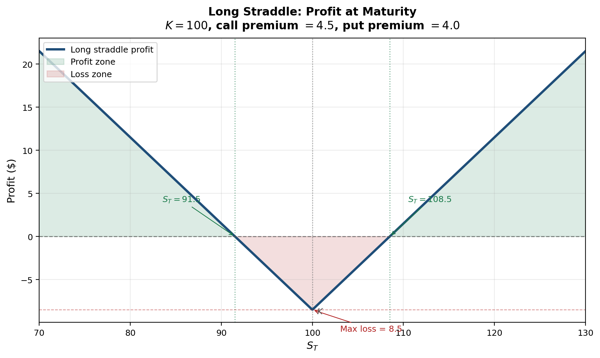

<section class="slide" markdown="1">

# Financial Engineering

**Sukrit Mittal**
Franklin Templeton Investments

</section>

<section class="slide" markdown="1">

## Outline

1. From pricing to engineering
2. The hedging problem
3. Delta hedging
4. The Black-Scholes PDE: pricing is hedging
5. Delta hedging in practice
6. Greek parameters as hedge targets
7. Delta-gamma hedging
8. Hedging business risk
9. Case study: airline fuel hedging
10. Speculating with derivatives
11. Case study: long straddle
12. Exercises

</section>

<section class="slide" markdown="1">

## 1. From Pricing to Engineering

In Lectures 12 and 13, we developed the theory of option pricing — from no-arbitrage bounds and put-call parity to binomial trees, the CRR formula, and the Black-Scholes equation.

That answered the question:

> What is this contract worth under no-arbitrage?

This lecture asks a different question:

> Given this contract, what position should I take, and how should I manage its risk over time?

If a position has value
$$
V = V(S,\sigma,r,t),
$$
then engineering means choosing additional traded positions so that the combined portfolio has desired properties:

* lower risk
* a particular payoff shape
* controlled sensitivity to market variables

Pricing values the machine. Engineering decides how to use it.

</section>

<section class="slide" markdown="1">

### Three Uses of the Same Derivative

The same derivative can serve three very different purposes:

* **Hedging:** reduce an unwanted exposure
* **Speculation:** deliberately take an exposure
* **Arbitrage/relative value:** exploit a pricing inconsistency

Example: a put option on an equity index.

* For a pension fund holding equities, it is **insurance**
* For a macro trader expecting a recession, it is a **bearish bet**
* For an arbitrageur observing a violation of put-call parity, it is one **leg of a riskless trade**

Same instrument. Same mathematics. Different objective function.

In Lecture 11, we saw that forwards serve all three purposes in the context of linear payoffs. Options extend this to nonlinear payoffs — and nonlinearity is where the real engineering begins.

</section>

<section class="slide" markdown="1">

## 2. The Hedging Problem

Options create **nonlinear** exposure.

That is their value. It is also their danger.

For a small change in market conditions, the option value changes approximately as
$$
\Delta V \approx \frac{\partial V}{\partial S}\Delta S
+ \frac{1}{2}\frac{\partial^2 V}{\partial S^2}(\Delta S)^2
+ \frac{\partial V}{\partial t}\Delta t
+ \frac{\partial V}{\partial \sigma}\Delta \sigma
+ \frac{\partial V}{\partial r}\Delta r.
$$

This is the second-order Taylor expansion of $V(S,\sigma,r,t)$ — the same tool we use throughout calculus, now applied to risk.

Each term has a name and a meaning:

| Term | Name | Risk |
|------|------|------|
| $\frac{\partial V}{\partial S}\Delta S$ | Delta | Directional price risk |
| $\frac{1}{2}\frac{\partial^2 V}{\partial S^2}(\Delta S)^2$ | Gamma | Curvature / large-move risk |
| $\frac{\partial V}{\partial t}\Delta t$ | Theta | Time decay |
| $\frac{\partial V}{\partial \sigma}\Delta \sigma$ | Vega | Volatility risk |
| $\frac{\partial V}{\partial r}\Delta r$ | Rho | Interest rate risk |

A hedge is the attempt to neutralize one or more of these terms using other traded instruments.

</section>

<section class="slide" markdown="1">

### Why Static Hedging Usually Fails

A forward position has a **linear** payoff. Its slope with respect to the underlying is constant. A single offsetting position — entered once and never touched — neutralizes the risk completely. This is the kind of hedging we did in Lecture 11.

An option cannot be hedged this way.

Why not? Because the option's slope changes with the underlying price. In Lecture 13, the one-step binomial hedge ratio was
$$
x = \frac{f_u - f_d}{S_0(u - d)}.
$$

In a multi-step tree, this ratio changes at every node. In continuous time, it changes at every instant.

So an option hedge must usually be:

* **dynamic** — adjusted as the market moves
* **state-dependent** — the hedge ratio depends on where the stock is
* **approximate** — perfect in theory, imperfect in practice

Static hedging works for linear payoffs. Dynamic hedging is the price of nonlinearity.

</section>

<section class="slide" markdown="1">

## 3. Delta Hedging

The first and most important sensitivity is **delta**:
$$
\boxed{\Delta = \frac{\partial V}{\partial S}}
$$

In Lecture 13, we saw that $\Delta_{\text{call}} = \mathcal{N}(d_1)$ for a European call under Black-Scholes. Delta measures the local change in the option value when the stock price changes by $\$1$.

For a small move,
$$
\Delta V \approx \Delta \, \Delta S.
$$

If we hold one option and short $\Delta$ shares of stock, the portfolio
$$
\Pi = V - \Delta S
$$
has local stock-price sensitivity
$$
\frac{\partial \Pi}{\partial S}
= \frac{\partial V}{\partial S} - \Delta = 0.
$$

So delta hedging removes the **first-order** effect of stock-price movements.

Only the first-order effect.

This is equivalent to the replicating portfolio from Lecture 13 — but viewed from the perspective of a trader managing risk, not a theorist deriving a price.

</section>

<section class="slide" markdown="1">

### Numerical Example: A Short Call Hedge

Suppose a trader is short 1,000 European call options.

Current stock price: $S_0 = 100$. Each call has delta $\Delta_C = 0.62$.

The short option book has total delta
$$
\Delta_{\text{book}} = -1{,}000 \times 0.62 = -620.
$$

To become delta-neutral, the trader buys 620 shares.

If the stock rises by $\$1$:
$$
\Delta V_{\text{options}} \approx -1{,}000 \times 0.62 \times 1 = -620
$$
$$
\Delta V_{\text{stock}} = +620 \times 1 = +620
$$
$$
\Delta V_{\text{portfolio}} \approx -620 + 620 = 0 \quad \checkmark
$$

First-order risk is neutralized.

But only at that instant, and only for small moves.

</section>

<section class="slide" markdown="1">

### Why the Hedge Must Be Rebalanced

Suppose after the stock move, the call delta rises from $0.62$ to $0.69$.

Now the short option book has delta
$$
-1{,}000 \times 0.69 = -690.
$$

But the trader still owns only 620 shares.

The hedge is now short 70 deltas. To restore neutrality, the trader must buy 70 more shares.

If the stock then falls and delta drops to $0.55$, the book delta becomes $-550$, but the trader holds 690 shares — now 140 deltas too long. Sell 140 shares.

This is the central fact of option hedging:

* A delta hedge is not a one-time trade
* It is a **rebalancing strategy**
* The frequency of rebalancing depends on gamma, liquidity, and transaction costs

The model assumes continuous rebalancing. Markets do not. The gap between theory and practice is where hedging cost lives.

</section>

<section class="slide" markdown="1">

## 4. The Black-Scholes PDE: Pricing Is Hedging

There is a deeper reason delta matters. It connects hedging to pricing.

Take a short time interval $dt$. Using the second-order Taylor expansion of $V(S,t)$:
$$
dV \approx V_t \, dt + V_S \, dS + \frac{1}{2}V_{SS}(dS)^2
$$
where subscripts denote partial derivatives: $V_t = \frac{\partial V}{\partial t}$, $V_S = \frac{\partial V}{\partial S}$, $V_{SS} = \frac{\partial^2 V}{\partial S^2}$.

In the Black-Scholes model, the stock follows geometric Brownian motion with volatility $\sigma$, so heuristically
$$
(dS)^2 \approx \sigma^2 S^2 \, dt.
$$

Substituting:
$$
dV \approx V_t \, dt + V_S \, dS + \frac{1}{2}\sigma^2 S^2 V_{SS} \, dt
$$

$$
= \left(V_t + \frac{1}{2}\sigma^2 S^2 V_{SS}\right)dt + V_S \, dS.
$$

The $dS$ term is random. The $dt$ term is deterministic.

</section>

<section class="slide" markdown="1">

### Eliminating the Random Term

Now form the hedged portfolio:
$$
\Pi = V - \Delta S
$$

Its change is:
$$
d\Pi = dV - \Delta \, dS
$$

$$
= \left(V_t + \frac{1}{2}\sigma^2 S^2 V_{SS}\right)dt + V_S \, dS - \Delta \, dS
$$

$$
= \left(V_t + \frac{1}{2}\sigma^2 S^2 V_{SS}\right)dt + (V_S - \Delta) \, dS.
$$

Choose $\Delta = V_S$. Then the random $dS$ term disappears:
$$
\boxed{d\Pi = \left(V_t + \frac{1}{2}\sigma^2 S^2 V_{SS}\right)dt}
$$

The portfolio is **locally riskless** — its return over $dt$ involves no randomness. This is the continuous-time analogue of the one-step replication from Lecture 13.

</section>

<section class="slide" markdown="1">

### The PDE

If $\Pi = V - V_S S$ is locally riskless, then no-arbitrage requires it to earn the risk-free rate:
$$
d\Pi = r\Pi \, dt = r(V - V_S S) \, dt.
$$

Equating the two expressions for $d\Pi$:
$$
\left(V_t + \frac{1}{2}\sigma^2 S^2 V_{SS}\right)dt = r(V - V_S S) \, dt.
$$

Dividing by $dt$ and rearranging:
$$
V_t + \frac{1}{2}\sigma^2 S^2 V_{SS} = rV - rSV_S
$$

$$
\boxed{V_t + \frac{1}{2}\sigma^2 S^2 V_{SS} + rSV_S - rV = 0}
$$

This is the **Black-Scholes partial differential equation**.

**Verify:** The Black-Scholes call formula $c = S_0\mathcal{N}(d_1) - Ke^{-rT}\mathcal{N}(d_2)$ from Lecture 13 satisfies this PDE. Every closed-form option price we have encountered is a solution to this equation with appropriate boundary conditions. $\checkmark$

</section>

<section class="slide" markdown="1">

### Interpretation

The PDE deserves careful reading.

Each term has a clear meaning:

| Term | Meaning |
|------|---------|
| $V_t$ | Time decay (theta) |
| $\frac{1}{2}\sigma^2 S^2 V_{SS}$ | Convexity gain from gamma |
| $rSV_S$ | Cost of financing the delta hedge |
| $rV$ | Required return on the option position |

The equation says: for any option, **theta + gamma gain + financing cost = required return**.

This has three consequences:

1. **Option pricing and hedging are not separate ideas.** The pricing formula exists *because* dynamic hedging exists.

2. **Delta is the trading strategy hidden inside the formula.** The Black-Scholes price is the cost of the hedging program that replicates the option.

3. **The real-world probability $p$ does not appear.** Just as in the binomial tree (Lecture 13), only the risk-neutral measure matters.

Lecture 13 emphasized the price. This lecture emphasizes the implementation.

</section>

<section class="slide" markdown="1">

## 5. Delta Hedging in Practice

Theory says: rebalance continuously. Practice says: rebalance when you can afford to.

The following table shows a delta hedge for a short position of 1,000 European calls ($K = 100$, $T = 20$ weeks, $\sigma = 20\%$, $r = 5\%$) rebalanced weekly.

| Week | Stock Price | Call Delta | Shares Held | Shares Traded | Trade Cost (\$) | Cumulative Cost (\$) |
|------|-----------|------------|-------------|---------------|----------------|---------------------|
| 0 | 100.00 | 0.522 | 522 | +522 | 52,200 | 52,200 |
| 1 | 101.50 | 0.568 | 568 | +46 | 4,669 | 56,869 |
| 2 | 99.20 | 0.475 | 475 | $-93$ | $-9,226$ | 47,643 |
| 3 | 102.00 | 0.582 | 582 | +107 | 10,914 | 58,557 |
| 4 | 104.50 | 0.691 | 691 | +109 | 11,391 | 69,948 |
| 5 | 103.80 | 0.670 | 670 | $-21$ | $-2,180$ | 67,768 |

**Reading the table:** When the stock rises, delta increases, forcing the hedger to **buy more shares** (buy high). When the stock falls, delta decreases, forcing the hedger to **sell shares** (sell low). Delta hedging systematically buys high and sells low.

This is not a flaw. It is the cost of replication.

</section>

<section class="slide" markdown="1">

### Hedging Error and Gamma

In theory, continuous rebalancing makes the hedge exact. In practice, discrete rebalancing introduces error.

Over one rebalancing interval, the hedging error is approximately
$$
\epsilon \approx \frac{1}{2}\Gamma(\Delta S)^2 - \frac{1}{2}\sigma^2 S^2 \Gamma \, \Delta t.
$$

The first term is the actual gamma P&L from the realized stock move. The second is the expected gamma P&L under the model. The difference is random.

**Key insight:** The hedging error is proportional to $\Gamma$. Options with high gamma — typically those near the money and close to expiry — are the most expensive to hedge in practice.

This is why option dealers care deeply about gamma. It is not just a risk measure. It is a measure of **hedging cost**.

The theoretical Black-Scholes price assumes zero hedging cost (continuous rebalancing). The actual cost of running the hedge may exceed or fall short of this theoretical value, depending on the realized path of the stock.

</section>

<section class="slide" markdown="1">

### What Delta Hedging Leaves Behind

Once delta is neutralized, the leading residual risks are
$$
\Delta \Pi \approx \frac{1}{2}\Gamma (\Delta S)^2 + \Theta \, \Delta t + \mathcal{V}\,\Delta \sigma + \rho \, \Delta r
$$
where
$$
\Gamma = \frac{\partial^2 V}{\partial S^2}, \qquad
\Theta = \frac{\partial V}{\partial t}, \qquad
\mathcal{V} = \frac{\partial V}{\partial \sigma}, \qquad
\rho = \frac{\partial V}{\partial r}.
$$

So delta hedging removes directional risk, but not:

* **large-move risk** (gamma)
* **time-decay risk** (theta)
* **volatility risk** (vega)
* **interest-rate risk** (rho)

This is why serious derivatives risk management never stops at delta.

</section>

<section class="slide" markdown="1">

## 6. Greek Parameters as Hedge Targets

In Lecture 13, we computed the Greeks from the Black-Scholes formula. Here the emphasis is different.

> The Greeks are not descriptive statistics. They are hedge targets.

Each Greek answers a specific question for the risk manager:

| Greek | Symbol | Question it answers |
|------|------|---------|
| Delta | $\Delta$ | How many shares offset my directional risk? |
| Gamma | $\Gamma$ | How fast does my hedge become stale? |
| Theta | $\Theta$ | How much do I gain or lose each day from time decay? |
| Vega | $\mathcal{V}$ | How exposed am I to a change in implied volatility? |
| Rho | $\rho$ | How exposed am I to a shift in interest rates? |

A trader who says "I am hedged" but cannot say **to which Greek** is not hedged in any meaningful sense.

</section>

<section class="slide" markdown="1">

### Gamma and Theta: The Core Tradeoff

For long vanilla options:

* $\Gamma > 0$ — the holder benefits from large moves
* $\Theta < 0$ (usually) — the holder pays through time decay

For short vanilla options:

* $\Gamma < 0$ — the writer suffers from large moves
* $\Theta > 0$ (usually) — the writer collects time decay

This is not accidental.

From the Black-Scholes PDE, for a delta-neutral portfolio ($\Delta = 0$, so $V_S S$ term drops from consideration):
$$
\Theta + \frac{1}{2}\sigma^2 S^2 \Gamma = r\Pi.
$$

For a portfolio close to zero value ($\Pi \approx 0$), this gives
$$
\boxed{\Theta \approx -\frac{1}{2}\sigma^2 S^2 \Gamma}
$$

Gamma and theta are **mechanically linked**. A trader who is long gamma must pay theta. A trader who collects theta must bear gamma risk.

There is no free theta.

</section>

<section class="slide" markdown="1">

### Gamma-Theta Tradeoff: A Numerical Example

A trader is short 500 ATM call options ($K = 100$, $S_0 = 100$, $\sigma = 25\%$, $T = 3$ months, $r = 5\%$).

From the Black-Scholes formulas in Lecture 13:

$$
\Gamma_{\text{call}} = \frac{\mathcal{N}'(d_1)}{S_0 \sigma \sqrt{T}} = \frac{0.3970}{100 \times 0.25 \times 0.5} = 0.0318
$$

$$
\Theta_{\text{call}} = -\frac{S_0 \mathcal{N}'(d_1)\sigma}{2\sqrt{T}} - rKe^{-rT}\mathcal{N}(d_2) = -9.95 - 2.39 = -12.34 \text{ per year}
$$

The short book has total Greeks:
$$
\Gamma_{\text{book}} = -500 \times 0.0318 = -15.9
$$
$$
\Theta_{\text{book}} = -500 \times (-12.34) = +6{,}170 \text{ per year} \approx +\$16.90 \text{ per day}
$$

**Interpretation:** The trader collects about $\$17$ per day in time decay. But if the stock moves sharply — say $\Delta S = 5$ — the gamma loss is approximately
$$
\frac{1}{2}|\Gamma_{\text{book}}|(\Delta S)^2 = \frac{1}{2} \times 15.9 \times 25 = \$199.
$$

Twelve quiet days of theta barely cover one sharp move. This is the risk of being short gamma.

</section>

<section class="slide" markdown="1">

### Vega and Rho

**Vega** measures sensitivity to implied volatility:
$$
\mathcal{V} = \frac{\partial V}{\partial \sigma}.
$$

From Lecture 13: $\mathcal{V} = S_0 \sqrt{T}\,\mathcal{N}'(d_1)$. It is always positive for both calls and puts.

Long options are long vega. Rising volatility makes optionality more valuable.

This matters most when:

* options are near the money
* maturities are not too short
* markets face announcements or crises

In the 2008 financial crisis, implied volatility on S&P 500 options (the VIX) surged from 20% to over 80%. Traders who were short vega without adequate hedging suffered catastrophic losses.

**Rho** measures sensitivity to interest rates:
$$
\rho = \frac{\partial V}{\partial r}.
$$

For many short-dated equity options, rho is secondary. For long-dated contracts, FX options, and interest rate products, it is not.

</section>

<section class="slide" markdown="1">

## 7. Delta-Gamma Hedging

The practical problem is usually not "hedge one option."

It is:

> Hedge an entire book with many strikes, maturities, and underlyings.

If a portfolio has total sensitivities $(\Delta_P, \Gamma_P, \mathcal{V}_P, \rho_P, \ldots)$, then the hedge is constructed by combining instruments so that selected sensitivities sum to zero.

This is replication again — but instead of matching terminal payoffs exactly, we match **local sensitivities**.

### The Linear System

Suppose a portfolio has total delta $\Delta_P$ and gamma $\Gamma_P$. We use:

* $n$ shares of stock (delta = 1 per share, gamma = 0)
* $m$ units of a liquid hedge option with delta $\Delta_H$ and gamma $\Gamma_H$

Stock has zero gamma, so stock alone cannot fix gamma. We need the hedge option.

</section>

<section class="slide" markdown="1">

### Solving the System

To neutralize gamma:
$$
\Gamma_P + m\Gamma_H = 0
$$

To neutralize delta (after the gamma hedge changes our delta by $m\Delta_H$):
$$
\Delta_P + n + m\Delta_H = 0
$$

Solving:
$$
\boxed{m = -\frac{\Gamma_P}{\Gamma_H}}, \qquad
\boxed{n = -\Delta_P - m\Delta_H}
$$

This is a linear system. Risk management becomes linear algebra.

**Why gamma first, then delta?** Because only options carry gamma. Stock can adjust delta but not gamma. So we must use the option to fix gamma, then use stock to clean up the residual delta. The order matters.

</section>

<section class="slide" markdown="1">

### Numerical Example: Hedging an OTC Book

Suppose an OTC options book has:
$$
\Delta_P = -520, \qquad \Gamma_P = -18.
$$

A listed option available for hedging has:
$$
\Delta_H = 0.25, \qquad \Gamma_H = 0.06.
$$

**Step 1 — Gamma neutrality:**
$$
m = -\frac{-18}{0.06} = 300
$$

Buy 300 hedge options.

**Step 2 — Delta adjustment from the gamma hedge:**
$$
300 \times 0.25 = 75
$$

**Step 3 — Stock position for delta neutrality:**
$$
n = -(-520) - 75 = 445
$$

Buy 445 shares.

**Verification:**
$$
\text{Total delta} = -520 + 445 + 300 \times 0.25 = -520 + 445 + 75 = 0 \quad \checkmark
$$
$$
\text{Total gamma} = -18 + 300 \times 0.06 = -18 + 18 = 0 \quad \checkmark
$$

Delta and gamma are now neutral. Vega is not — neutralizing vega would require a third instrument with different vega, adding a third equation to the system.

</section>

<section class="slide" markdown="1">

### Extension: Delta-Gamma-Vega Hedging

Suppose the portfolio also has $\mathcal{V}_P = -40$, and we have two hedge options:

| Instrument | $\Delta_H$ | $\Gamma_H$ | $\mathcal{V}_H$ |
|-----------|-----------|-----------|------------|
| Option A | 0.25 | 0.06 | 0.10 |
| Option B | 0.40 | 0.03 | 0.22 |

Let $m_A$ and $m_B$ be the quantities. The system becomes:
$$
\Gamma_P + m_A \Gamma_A + m_B \Gamma_B = 0
$$
$$
\mathcal{V}_P + m_A \mathcal{V}_A + m_B \mathcal{V}_B = 0
$$
$$
\Delta_P + n + m_A \Delta_A + m_B \Delta_B = 0
$$

Three equations, three unknowns ($m_A$, $m_B$, $n$). The first two equations determine the option positions; the third determines the stock position.

Each additional Greek to neutralize requires one additional traded option. This is why liquid option markets with many available strikes are essential for risk management.

</section>

<section class="slide" markdown="1">

## 8. Hedging Business Risk

Financial engineering is not only for option dealers.

Corporations hedge:

* commodity input costs (airlines, manufacturers)
* foreign exchange receipts and payments (exporters, multinationals)
* interest-rate exposure (leveraged firms, banks)
* inventory price risk (commodity producers)

In Lecture 11, we introduced hedging with futures: the wheat farmer who shorts futures to lock in a selling price, the airline that goes long to lock in fuel costs. We also derived the **minimum-variance hedge ratio**.

Here we revisit that framework with a different lens: the hedge ratio and VaR as **engineering tools** for designing and evaluating a hedge.

</section>

<section class="slide" markdown="1">

### Minimum-Variance Hedge Ratio

From Lecture 11, when spot and futures are imperfectly correlated, a one-for-one hedge is generally suboptimal. The hedge that minimizes variance of the hedged position is:

$$
\boxed{h^* = \rho \frac{\sigma_A}{\sigma_F}}
$$

where $\sigma_A$ is spot price volatility, $\sigma_F$ is futures price volatility, and $\rho$ is the correlation between them.

The optimal number of futures contracts for an exposure of $Q_A$ units with contract size $Q_F$ is:
$$
\boxed{N^* = h^* \frac{Q_A}{Q_F}}
$$

**Recall from Lecture 11:** This is simply the regression coefficient of $\Delta S_A$ on $\Delta F$. The mathematics is identical; the context here is a corporate treasurer designing a hedge program, not an arbitrageur pricing a forward.

### Why the Optimal Hedge Is Not One-for-One

If $\rho = 1$ and $\sigma_A = \sigma_F$, then $h^* = 1$. This is the ideal one-for-one hedge.

But usually the spot exposure is not identical to the futures contract, maturities do not align perfectly, and $\rho < 1$. Then a full hedge introduces **basis risk** that can actually increase total variance. The mathematics tells us: the optimal hedge is not the largest one. It is the variance-minimizing one.

</section>

<section class="slide" markdown="1">

### Value at Risk as a Hedge Metric

In Lecture 10, we introduced Value at Risk (VaR) as a downside risk metric. Here it plays a new role:

> VaR is a way to evaluate whether a hedge is doing enough.

Under the minimum-variance hedge, the residual variance of the hedged position is (from Lecture 11):
$$
\mathrm{Var}(\Delta \Pi^*) = Q_A^2 \sigma_A^2 (1-\rho^2).
$$

**Derivation:** Substitute $N^*$ into $\mathrm{Var}(\Delta\Pi) = Q_A^2\sigma_A^2 + N^2Q_F^2\sigma_F^2 - 2NQ_AQ_F\rho\sigma_A\sigma_F$:

$$
= Q_A^2\sigma_A^2 + \left(\rho\frac{\sigma_A}{\sigma_F}\right)^2 Q_A^2 \sigma_F^2 - 2\rho\frac{\sigma_A}{\sigma_F}Q_A^2\rho\sigma_A\sigma_F
$$

$$
= Q_A^2\sigma_A^2(1 + \rho^2 - 2\rho^2) = Q_A^2\sigma_A^2(1 - \rho^2) \quad \checkmark
$$

Hence
$$
\boxed{\sigma_{\Pi^*} = Q_A \sigma_A \sqrt{1-\rho^2}}
$$

If the hedged P&L is approximately normal, then at confidence level $\alpha$:
$$
\boxed{\mathrm{VaR}_{\alpha}^* = z_{\alpha} Q_A \sigma_A \sqrt{1-\rho^2}}
$$

Hedge effectiveness under this model is driven entirely by $\rho^2$. This is the $R^2$ from the hedge regression — the fraction of variance eliminated.

</section>

<section class="slide" markdown="1">

## 9. Case Study: Airline Fuel Hedging

An airline expects to buy
$$
Q_A = 2{,}100{,}000
$$
gallons of jet fuel next month.

No liquid jet fuel futures exist, so the airline uses **heating-oil futures** as a proxy hedge — the same cross-hedging situation we encountered in Lecture 11.

**Given:**

| Parameter | Value |
|-----------|-------|
| Futures contract size | $Q_F = 42{,}000$ gallons |
| Spot volatility (jet fuel) | $\sigma_A = \$0.08$ per gallon |
| Futures volatility (heating oil) | $\sigma_F = \$0.10$ per gallon |
| Correlation | $\rho = 0.85$ |

**Step 1 — Hedge ratio:**
$$
h^* = 0.85 \times \frac{0.08}{0.10} = 0.68
$$

**Step 2 — Number of contracts:**
$$
N^* = 0.68 \times \frac{2{,}100{,}000}{42{,}000} = 34
$$

The airline buys 34 heating-oil futures contracts. Note: $h^* < 1$ because $\rho < 1$ and $\sigma_A < \sigma_F$. A full hedge (50 contracts) would over-hedge.

</section>

<section class="slide" markdown="1">

### Evaluating the Hedge with VaR

**Unhedged standard deviation of fuel-cost change:**
$$
Q_A \sigma_A = 2{,}100{,}000 \times 0.08 = \$168{,}000
$$

**Hedged standard deviation:**
$$
\sigma_{\Pi^*} = 168{,}000 \times \sqrt{1-0.85^2}
= 168{,}000 \times \sqrt{0.2775}
= 168{,}000 \times 0.5268
= \$88{,}500
$$

**95% VaR comparison** (using $z_{0.95} = 1.645$):

| | Standard Deviation | 95% VaR |
|--|---|---|
| Unhedged | \$168,000 | $1.645 \times 168{,}000 = \$276{,}360$ |
| Hedged | \$88,500 | $1.645 \times 88{,}500 = \$145{,}600$ |

**VaR reduction:**
$$
\frac{276{,}360 - 145{,}600}{276{,}360} = 47\%
$$

The hedge does not eliminate risk. It cuts it almost in half.

That is usually what good corporate hedging looks like: not perfection, but damage control. The remaining risk — $\$145{,}600$ at 95% confidence — is **basis risk**: the irreducible mismatch between jet fuel and heating oil.

</section>

<section class="slide" markdown="1">

## 10. Speculating with Derivatives

Hedging reduces exposure.

Speculation deliberately creates it.

The appeal of derivatives for speculators is obvious:

* small initial capital outlay
* embedded leverage
* ability to target convexity or volatility

But the same features that make derivatives efficient also make them unforgiving.

Leverage narrows the margin for error. A correct view with the wrong position size is still a bad trade.

### Historical Caution

Nick Leeson's unauthorized speculation in Nikkei index futures brought down Barings Bank in 1995 — a $\$1.4$ billion loss from a single trader's leveraged bets. The mathematics of futures was correct; the risk management was not.

Derivatives amplify intelligence and recklessness in equal measure.

</section>

<section class="slide" markdown="1">

### Tools: Matching the Instrument to the Thesis

Different derivatives express different beliefs.

**Futures and forwards**

* Best for clean directional views
* Linear payoff:
$$
\Pi_{\text{long forward}} = S_T - K
$$
* Symmetric risk: gain and loss are unbounded in both directions

**Options**

* Directional views with asymmetry
* Long call profit: $(S_T - K)^+ - c$
* Long put profit: $(K - S_T)^+ - p$
* Bounded loss (premium paid), unbounded or large potential gain

**Option combinations**

* Spreads, straddles, strangles
* Useful when the thesis is about **volatility** or **range**, not just direction

The instrument should match the thesis. Using a linear instrument for a convex view is poor engineering. Using options when a forward suffices wastes premium.

</section>

<section class="slide" markdown="1">

### Leverage

Consider a futures contract on 100 units of an asset at futures price $F_0 = 100$.

Suppose the required initial margin is only $\$1{,}000$ (about 1% of the $\$10{,}000$ notional).

If the futures price rises to $103$, the gain is
$$
100 \times (103 - 100) = \$300.
$$

Return on posted margin:
$$
\frac{300}{1{,}000} = 30\%.
$$

A 3% move in the underlying produces a 30% return on capital — a leverage factor of 10.

If the price falls to $97$, the loss is also $\$300$: a 30% loss on capital from a 3% adverse move.

Leverage magnifies views. It also magnifies mistakes.

In Lecture 11, we saw that daily margining creates a stream of cash flows that must be financed. Leverage means that even a correct long-term view can fail if interim margin calls force liquidation — the Metallgesellschaft lesson.

</section>

<section class="slide" markdown="1">

## 11. Case Study: Long Straddle

Suppose a stock is trading at $S_0 = 100$.

A trader expects a major announcement (earnings, FDA ruling, court decision) and believes the market is **underpricing the magnitude of the move**. The trader has no view on direction — only on movement.

The trader buys:

* one call with strike $K = 100$ for premium $c = 4.5$
* one put with strike $K = 100$ for premium $p = 4.0$

Total premium paid:
$$
c + p = 8.5.
$$

The maturity payoff is
$$
(S_T - 100)^+ + (100 - S_T)^+ = |S_T - 100|.
$$

**Verify:** If $S_T = 115$: payoff $= 15 + 0 = 15 = |115 - 100|$. $\checkmark$

If $S_T = 88$: payoff $= 0 + 12 = 12 = |88 - 100|$. $\checkmark$

The straddle pays the **absolute value** of the stock's move from the strike.

</section>

<section class="slide" markdown="1">

### Long Straddle: Profit and Greek Profile

The maturity profit is
$$
|S_T - 100| - 8.5.
$$

Break-even prices:
$$
100 - 8.5 = 91.5, \qquad 100 + 8.5 = 108.5.
$$

So the trade profits if the stock finishes below $91.5$ or above $108.5$. Maximum loss is $8.5$ (premium paid), occurring when $S_T = 100$ exactly.

*Figure: Profit at maturity for a long straddle ($K=100$, total premium $= 8.5$). The position profits from large moves in either direction. Maximum loss occurs at the strike.*

This is not primarily a directional position. It is a view on **movement** — and, more precisely, on **volatility**.

</section>

<section class="slide" markdown="1">

### Straddle Greeks

At initiation, an ATM straddle has approximate Greek profile:

| Greek | Call contribution | Put contribution | Straddle total |
|-------|-----------------|------------------|----------------|
| Delta | $\approx +0.5$ | $\approx -0.5$ | $\approx 0$ |
| Gamma | $+\Gamma$ | $+\Gamma$ | $+2\Gamma$ |
| Vega | $+\mathcal{V}$ | $+\mathcal{V}$ | $+2\mathcal{V}$ |
| Theta | $\Theta_C < 0$ | $\Theta_P < 0$ | $2\Theta < 0$ |

The straddle is:

* **delta-neutral** — insensitive to small directional moves
* **long gamma** — benefits from large moves (the $(\Delta S)^2$ term)
* **long vega** — benefits from an increase in implied volatility
* **short theta** — pays time decay each day

If the market stays quiet, time decay hurts. If the market explodes, convexity pays. If implied volatility rises (even before the move), vega pays.

This is the cleanest example of a **volatility trade** — a position whose profitability depends not on which way the market moves, but on whether it moves enough.

</section>

<section class="slide" markdown="1">

## Final Takeaways

* **Financial engineering begins where pricing ends**
  * Pricing tells us what a contract is worth
  * Engineering tells us how to use it — to hedge, to speculate, or to reshape exposure

* **Delta hedging is the first layer of option risk control**
  * It removes first-order price risk: $\Pi = V - \Delta S$
  * It does not remove gamma, vega, theta, or discrete-rebalancing risk
  * The hedge must be rebalanced as the market moves — systematically buying high and selling low

* **The Black-Scholes PDE is a hedging statement**
  * $V_t + \frac{1}{2}\sigma^2 S^2 V_{SS} + rSV_S - rV = 0$
  * Dynamic replication is the economic content behind the pricing formula
  * The PDE links theta, gamma, and the cost of carry in one equation

* **Greek parameters are hedge targets, not just descriptive statistics**
  * Gamma and theta are mechanically linked: $\Theta \approx -\frac{1}{2}\sigma^2 S^2 \Gamma$
  * Neutralizing each additional Greek requires one more traded instrument
  * Delta-gamma-vega hedging is a system of linear equations

* **Business hedging is a variance-minimization problem**
  * With basis risk, the optimal futures hedge is $h^* = \rho\,\sigma_A / \sigma_F$ (Lecture 11)
  * VaR under the hedge is $z_\alpha Q_A \sigma_A \sqrt{1-\rho^2}$ (Lecture 10)
  * Hedging reduces variance; it does not abolish uncertainty

* **Speculation with derivatives is a choice about payoff geometry**
  * Futures create linear exposure (direction)
  * Options create convex exposure (magnitude, volatility)
  * Combinations let traders isolate direction, volatility, or tail risk

**Key insight:** Financial engineering is the mathematics of reshaping exposure. The same no-arbitrage logic that prices a derivative also determines the trading strategy required to manage it.

</section>

<section class="slide" markdown="1">

## 12. Exercises

### Exercise 1: Delta Hedge and Rebalancing

A trader is short 600 European call options on a stock. Each call currently has delta $0.58$.

**Tasks:**
1. Compute the total delta of the option book
2. Determine the stock position needed for a delta-neutral hedge
3. If the stock rises by $\$2$, estimate the first-order change in the value of the option book
4. If the option delta then rises to $0.67$, how many additional shares must be bought?
5. Explain why this hedge cannot remain exact over time

</section>

<section class="slide" markdown="1">

### Exercise 2: Heuristic Derivation of the Black-Scholes PDE

Consider an option value $V(S,t)$.

**Tasks:**
1. Write the second-order local expansion
$$
dV \approx V_t \, dt + V_S \, dS + \frac{1}{2}V_{SS}(dS)^2
$$
2. Form the portfolio $\Pi = V - \Delta S$
3. Choose $\Delta$ so that the random $dS$ term disappears. What is $\Delta$?
4. Use $(dS)^2 \approx \sigma^2 S^2 dt$ to simplify the remaining expression
5. Apply the no-arbitrage condition $d\Pi = r\Pi \, dt$ and derive the Black-Scholes PDE
6. Identify each term of the PDE with a Greek parameter and interpret its economic meaning

</section>

<section class="slide" markdown="1">

### Exercise 3: Delta-Gamma Hedge

A portfolio has total Greeks
$$
\Delta_P = -150, \qquad \Gamma_P = -9.
$$

A liquid hedge option has
$$
\Delta_H = 0.30, \qquad \Gamma_H = 0.05.
$$

**Tasks:**
1. Compute how many hedge options are needed to neutralize gamma
2. Compute how many shares of stock are needed to neutralize delta
3. Verify that the resulting position has zero delta and gamma
4. Is vega necessarily zero after this hedge? Explain why or why not
5. Explain why gamma-neutrality is temporary rather than permanent

</section>

<section class="slide" markdown="1">

### Exercise 4: Gamma-Theta P&L Analysis

A trader is short 200 ATM call options with the following per-option Greeks:

$$
\Gamma = 0.04, \qquad \Theta = -15 \text{ (per year)}
$$

The current stock price is $S_0 = 50$ and $\sigma = 30\%$.

**Tasks:**
1. Compute the total gamma and total theta of the short position
2. Compute the daily theta income (in dollars) for the short position
3. If the stock moves by $\Delta S = +3$ over one day, estimate the gamma loss
4. How many quiet days of theta collection does it take to offset this gamma loss?
5. Verify that the gamma-theta relationship $\Theta \approx -\frac{1}{2}\sigma^2 S^2 \Gamma$ holds approximately for a single option. (Use the given per-option Greeks.)

</section>

<section class="slide" markdown="1">

### Exercise 5: Minimum-Variance Hedge Ratio

A firm is exposed to 800,000 units of a commodity. A futures contract covers 20,000 units. Spot and futures price changes satisfy:

* $\sigma_A = 0.12$
* $\sigma_F = 0.15$
* $\rho = 0.75$

**Tasks:**
1. Compute the minimum-variance hedge ratio $h^*$
2. Compute the optimal number of futures contracts
3. Verify that the hedged variance is $Q_A^2 \sigma_A^2(1-\rho^2)$
4. Explain why the optimal hedge is not a full one-for-one hedge
5. How would your answer change if $\rho$ increased to $0.95$? Compute the new $h^*$ and $N^*$, and comment on how the hedged variance changes

</section>

<section class="slide" markdown="1">

### Exercise 6: VaR Before and After Hedging

Using the data from Exercise 5:

**Tasks:**
1. Compute the unhedged standard deviation of exposure value changes
2. Compute the hedged standard deviation under the minimum-variance hedge
3. Compute the 95% VaR before and after hedging using $z_{0.95} = 1.645$
4. By what percentage does the hedge reduce VaR?
5. Compute the same for $\rho = 0.95$ (from Exercise 5, part 5) and compare
6. Does a lower VaR imply that catastrophic outcomes are impossible? Explain

</section>

<section class="slide" markdown="1">

### Exercise 7: Speculation with a Straddle

A stock trades at $S_0 = 75$. A trader buys:

* one call with strike $75$ for premium $3.2$
* one put with strike $75$ for premium $2.8$

**Tasks:**
1. Write the maturity payoff of the position as a function of $S_T$
2. Write the maturity profit as a function of $S_T$
3. Compute the two break-even prices
4. Describe the position in Greek terms: is it long or short delta, gamma, vega, and theta at initiation?
5. Explain what market view would justify entering this trade
6. If the trader is wrong and the stock does not move, what is the maximum loss?

</section>

<section class="slide" markdown="1">

### Exercise 8: Verifying the Black-Scholes PDE

Consider a European call with $S_0 = 100$, $K = 100$, $T = 0.5$, $r = 5\%$, $\sigma = 25\%$.

From the Black-Scholes formulas in Lecture 13:
$$
d_1 = \frac{\ln(100/100) + (0.05 + 0.5 \times 0.0625) \times 0.5}{0.25\sqrt{0.5}}, \qquad d_2 = d_1 - 0.25\sqrt{0.5}
$$

**Tasks:**
1. Compute $d_1$ and $d_2$
2. Compute the Greeks: $\Delta = \mathcal{N}(d_1)$, $\Gamma = \frac{\mathcal{N}'(d_1)}{S_0\sigma\sqrt{T}}$, $\Theta = -\frac{S_0\mathcal{N}'(d_1)\sigma}{2\sqrt{T}} - rKe^{-rT}\mathcal{N}(d_2)$
3. Substitute into the Black-Scholes PDE:
$$
\Theta + \frac{1}{2}\sigma^2 S_0^2 \Gamma + rS_0\Delta - rV = 0
$$
and verify that the equation holds (where $V$ is the Black-Scholes call price)
4. Interpret: which term is largest in magnitude? What does that tell you about the dominant risk for an ATM option with 6 months to expiry?

</section>

